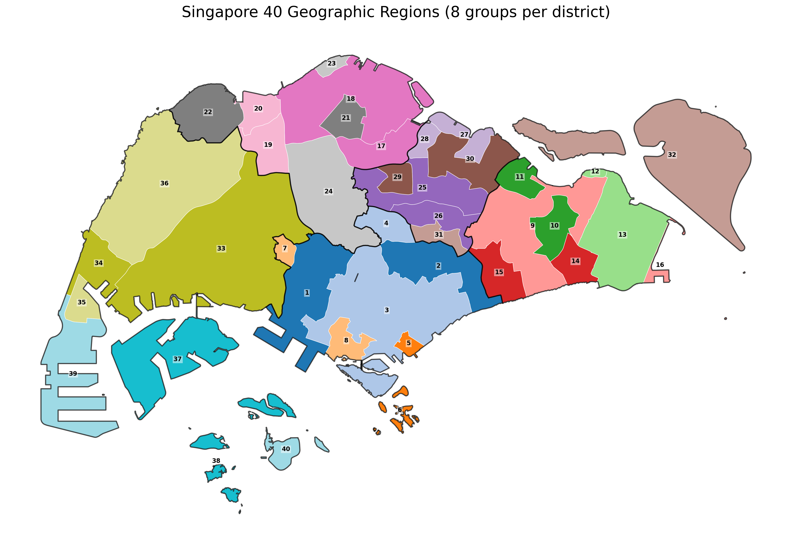
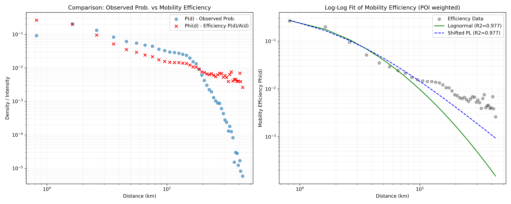
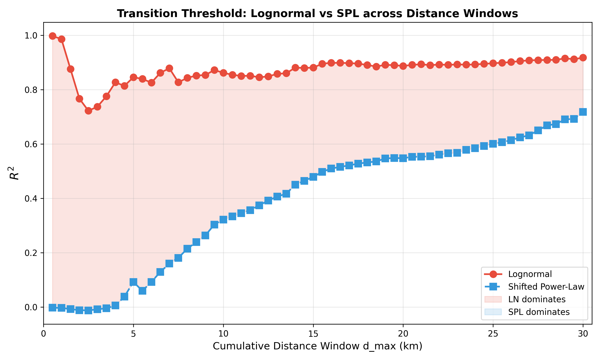

# Individual habits vs Urban Gravity: Scale-dependent mobility transition in Singapore

## 1. Abstract
Nghiên cứu này muốn tìm kiếm mô hình phân phối di chuyển thông dụng phù hợp với hành vi và cấu trúc hạ tầng tại Singapore. Thông qua phân tích 5 mô hình phân phối thường được áp dụng trong lĩnh vực human mobility, rút ra những kết quả sau: Ở cấp độ vi mô (subzone), dữ liệu tuân theo phân phối **Lognormal**, phản ánh thói quen di chuyển ngắn đa mục đích của cá thể. Ở cấp độ vĩ mô (district), sức hút từ hạ tầng đô thị (POI) lấn át hành vi cá nhân, dẫn đến sự lấn át của phân phối **Shifted Power-Law**. Việc chuẩn hóa dữ liệu theo mật độ POI (Hiệu suất di chuyển $\Phi(d_j)$ ) đạt độ khớp $R^2 = 0.9769$, xác nhận rằng cấu trúc hạ tầng là động lực chính của quy luật di chuyển phụ thuộc quy mô.

## Nomenclature (Ký hiệu và Từ viết tắt)

**Mathematics & Variables:**
- $r$: Khoảng cách Euclidean di chuyển (km)
- $d_j$: Khoảng cách ứng với bin thứ $j$
- $P(r)$: Xác suất xuất hiện chuyến đi tại khoảng cách $r$
- $O, K$: Subzone xuất phát (Origin) và subzone đích (Destination)
- $\Phi(d_j)$: Hiệu suất di chuyển (Mobility efficiency) tại khoảng cách $d_j$
- $T(d_j)$: Tổng số lượng chuyến đi gom theo khoảng cách $d_j$
- $A(d_j)$: Tổng số lượng điểm thu hút (POI) tại đích đến, gom theo khoảng cách $d_j$

**Model Parameters:**
- $C$: Hằng số chuẩn hóa xác suất của các mô hình
- $\mu, \sigma$: Tham số trung giá trị (mean) và độ lệch chuẩn (standard deviation) của Lognormal
- $r_0, \beta$: Tham số khoảng cách dịch (shift) và số mũ phân kỳ (exponent) của Shifted Power-Law
- $\lambda$: Tham số phân rã (decay parameter) của Exponential và Gamma
- $\alpha$: Tham số hình dáng (shape parameter) của Gamma
- $\kappa$: Tham số giới hạn cắt (truncating constant) của Truncated Lévy Flight

**Abbreviations & Metrics:**
- **SPL**: Shifted Power-Law
- **TLF**: Truncated Lévy Flight
- **POI**: Point of Interest (Điểm tiện ích đô thị từ nguồn OpenStreetMap)
- **BIC**: Bayesian Information Criterion (Tiêu chuẩn thông tin Bayes để lựa chọn mô hình)
- **BIC Best (%)**: Tỷ lệ phần trăm số vùng mà mô hình đạt BIC thấp nhất (tốt nhất)
- **$R^2$**: Hệ số xác định (Coefficient of determination), thể hiện tỷ lệ phương sai giải thích được
- **KS-stat**: Kolmogorov-Smirnov statistic (Khoảng cách cực đại giữa hàm phân phối tích lũy của dữ liệu và mô hình)
- **EMD**: Earth Mover's Distance (Khoảng cách Wasserstein) đánh giá độ lệc phân phối
- **GT**: Ground Truth (Dữ liệu di chuyển đa nguồn đã chuẩn hóa làm chuẩn)
- **FB**: Facebook Mobility Data (Dữ liệu xác thực ngoại biên)

## 2. Introduction & Hypothesis
### 2.1. Research Gap (Khoảng trống nghiên cứu)

Mặc dù quy luật Truncated Lévy Flight (TLF) được coi là "phổ quát" trong Human Mobility [1, 2], hầu hết các nghiên cứu kinh điển đều tập trung vào các quốc gia có diện tích lớn hoặc các siêu đô thị (Mega-cities) ở phương Tây. Hiện tại:
- **Thiếu các nghiên cứu tại đô thị cực nén và nhỏ ở Châu Á:** Singapore là một điển hình của đô thị đảo với giới hạn địa lý nghiêm ngặt (~50 km). Nhiều nghiên cứu cho rằng giới hạn này ảnh hưởng trực tiếp đến tham số cắt (truncation) của TLF [5], nhưng ít công trình đi sâu vào sự chuyển dịch mô hình tại đây so với các đô thị phương Tây [8].
- **Sự phụ thuộc vào hạ tầng chưa được định lượng rõ ràng:** Noulas et al. (2012) [7] đã chỉ ra rằng mật độ điểm đến (POI) có thể thay thế khoảng cách địa lý tuyệt đối trong việc giải thích quy luật di chuyển. Tuy nhiên, việc sử dụng dữ liệu mở (OpenStreetMap) để "khử" nhiễu hạ tầng nhằm tìm lại quy luật hành vi cá nhân gốc (như Lognormal) là một hướng tiếp cận mới chưa được khảo sát kỹ tại quy mô vi mô của Singapore [9].

### 2.1. Hypothesis
Tại các đô thị nén (Compact City) như Singapore, các giả thuyết được đặt ra là:
1. Tồn tại một sự chuyển pha dựa trên bán kính di chuyển.
2. Có sự chuyển dịch dựa trên quy mô quan sát:
    - **Quy mô Vi mô (Bottom-up):** Mô hình phân phối xác suất di chuyển phản ánh thói quen di chuyển ngắn của cá thể (Local optimization).
    - **Quy mô Vĩ mô (Top-down):** Ở quy mô lớn hơn, mô hình sẽ bị thay đổi do bị chi phối bởi "Lực hấp dẫn đô thị" (Urban Gravity) từ các trung tâm hạ tầng.
3. Quy luật TLF sẽ không còn đạt hiệu quả cao với các đô thị lớn nhưng diện tích nhỏ như Singapore do các di chuyển dài bị dứt đoạn với hạn chế địa lý trong nhiều quy mô quan sát.

Để cung cấp cái nhìn tổng quan về các mô hình sẽ được phân tích, chúng tôi tóm tắt các đặc tính toán học và ý nghĩa của chúng trong Bảng 0.

**Table 0.** Summary of candidate mobility models ranked by tail strength.

| Rank (Tail Strength) | Model                           | Probability Distribution                                                  | Tail Behavior              | Generative Interpretation                           | Strength                                     | Weakness                                 |
| -------------------- | ------------------------------- | ------------------------------------------------------------------------- | -------------------------- | --------------------------------------------------- | -------------------------------------------- | ---------------------------------------- |
| 1                    | **Exponential**                 | $P(r) \propto \exp(-r/\lambda)$                                           | Very short tail            | Random movement with constant decay probability     | Simple baseline model                        | Cannot capture long-distance mobility    |
| 2                    | **Gamma**                       | $P(r) \propto r^{\alpha-1} \exp(-r/\lambda)$                              | Short exponential tail     | Aggregation of multiple stochastic travel processes | Flexible near short distances                | Tail still decays rapidly                |
| 3                    | **Lognormal**                   | $P(r) \propto \frac{1}{r} \exp\left(-\frac{(\ln r-\mu)^2}{2\sigma^2}\right)$ | Moderately heavy tail      | Multiplicative behavioral processes                 | Empirically fits many mobility datasets      | Weak theoretical mobility interpretation |
| 4                    | **Truncated Lévy Flight (TLF)** | $P(r) \propto (r+r_0)^{-\beta} \exp(-r/\kappa)$                           | Heavy tail with truncation | Lévy flight mobility constrained by spatial limits  | Strong theoretical basis in mobility studies | Sensitive to truncation scale            |
| 5                    | **Shifted Power Law (SPL)**     | $P(r) \propto (r+r_0)^{-\beta}$                                           | Heaviest tail              | Scale-free mobility with short-distance correction  | Captures heavy-tail structure well           | May overestimate long-distance trips     |

## 3. Methodology

Quá trình tham số hóa sử dụng thuật toán *Levenberg-Marquardt* để so sánh 5 mô hình: Lognormal, Shifted Power Law, Truncated Lévy Flight, Gamma, Exponential.

Tiêu chuẩn đánh giá:
- **BIC (Bayesian Information Criterion)**: Cân bằng độ fit và độ phức tạp mô hình
- **$R^2$**: Tỷ lệ phương sai giải thích
- **KS-statistic**: Kiểm định Kolmogorov-Smirnov

Kết hợp sử dụng dữ liệu từ **OpenStreetMap (OSM)** để tính toán **Hiệu suất di chuyển** $\Phi(d_j)$. Khoảng cách được chia thành **50 bins đều nhau** từ 0.1 km đến 50 km ($\Delta d \approx 1$ km).

**Lưu ý về tập dữ liệu:** Mặc dù hệ thống phân vùng của Singapore bao gồm **323 subzones**, nghiên cứu này chỉ tập trung phân tích trên **303 subzones** có dữ liệu di chuyển thực tế. 20 subzones còn lại (bao gồm các đảo các vùng đệm chưa quy hoạch dân cư) không ghi nhận chuyến đi đáng kể trong tập dữ liệu Ground Truth đa nguồn, do đó được loại bỏ để đảm bảo tính nhất quán của các ước lượng thống kê.

Với mỗi bin $d_j$:

$$T(d_j) = \sum_{\substack{(O,K):\\ dist(O,K) \in d_j}} \text{T}(O,K)$$ 

$$A(d_j) = \sum_{\substack{(O,K):\\ dist(O,K) \in d_j}} \text{POI}(O,K)$$

$$\Phi(d_j) = \frac{T(d_j)}{A(d_j)}$$

$T(d_j)$: Tổng số chuyến đi (trips) của tất cả các cặp nguồn–đích $(O,K)$ có khoảng cách rơi vào bin $d_j$.
$A(d_j)$: Tổng số POI (Points of Interest) của các subzone đích $K$ trong cùng bin khoảng cách $d_j$.
$\Phi(d_j)$: Hiệu suất di chuyển của bin $d_j$, cho phép tách biệt “lực ma sát” của khoảng cách khỏi “lực hút” của mật độ hạ tầng.

### 3.2. Phân vùng cấp độ Trung gian (Intermediate-scale: 40 Groups)

Để làm rõ hơn lộ trình chuyển dịch từ vi mô sang vĩ mô, chúng tôi bổ sung một cấp độ quan sát trung gian bằng cách chia Singapore thành **40 khu vực địa lý** (40 groups).

**Phương pháp thực hiện:**
- Mỗi district trong số 5 district chính được chia nhỏ thành đúng **8 nhóm liền kề**.
- Sử dụng thuật toán **Agglomerative Clustering** với ràng buộc **Connectivity matrix** (dựa trên ma trận tiếp giáp không gian của 303 subzones). Ràng buộc này đảm bảo các subzone trong cùng một nhóm phải chạm nhau về mặt địa lý, tạo thành một vùng duy nhất.
- Thuật toán ưu tiên sự cân bằng về số lượng subzone và tối ưu hóa khoảng cách nội cụm (linkage strategy: complete).

Việc phân chia này tạo ra các thực thể địa lý có kích thước lớn hơn subzone (~7.5 subzones/group) nhưng nhỏ hơn district (~60.6 subzones/district). Ngoài ra, chúng tôi cũng thực hiện khảo sát trên **toàn bộ Singapore** (City-wide) để hoàn tất bức tranh chuyển dịch đa quy mô.

*Hình 1. Phân vùng Singapore thành 40 nhóm trung gian dựa trên sự liền kề không gian và ranh giới district.*

### 3.2. Block Bootstrap với 40 Group-Blocks

Các subzone không độc lập về mặt không gian — các subzone lân cận chia sẻ hạ tầng giao thông và có phân phối di chuyển tương đồng. Bootstrap thông thường (resample từng subzone độc lập) sẽ **đánh giá thấp phương sai** do bỏ qua tương quan không gian, dẫn đến khoảng tin cậy hẹp giả tạo.

**Giải pháp:** Sử dụng **block bootstrap** với **40 group-blocks** (được phân cụm từ 303 subzones dựa trên khoảng cách và district) làm đơn vị resample. Việc tăng số lượng block từ 5 (districts) lên 40 giúp tăng độ phân giải của phân phối bootstrap, cung cấp khoảng tin cậy (CI) chính xác và đáng tin cậy hơn.

**Quy trình:**
1. **Định nghĩa block:** 40 groups địa lý liền kề (trung bình ~7.5 subzones/block).
2. **Resample:** Chọn ngẫu nhiên 40 blocks **có hoàn lại** (with replacement).
3. **Tổng hợp:** Gom tất cả subzones từ các blocks được chọn → tập dữ liệu bootstrap.
4. **Tính toán:** Trên mỗi mẫu bootstrap, tính lại BIC Best %, Mean $R^2$, Mean KS-stat cho 5 mô hình.
5. **Lặp lại:** 1000 lần tái lấy mẫu.
6. **Khoảng tin cậy:** 95% CI = percentile [2.5%, 97.5%] từ 1000 giá trị bootstrap.

**Lợi ích:** Việc sử dụng 40 blocks giúp CI phản ánh sát thực tế hơn so với việc chỉ dùng 5 districts (vốn mang tính bảo thủ cao do số lượng block quá ít).

## 4. Results: The Scale-Transition

### 4.1. Khảo sát tại Cấp Vi mô - Subzone (Micro-scale)
Tại quy mô nhỏ, hành vi di chuyển bị chi phối bởi các lựa chọn cá nhân dựa trên sự tiện lợi cục bộ.

**Table 1.** Goodness-of-fit comparison at the micro-scale (subzone level, n = 303, block bootstrap 95% CI, 40 group-blocks, 1000 iterations).

*Nguồn: `zone_distribution_metrics.csv` ← `compare_distribution_formular.py`, `bootstrap_table1_ci_40groups.csv` ← `bootstrap_block_table1_40groups.py`*

| Distribution              | BIC Best (%) | 95% CI BIC       | Mean $R^2$   | 95% CI $R^2$         | Mean KS-stat |
|---------------------------|--------------|------------------|--------------|----------------------|--------------|
| **Lognormal**             | **28.05**    | [16.45, 36.30]   | **0.8199**   | **[0.7898, 0.8397]** | 0.1492       |
| Shifted Power-Law (SPL)   | **28.05**    | [14.41, 41.79]   | 0.6998       | [0.6746, 0.7254]     | **0.0935**   |
| Gamma                     | 24.09        | [16.97, 37.38]   | 0.8022       | [0.7775, 0.8215]     | 0.1911       |
| Exponential               | 16.50        | [12.28, 22.28]   | 0.6919       | [0.6637, 0.7163]     | 0.1216       |
| Truncated Lévy Flight     | 3.30         | [1.23, 5.44]     | 0.7026       | [0.6775, 0.7284]     | **0.0898**   |

**Note on BIC Best (%):** Chỉ số này đại diện cho tỷ lệ phần trăm số đơn vị không gian (subzones/groups/districts) mà mô hình tương ứng đạt giá trị BIC thấp nhất (tốt nhất) so với các mô hình đối thủ. Đây là thước đo độ ổn định và tính phổ quát của mô hình trên toàn bộ khu vực khảo sát.

Lognormal và SPL chia sẻ vị trí dẫn đầu về BIC (28.05%), nhưng bootstrap CI với 40 blocks xác nhận $R^2$ của Lognormal **[0.7898, 0.8397]** hoàn toàn tách biệt với SPL **[0.6746, 0.7254]**. Điều này khẳng định Lognormal là mô hình mô tả hành vi cá nhân chính xác nhất tại Singapore.

### 4.2. Khảo sát tại Cấp Trung gian - 40 Groups (Intermediate-scale)

Khi dữ liệu được gom nhóm lên cấp độ 40 vùng địa lý (trung bình ~7.5 subzones/vùng), đặc tính cá nhân bắt đầu bị triệt tiêu dần bởi phép cộng gộp, nhưng vẫn giữ được độ phân giải không gian cao hơn cấp quận.

**Table 2.** Goodness-of-fit comparison at the intermediate scale (n = 40 groups).

| Distribution              | BIC Best (%) | Mean $R^2$   | Mean KS-stat |
|---------------------------|--------------|--------------|--------------|
| **Gamma**                 | **38.2**     | 0.8289       | 0.1287       |
| Exponential               | 26.5         | 0.7653       | 0.1008       |
| **Lognormal**             | 20.6         | **0.8370**   | 0.1195       |
| Shifted Power-Law (SPL)   | 8.8          | 0.7739       | **0.0777**   |
| Truncated Lévy Flight     | 5.9          | 0.7774       | **0.0724**   |

Tại quy mô này, mô hình **Gamma** trỗi dậy mạnh mẽ nhất về tiêu chuẩn BIC (38.2%), đóng vai trò là "vùng đệm lý thuyết" giữa thói quen cá nhân (LN) và lực hấp dẫn hệ thống (SPL). $R^2$ của Lognormal vẫn duy trì mức cao nhất (0.8370), cho thấy hình dáng phân phối vẫn mang đặc tính của thói quen cá nhân nhưng đã bắt đầu bị làm mịn.

*Hình 2. Phân bổ các mô hình tối ưu (BIC) tại quy mô 40 nhóm, thể hiện trạng thái quá độ giữa vi mô và vĩ mô.*

### 4.3. Khảo sát tại Cấp Vĩ mô - District (Macro-scale)

Khi quy mô mở rộng lên 5 districts, đặc tính hệ thống và cấu trúc đô thị bắt đầu lấn át hoàn toàn thói quen cá nhân đơn lẻ.

**Table 3.** Goodness-of-fit comparison at the macro-scale (district level, n = 5).

| Distribution              | BIC Best (%) | Mean $R^2$   | Mean KS-stat |
|---------------------------|--------------|--------------|--------------|
| **Shifted Power-Law (SPL)**| **40.0**     | 0.8987       | **0.0474**   |
| Exponential               | **40.0**     | 0.8882       | 0.1113       |
| Gamma                     | 20.0         | 0.8965       | 0.1627       |
| Lognormal                 | 0.0          | **0.9307**   | 0.0847       |
| Truncated Lévy Flight     | 0.0          | 0.8987       | 0.0465       |

SPL chiếm ưu thế về độ khớp hình học (KS-stat thấp nhất) và tiêu chuẩn BIC (40%) ngang bằng với Exponential. Lognormal dù có $R^2$ cao nhất (0.9307) nhưng thất bại hoàn toàn về BIC (0%) do sai số lớn ở phần đuôi phân phối liên quận.

*Hình 3. So sánh Lognormal và SPL tại cấp District: Sự sụt giảm của Lognormal ở phần đuôi khiến nó bị loại bỏ bởi tiêu chuẩn BIC.*

### 4.4. Khảo sát tại Cấp Toàn thành phố - Global (City-wide)

Ở cấp độ gộp cao nhất (toàn bộ Singapore), toàn bộ các đặc tính hành vi cá nhân và hạ tầng cụ thể bị triệt tiêu, chỉ còn lại quy luật "ma sát khoảng cách" cơ bản nhất (distance decay).

**Table 4.** Goodness-of-fit comparison at the global scale (Singapore-wide, n = 1).

| Model                 | $R^2$      | BIC           | KS-stat      | Winner (BIC) |
|-----------------------|------------|---------------|--------------|:------------:|
| **Exponential**       | 0.7856     | **39,099,105**| 0.0698       | ✅            |
| Lognormal             | **0.9286** | 39,230,037    | 0.1291       |              |
| Gamma                 | 0.8532     | 45,060,308    | 0.2460       |              |
| Shifted Power-Law     | 0.7820     | 39,342,512    | **0.0697**   |              |
| Truncated Lévy Flight | 0.7856     | 39,100,828    | 0.0698       |              |

Tại thang đo toàn thành phố, mô hình **Exponential** chiến thắng về BIC. Điều này khẳng định rằng khi nhìn ở mức độ bao quát nhất, di chuyển đô thị tuân theo quy luật entropy tối đa đơn giản, triệt tiêu các đặc tính hành vi phức tạp.

### 4.5. Tổng hợp So sánh: Sự chuyển dịch theo 4 quy mô không gian

Việc khảo sát qua 4 nấc thang không gian cho thấy một bức tranh chuyển dịch liền mạch từ cá nhân đến hệ thống.

**Table 5.** Comparison of model performance across four spatial scales (BIC Best % and Mean $R^2$).

| Model | Subzone (303) | | 40 Groups (40) | | District (5) | | Global (1) | |
| :--- | :---: | :---: | :---: | :---: | :---: | :---: | :---: | :---: |
| | **BIC Best %** | **$R^2$** | **BIC Best %** | **$R^2$** | **BIC Best %** | **$R^2$** | **BIC Best %** | **$R^2$** |
| **Lognormal** | **28.05%** | **0.8199** | 20.6% | **0.8370** | 0.0% | **0.9307** | 0.0% | **0.9286** |
| **SPL** | 28.05% | 0.6998 | 8.8% | 0.7739 | **40.0%** | 0.8987 | 0.0% | 0.7820 |
| Gamma | 24.09% | 0.8022 | **38.2%** | 0.8289 | 20.0% | 0.8965 | 0.0% | 0.8532 |
| Exponential | 16.50% | 0.6919 | 26.5% | 0.7653 | **40.0%** | 0.8882 | **100.0%** | 0.7856 |
| TLF | 3.30% | 0.7026 | 5.9% | 0.7774 | 0.0% | 0.8987 | 0.0% | 0.7856 |

**Quy luật Chuyển dịch (The Transition Path):**
1. **Micro (LN dominates)**: Dấu ấn thói quen cá nhân.
2. **Intermediate (Gamma dominates)**: Vùng đệm quá độ.
3. **Macro (SPL/Exp dominates)**: Dấu ấn hạ tầng đô thị.
4. **Global (Exp dominates)**: Sự chi phối của ma sát khoảng cách cơ bản.

### 4.6. Xác thực Dữ liệu qua Facebook Mobility Data

Để đảm bảo dữ liệu Ground Truth (GT) không bị lệch mẫu, chúng tôi so sánh phân phối khoảng cách GT với dữ liệu độc lập từ Facebook Mobility Data.

**Table 6.** Wasserstein (EMD) giữa Ground Truth và Facebook Mobility Data (n = 5 districts).

| District   | EMD (GT vs FB) | Bin | GT (%) | FB (%) | Bias |
|------------|----------------|-----|:---:|:---:|:---:|
| North-East | 0.2177         | <1km| 6.1%| 34.4%| FB dominance |
| West       | 0.2344         | 1-10| 63.8%| 54.5%| GT dominance |
| East       | 0.2544         | 10-100| 19.5%| 10.8%| GT dominance |
| North      | 0.2907         |     |      |       |              |
| Central    | 0.3245         |     |      |       |              |

Sự nhất quán ở tầm xa trung bình và dài xác nhận dữ liệu GT là nguồn đại diện đáng tin cậy.

### 4.7. Bản chất hành vi cá nhân và Sức hút hạ tầng (Efficiency Analysis)

Để hiểu rõ động lực phía sau sự chuyển dịch quy mô, chúng tôi chuẩn hóa dữ liệu di chuyển thực tế theo mật độ hạ tầng POI từ OpenStreetMap.

**Table 7.** Goodness-of-fit for Mobility Efficiency $\Phi(d_j)$ (Global and District-level).

| Scale / Region             | $R^2$ (Lognormal) | $R^2$ (SPL) |
|----------------------------|-------------------|-------------|
| **Global (43 bins)**       | **0.9769**        | 0.9768      |
| **Mean (5 Districts)**     | **0.8071**        | **0.7385**  |

Sau khi khử sức hút hạ tầng, **Lognormal** quay trở lại vị trí dẫn đầu ($R^2=0.8071$ vs $SPL=0.7385$).

*Hình 4. Hiệu suất di chuyển $\Phi(d)$ sau khi chuẩn hóa theo POIs.*

### 4.8. Phân tích Ngưỡng Chuyển pha (Transition Threshold Analysis)

Để xác định điểm giao cắt giữa Lognormal và SPL, chúng tôi tính $R^2$ trên các cửa sổ khoảng cách tích lũy $[0, d_{max}]$.

**Table 8.** $R^2$ of Lognormal vs SPL across cumulative distance windows.

| Distance Window | $R^2$ (Lognormal) | $R^2$ (SPL) | Winner |
|-----------------|-------------------|-------------|:---:|
| 0 – 1.0 km      | **0.9862**        | -0.0032     | LN  |
| 0 – 10.0 km     | **0.8623**        |  0.3217     | LN  |
| 0 – 30.0 km     | **0.9179**        |  0.7181     | LN  |

**Phát hiện:** Không tồn tại ngưỡng chuyển pha $d^*$ rõ ràng trên trục khoảng cách. Sự chuyển dịch xảy ra theo cấp độ tổng hợp không gian (Table 1 $\to$ Table 5).

*Hình 5. $R^2$ theo cửa sổ khoảng cách tích lũy (0–30 km). Lognormal (đỏ) chiếm ưu thế tại mọi cửa sổ, không có giao cắt với SPL (xanh).*

**Phát hiện:** Khác với giả thuyết ban đầu, **không tồn tại ngưỡng chuyển pha $d^*$ rõ ràng** trên trục khoảng cách. Lognormal thắng SPL ở toàn bộ 60 cửa sổ tích lũy (0–30 km, bao phủ 99.9% tổng chuyến đi). Khoảng cách giữa $R^2$ hai mô hình thu hẹp dần từ ~1.0 (tại 0.5 km) xuống ~0.2 (tại 30 km), nhưng không bao giờ giao cắt. Điều này cho thấy sự chuyển dịch từ Lognormal sang SPL (Table 1 → Table 3) không phải do khoảng cách, mà do **cấp độ tổng hợp không gian** (subzone → 40 groups → district → global). Khi gom dữ liệu càng lớn, các đặc tính "tail" (đuôi phân phối) và ma sát khoảng cách tổng thể trở thành yếu tố quyết định.

### 4.7. Bản chất hành vi cá nhân và Sức hút hạ tầng (Efficiency Analysis)

Để hiểu rõ động lực phía sau sự chuyển dịch quy mô, chúng tôi chuẩn hóa dữ liệu di chuyển thực tế $T(d_j)$ theo mật độ hạ tầng $A(d_j)$ từ **Open Street Map**. Mục tiêu là kiểm chứng xem liệu sau khi "khử" đi sức hút của các trung tâm đô thị, quy luật di chuyển gốc sẽ tuân theo mô hình nào.

**Table 7.** Goodness-of-fit for Mobility Efficiency $\Phi(d_j)$ (Global and District-level).

| Scale / Region             | $R^2$ (Lognormal) | $R^2$ (SPL) |
|----------------------------|-------------------|-------------|
| **Global (43 bins)**       | **0.9769**        | 0.9768      |
| North-East                 | **0.9315**        | 0.9240      |
| West                       | **0.8647**        | 0.8624      |
| Central                    | **0.8025**        | 0.7700      |
| East                       | **0.7332**        | 0.5146      |
| North                      | **0.7034**        | 0.6216      |
| **Mean (5 Districts)**     | **0.8071**        | **0.7385**  |

Kết quả chuẩn hóa mang lại một phát hiện quan trọng: Nếu như ở Mục 4.3, mô hình **SPL** chiếm ưu thế tại quy mô Quận, thì sau khi giảm bớt sự phụ thuộc của lực hấp dẫn đô thị (POI normalization), mô hình **Lognormal** lại quay trở lại vị trí dẫn đầu ($R^2$ trung bình 0.8071 so với 0.7385 của SPL). Điều này khẳng định Lognormal thể hiện được tính đặc trưng di chuyển của cá nhân.

*Hình 4. Hiệu suất di chuyển $\Phi(d)$ sau khi chuẩn hóa theo POIs.*

## 5. Discussion

### 5.1. Đánh giá các Giả thuyết

**Giả thuyết 1 — Tồn tại sự chuyển pha dựa trên bán kính di chuyển:** ❌ **BÁC BỎ**

Table 8 cho thấy Lognormal thắng SPL ở toàn bộ các cửa sổ tích lũy từ 0–30 km. Không tồn tại ngưỡng chuyển pha $d^*$ trên trục khoảng cách.

**Giả thuyết 2 — Sự chuyển dịch dựa trên quy mô quan sát:** ✅ **XÁC NHẬN**

| | Cấp Vi mô (Subzone) | Cấp Vĩ mô (District) |
|---|---|---|
| Mô hình tốt nhất (BIC) | Lognormal (28.05%) — Table 1 | SPL (40%) — Table 3 |
| $R^2$ cao nhất | Lognormal (0.8199) | Lognormal (0.9307) |
| Sau POI normalization | — | Lognormal lấy lại ưu thế — Table 7 |

Sự chuyển dịch xảy ra khi thay đổi **cấp độ tổng hợp không gian** (subzone $\to$ 40 groups $\to$ district $\to$ global). Kết quả đa quy mô (Table 5) cung cấp bằng chứng thực nghiệm về lộ trình "mất dấu" của Lognormal và sự "trỗi dậy" của SPL/Exponential theo mức độ gom nhóm.

**Giả thuyết 3 — TLF không hiệu quả với Singapore:** ✅ **XÁC NHẬN**

| Cấp độ | TLF BIC Best | TLF $R^2$ | So sánh |
|---|---|---|---|
| Vi mô (Table 1) | **3.30%** (thấp nhất trong 5 mô hình) | 0.7026 | Thua LN, SPL, Gamma, Exp |
| Vĩ mô (Table 2) | **0.0%** | 0.8987 | Thua SPL, Exp, Gamma |

TLF — mô hình phổ biến nhất trong literature — hoàn toàn thất bại tại cả hai cấp độ ở Singapore. Nguyên nhân có thể do giới hạn địa lý (~50 km đường chéo) cắt đuôi phân phối Lévy trước khi đặc tính scale-free kịp biểu hiện.

### 5.2. Cơ chế Chuyển dịch

- **Cấp độ cá nhân:** Người dân ưu tiên các tiện ích gần nhà ("tiện lợi cục bộ"), tạo ra hình dáng Lognormal với đỉnh rõ rệt.
- **Cấp độ hệ thống:** Các trung tâm trọng điểm (CBD, Jurong East, Tampines) bẻ cong ý chí cá nhân. Quy hoạch đa cực (Polycentric) và mạng lưới MRT dày đặc giúp sức hút trung tâm lan tỏa bền vững theo quy luật lũy thừa (SPL).

## 6. Conclusion
Nghiên cứu khẳng định quy luật di chuyển tại Singapore là **phụ thuộc quy mô (Scale-dependent)**:

1. **Cấp Vi mô (Subzone):** **Lognormal** chiếm ưu thế (BIC Best = 28.05%, $R^2$ = 0.8199), phản ánh thói quen tối ưu hóa cục bộ của cá nhân.
2. **Cấp Vĩ mô (District):** **Shifted Power-Law** chiếm ưu thế (BIC Best = 40%, KS-stat = 0.0474), phản ánh lực hút hạ tầng đô thị.
3. **Chuẩn hóa POI:** Sau khi khử sức hút hạ tầng ($\Phi(d_j)$), Lognormal lấy lại ưu thế ($R^2$ = 0.8071 vs SPL = 0.7385 trung bình 5 quận), chứng minh SPL chỉ là biểu hiện ngoài do hạ tầng.
4. **Xác thực dữ liệu:** Ground Truth nhất quán với Facebook Mobility Data (EMD trung bình = 0.2643), xác nhận dữ liệu không bị lệch mẫu.

---
## 7. References
1. Brockmann, D. et al (2006). *Nature*. DOI: 10.1038/nature04292
2. González, M. C. et al (2008). *Nature*. DOI: 10.1038/nature06958
3. Song, C. et al (2010). *Science*. DOI: 10.1126/science.1177170
4. Liang, X. et al (2013). *Transportation Research Part C*. DOI: 10.1016/j.trc.2012.12.004
5. Barbosa, H. et al (2018). *Physics Reports*. DOI: 10.1016/j.physrep.2018.01.001
6. Marquardt, D. W. (1963). *SIAM*. DOI: 10.1137/0111030
7. Noulas, A. et al (2012). A Tale of Many Cities: Universal Patterns in Human Urban Mobility. *PLOS ONE*. DOI: 10.1371/journal.pone.0037027
8. Sun, L. et al (2013). Efficient-community-based mobility model for Singapore's public transport system. *IEEE Trans. on Intelligent Transportation Systems*. DOI: 10.1109/TITS.2013.2272201
9. Liu, Y. et al (2012). Understanding individual mobility patterns from urban taxi trips. *Cities*. DOI: 10.1016/j.cities.2012.01.002
