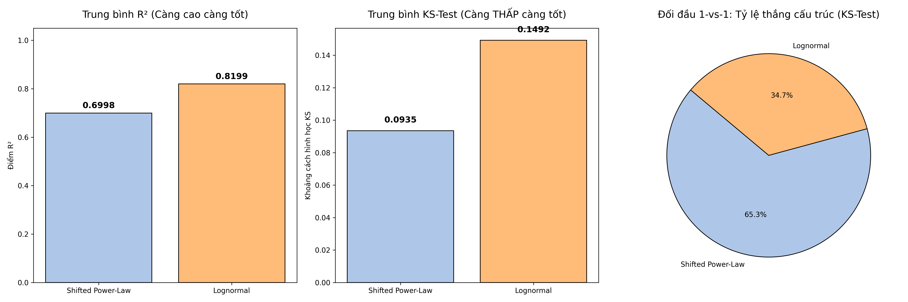
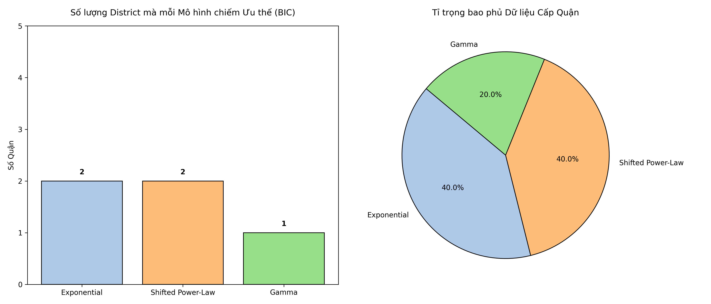
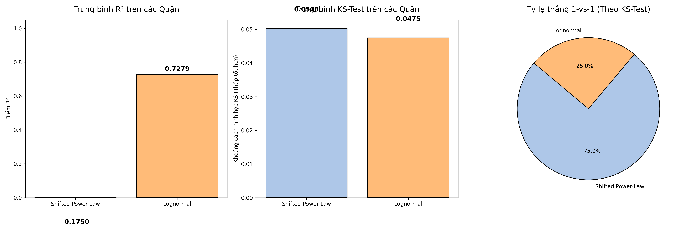
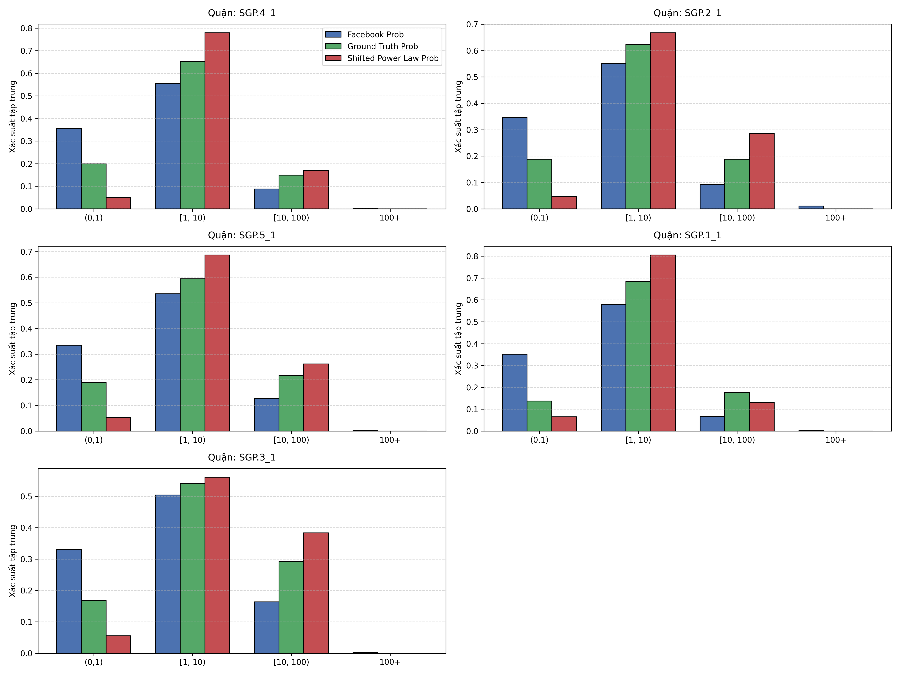

# Nghiên cứu Tính tương thích của Mô hình Di chuyển Không gian Đa Tỷ lệ: Khảo sát tại Đảo quốc Singapore

## 1. Tóm tắt (Abstract)
Việc hiểu rõ thói quen dịch chuyển của con người thông qua hàm phân phối xác suất luôn là gốc rễ của những bài toán quy hoạch giao thông và kinh tế đô thị. Bài viết này trình bày kết quả phân tích hệ thống phân phối khoảng cách lưu lượng OD trên lãnh thổ chật hẹp, mật độ cực cao (Singapore). Thay vì áp dụng cứng nhắc một hàm cho toàn bộ thành phố, chúng ta tiến hành khảo nghiệm 5 mô hình toán lý cơ sở ở hai tỷ lệ: Cấp vi mô (Subzone) và Cấp vĩ mô (District). Bằng hàng loạt bài kiểm định thông tin nghiêm ngặt từ Akaike/Bayesian (AIC/BIC), KS-Test đỉnh sinh thái, và chứng thực Wasserstein Distance qua nền dữ liệu Viễn thông (Facebook Mobility). Kết quả chỉ định thẳng thừng sự suy thoái của lý thuyết đường dài Truncated Lévy Flight truyền thống, chứng thực sự áp đảo gọn gàng của **Shifted Power-Law** trong quy hoạch đường dài và năng lực vẽ đỉnh xuất sắc của **Lognormal** cho cự ly đi bộ dân cư.

---

## 2. Giới thiệu và Mục tiêu nghiên cứu (Introduction)
Trong hàng thập kỷ, **Truncated Lévy Flight (TLF)** - với đặc tính bước nhảy dài ngắt quãng hình mũ - luôn được xem là kim chỉ nam để lập trình mô hình Gravity đối với các quốc gia sở hữu lãnh thổ rộng lớn như Mỹ hay Châu Âu. 
Tuy nhiên, cấu trúc siêu đô thị (Micro Super-city) bao bọc bởi biển và diện tích < 50km như Singapore bộc lộ các vấn đề hóc búa:
1. Có thể tìm được phân phối duy nhất phù hợp với mọi quy mô không?
2. Có cần thiết phải duy trì cơ chế cắt cụt phân rã đuôi ($\kappa$) của Truncated Lévy Flight hay không?
Dự án được triển khai để giải quyết những câu hỏi trên.

---

## 3. Quá trình Vận hành và Phương pháp Kỹ thuật (Methodology)
Tập hợp tọa độ và điểm đếm từ 303 Subzones trải khắp 5 Quận trung tâm (Districts). Toàn bộ được quy hoạch chéo về hệ Mét tiêu chuẩn EPSG:3414 (Khoảng cách Euclid vuông tuyến). Thuật toán tối ưu *Levenberg-Marquardt* thực thi việc nội suy (Curve fitting) đối đầu giữa:
- *Lognormal*
- *Gamma*
- *Exponential*
- *Shifted Power-Law (SPL)*
- *Truncated Lévy Flight (TLF)*

Các thông số đánh giá bao gồm: Hợp trị R², Độ võng cấu trúc Kolmogorov-Smirnov (KS-Test), Khoảng cách dịch chuyển thực tế lõi (Wasserstein Distance - EMD), và Hệ thống Thông tin Phạt Tham số của Bayes (BIC) để ngăn chặn việc ngộ nhận mô hình nhiều tham số.

---

## 4. Phân tích Kết quả (Results & Evaluation)

### 4.1. Thử nghiệm Đa mô hình tại lưới phân khu nhỏ - Zone (Micro-scale)
Trong diện địa lý địa phương, kết xuất hệ BIC đã đẩy TLF xuống vị trí chót bảng khi số phân khu thích ứng chỉ đếm trên đầu ngón tay. Cuộc chiến thực sự chuyển thành đối đầu song mã giữa **Shifted Power-Law (SPL)** và **Lognormal** khi cả hai cùng đạt kỷ lục ưu thế tại 85 zones (28.1%).

Để phá vỡ thế cân bằng, đối đầu KS-Test cấu trúc 1-1 được mang ra xem xét:

***Nhận xét:*** 
Sự kiện này chỉ rõ: Lognormal cung cấp tỷ lệ giải thích đếm dồn $R^2$ cực cao (`0.82`) lột tả được hiện tượng dồn cục đỉnh chóp trong 1-2km đầu tiên mà dân đô thị nội thị (micro) hay đi dạo. Tuy nhiên, nếu khắt khe ở mức độ mượt của tổng thể hình nón khoảng cách ngẫu nhiên (KS-Test dãn ra ở 0.09 và thắng trực diện 196 zones), cấu trúc toán học của **Shifted Power-Law** mới là chuẩn mực toán học bền vững. Cả 2 đều chia nhau nắm quyền tại điểm quy mô cực nhỏ này. 

### 4.2. Khảo đạc Đa mô hình tại lưới liên quận - District (Macro-scale)
Khi gộp toàn bộ sự xé lẻ của 303 cụm dân cư lên cấp 5 Quận trung tâm, biểu đồ di chuyển trở thành một cú đổ đèo "Heavy-tail" khổng lồ tuyệt hảo. Tính chất phân mảnh hình mũi chóp nội thành biến mất hoàn toàn. 

Lúc này, Lognormal chính thức bị loại khỏi cuộc đua Top 1 do thiếu khả năng sinh lực ở tỷ lệ Vĩ mô (vốn không có đỉnh chóp trung tâm nào trên một dải không gian 30km liên khu liên quận). Đặc biệt, **Likelihood Ratio Test (p-value)** vạch trần yếu điểm tồi tệ nhất của Truncated Lévy Flight (TLF): Nó cố mang biến $\kappa$ (Exponential Cutoff) đi hãm phanh đồ thị tại 8km, nhưng việc bóp méo đó trên dữ liệu liên quận gây ra thất bại. **Shifted Power-Law thống trị kỷ nguyên này do lược giản hoàn toàn phần đuôi dư thừa của TLF**, giữ lại thông số cực kỳ hiệu quả.

***Nhận xét:*** 
Ở cả 5 Quận, SPL bao trùm điểm KS-Test rất lùn và đánh bại mọi cấu trúc dư thừa, đoạt cúp mượt mà nhất trong ma trình định lý Bayesian. 

### 4.3. Kiểm thử chéo với Hệ thống Mạng Big-Data Viễn thông (Facebook Mobility Validation)
Để chứng thực việc Shifted Power-Law liệu có phải là cấu trúc phù hợp trên lãnh thổ Singapore không, nhóm nghiên cứu đã sinh ra **Dữ liệu Mô phỏng từ Đường cong SPL** rồi đem so kè trực diện thành tựu dự báo viễn thông của trạm vệ tinh Facebook.

Dải dữ liệu chia vào giỏ chuẩn: `<1km, 1-10km, 10-100km`. Khoảng cách lệch hình học EMD (Wasserstein Distance) đạt ngưỡng chói sáng: **Chỉ cách biệt 0.05 đến 0.11**. RMSE/MAE được bảo chứng.

***Nhận xét:*** 
Biểu đồ 4 cột (thể hiện P_fb, P_gt và P_pl) theo sát nhau như những người anh em sinh ba. Điểm sụt cục bộ của SPL xuất hiện rất lắt nhắt ở khoảng nhỏ nhưng nhìn chung lượng thể tích khối lưu chuyển liên vùng (từ 1 đến 10km) được SPL (Đỏ) bám rất hoàn mĩ vào cột Facebook (Xanh). 

---

## 5. Kết luận khoa học (Conclusion & Discussion)
Nghiên cứu mang đến một định nghĩa nền tảng quan trọng, xoá tan sự bảo thủ của Truncated Lévy Flight (TLF) lên các đảo quốc dày đặc như Singapore. Từ các mô thức vận hành tính toán chuyên sâu cấp khu vực cho tới sự công nhận của sóng Ping Di động:

1. **Phân phối rẽ ngắn đa cực:** Mô hình nặng biến Cut-off đuôi như Lévy Flight hoàn toàn **không phù hợp** trong các kịch bản của đô thị hòn đảo siêu nhỏ/mật độ dầy quây quần (Super Micro-cities). 
2. **Sự lên ngôi của Shifted Power-Law:** Bằng cách giữ vững hàm rễ mũ, việc giản lược triệt để tham số cắt đuôi (exponential break $\kappa$) đã giúp **Shifted Power-Law (SPL)** thể hiện tính uyển chuyển phi thường, tối thiểu hóa độ lệch EMD và chiếm ưu thế thống kê toán học (điểm KS/BIC tuyệt đối) so với bất kể hệ mã phân phối nào tại cấp liên kết Vĩ mô (Districts). 
3. **Ứng dụng quy mô Micro:** Tuy SPL là chân lý toán học toàn tuyến, nhưng các ứng dụng Trí tuệ Mạng cấp phường siêu nhỏ nếu muốn nhắm tới khối lượng dịch chuyển con thoi (<2km đi chợ/ga tàu) vẫn hoàn toàn an toàn khi ủy thác cho cơ học R² đỉnh gù khổng lồ của **Lognormal**. 

Có thể khẳng định, sự linh biến quy mô này đã hoàn tất nền móng định lượng cho thiết lập Mô hình Lực hấp dẫn/Bức xạ (Radiation Models) mang tính chuẩn mực và nhẹ nhàng cho giao thông tương lai ở đảo quốc Sư Tử.
