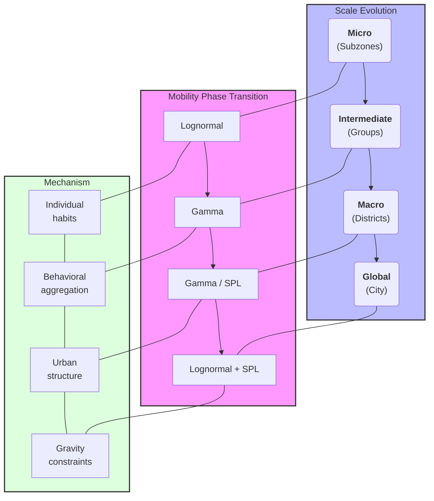

# Individual habits vs Urban Gravity: Scale-dependent mobility transition in Singapore

## 1. Abstract
Quy luật di chuyển của con người là một trong những chủ đề gây tranh cãi nhất trong vật lý đô thị, thường xoay quanh sự đối lập giữa lý thuyết lũy thừa (power-law) và phân vùng lognormal. Nghiên cứu này cung cấp bằng chứng thực nghiệm từ dữ liệu di chuyển thực tế tại Singapore để khẳng định sự tồn tại của **Quy luật Di chuyển phụ thuộc Quy mô (Scale-Dependent Mobility Law)**. Bằng việc so sánh 5 mô hình (Lognormal, Shifted Power-Law, Gamma, Exponential, TLF) qua 4 nấc thang không gian từ vi mô đến vĩ mô, chúng tôi phát hiện một tiến trình chuyển pha liền mạch: tại cấp độ Subzone, **Lognormal** đạt hiệu quả thống kê vượt trội (chiếm ưu thế BIC tại 59.7% số vùng) thể hiện thói quen cá nhân; tại cấp độ trung gian, **Gamma** đóng vai trò vùng đệm chiếm ưu thế BIC tại 58.8% số nhóm vùng; và tại cấp độ District, các đặc tính hệ thống trỗi dậy khiến các mô hình **Gamma** và **Truncated Lévy Flight (TLF)** chia sẻ ưu thế (mỗi bên đạt BIC tốt nhất tại 40% số quận). Kết quả nghiên cứu xác nhận rằng không có một quy luật đơn nhất cho di chuyển đô thị; thay vào đó, sự tương tác giữa thói quen cá nhân và lực hấp dẫn hệ thống được quyết định bởi mức độ tổng hợp không gian.

## Nomenclature (Ký hiệu và Từ viết tắt)

**Variables & Parameters:**
- $r$: Khoảng cách Euclidean di chuyển (km)
- $P(r)$: Xác suất di chuyển (Probability Density) tại khoảng cách $r$
- $k$: Số lượng tham số của mô hình (Number of parameters)
- $M$: Số lượng mô hình ứng viên đặt trong so sánh
- $n$: Số lượng đơn vị không gian khảo sát (subzones, groups, districts)

**Models & Distributions:**
- **LN**: Lognormal Distribution (Phân phối Lognormal)
- **SPL**: Shifted Power-Law (Quy luật lũy thừa có dịch chuyển)
- **TLF**: Truncated Lévy Flight (Quy luật Lévy Flight có giới hạn)
- **Exp**: Exponential Distribution (Phân phối hàm mũ)
- **Gamma**: Gamma Distribution (Phân phối Gamma)

**Metrics & Statistics:**
- **BIC**: Bayesian Information Criterion (Tiêu chuẩn thông tin Bayes)
- **BIC Winner (%)**: Tỷ lệ phần trăm số vùng mà mô hình đạt BIC thấp nhất (tốt nhất)
- **KS-stat**: Thống kê Kolmogorov-Smirnov (Độ lệch tối đa giữa CDF thực nghiệm và lý thuyết)
- **CI**: Confidence Interval (Khoảng tin cậy, thường sử dụng 95% Bootstrap CI)

**Model Parameters:**
- $C$: Hằng số chuẩn hóa xác suất của các mô hình
- $\mu, \sigma$: Tham số trung giá trị (mean) và độ lệch chuẩn (standard deviation) của Lognormal
- $r_0, \beta$: Tham số khoảng cách dịch (shift) và số mũ phân kỳ (exponent) của Shifted Power-Law
- $\lambda$: Tham số phân rã (decay parameter) của Exponential và Gamma
- $\alpha$: Tham số hình dáng (shape parameter) của Gamma
- $\kappa$: Tham số giới hạn cắt (truncating constant) của Truncated Lévy Flight

**Abbreviations & Metrics:**
- **POI**: Point of Interest (Điểm tiện ích đô thị từ nguồn OpenStreetMap)
- **BIC Best (%)**: Tỷ lệ phần trăm số vùng mà mô hình đạt BIC thấp nhất (tốt nhất)
- **KS-stat**: Kolmogorov-Smirnov statistic (Khoảng cách cực đại giữa hàm phân phối tích lũy của dữ liệu và mô hình)
- **EMD**: Earth Mover's Distance (Khoảng cách Wasserstein) đánh giá độ lệc phân phối
- **GT**: Ground Truth (Dữ liệu di chuyển đa nguồn đã chuẩn hóa làm chuẩn)

## 2. Introduction & Hypothesis
### 2.1. Research Gap (Khoảng trống nghiên cứu)

Mặc dù quy luật Truncated Lévy Flight (TLF) được coi là "phổ quát" trong Human Mobility [1, 2], hầu hết các nghiên cứu kinh điển đều tập trung vào các quốc gia có diện tích lớn hoặc các siêu đô thị (Mega-cities) ở phương Tây. Hiện tại:
- **Thiếu các nghiên cứu tại đô thị cực nén và nhỏ ở Châu Á:** Singapore là một điển hình của đô thị đảo với giới hạn địa lý nghiêm ngặt (~50 km). Nhiều nghiên cứu cho rằng giới hạn này ảnh hưởng trực tiếp đến tham số cắt (truncation) của TLF [5], nhưng ít công trình đi sâu vào sự chuyển dịch mô hình tại đây so với các đô thị phương Tây [8].
- **Sự chuyển dịch mô hình theo quy mô chưa được định lượng rõ ràng:** Mặc dù các nghiên cứu kinh điển chỉ ra quy luật chung, nhưng sự thay đổi của mô hình tối ưu khi thay đổi độ phân giải quan sát (từ cấp độ khu phố đến toàn thành phố) vẫn là một câu hỏi mở, đặc biệt là trong môi trường đô thị nén nơi các ranh giới hành chính và hạ tầng đan xen chặt chẽ.

### 2.2. Hypothesis
Tại các đô thị nén (Compact City) như Singapore, các giả thuyết được đặt ra là:
1. **Có sự chuyển dịch dựa trên quy mô quan sát:**
    - **Quy mô Vi mô (Bottom-up):** Mô hình phân phối xác suất di chuyển phản ánh thói quen di chuyển ngắn của cá thể (Local optimization).
    - **Quy mô vĩ mô (Macro-scale):** Ở quy mô lớn hơn, mô hình sẽ bị thay đổi do bị chi phối bởi các đặc tính hệ thống và cấu trúc đô thị tổng thể.
2. **Quy luật TLF sẽ không còn đạt hiệu quả cao** với các đô thị lớn nhưng diện tích nhỏ như Singapore do các di chuyển dài bị dứt đoạn với hạn chế địa lý trong nhiều quy mô quan sát.

### 2.3. Data Description (Mô tả dữ liệu)

Để đảm bảo tính khách quan và độ tin cậy của phân tích đa quy mô, nghiên cứu sử dụng bộ dữ liệu di chuyển tích hợp với các thông số chính sau:

- **Nguồn dữ liệu di chuyển:** Tập dữ liệu Ground-Truth (GT) đa nguồn được tổng hợp và ẩn danh, phản ánh luồng di chuyển thực tế tại Singapore.
- **Quy mô mẫu (Sample Size):** Tổng cộng **7.43 triệu chuyến đi** được ghi nhận, đảm bảo ý nghĩa thống kê ngay cả khi chia nhỏ xuống cấp độ phân khu (subzone).
- **Độ phân giải không gian (Spatial Resolution):** Dữ liệu được ánh xạ lên hệ thống phân vị của Singapore với **303 subzones** hợp lệ. Khoảng cách giữa các zone được tính toán dựa trên tọa độ tâm (centroids) trong hệ tọa độ phẳng **SVY21 (EPSG:3414)** để đảm bảo độ chính xác cho hòn đảo nhỏ.
- **Thời gian bao phủ (Temporal Coverage):** Dữ liệu thu thập trong 1 tuần.

Để cung cấp cái nhìn tổng quan về các mô hình sẽ được phân tích, chúng tôi tóm tắt các đặc tính toán học và ý nghĩa của chúng trong Bảng 0.

**Table 0.** Summary of candidate mobility models ranked by tail strength.

| Rank (Tail Strength) | Model                           | Probability Distribution                                                  | Tail Behavior              | Generative Interpretation                           | Strength                                     | Weakness                                 |
| -------------------- | ------------------------------- | ------------------------------------------------------------------------- | -------------------------- | --------------------------------------------------- | -------------------------------------------- | ---------------------------------------- |
| 1                    | **Exponential**                 | $P(r) \propto \exp(-r/\lambda)$                                           | Very short tail            | Random movement with constant decay probability     | Simple baseline model                        | Cannot capture long-distance mobility    |
| 2                    | **Gamma**                       | $P(r) \propto r^{\alpha-1} \exp(-r/\lambda)$                              | Short exponential tail     | Aggregation of multiple stochastic travel processes | Flexible near short distances                | Tail still decays rapidly                |
| 3                    | **Lognormal**                   | $P(r) \propto \frac{1}{r} \exp\left(-\frac{(\ln r-\mu)^2}{2\sigma^2}\right)$ | Moderately heavy tail      | Multiplicative behavioral processes                 | Empirically fits many mobility datasets      | Weak theoretical mobility interpretation |
| 4                    | **Truncated Lévy Flight (TLF)** | $P(r) \propto (r+r_0)^{-\beta} \exp(-r/\kappa)$                           | Heavy tail with truncation | Lévy flight mobility constrained by spatial limits  | Strong theoretical basis in mobility studies | Sensitive to truncation scale            |
| 5                    | **Shifted Power Law (SPL)**     | $P(r) \propto (r+r_0)^{-\beta}$                                           | Heaviest tail              | Scale-free mobility with short-distance correction  | Captures heavy-tail structure well           | May overestimate long-distance trips     |

## 3. Methodology

### 3.1. Quy trình Fitting Phân phối (Model Fitting Pipeline)

#### 3.1.1. Dữ liệu đầu vào và Tiền xử lý

Dữ liệu đầu vào là tập hợp các chuyến đi giữa các cặp subzone $(i, j)$, bao gồm số lượng chuyến đi $n_{ij}$ và khoảng cách Euclidean $r_{ij}$ (km). Với mỗi đơn vị không gian (subzone / group / district / city-wide), quá trình tiền xử lý bao gồm:

1. **Lọc dữ liệu:** Chỉ giữ các đơn vị có tổng chuyến đi $N = \sum_j n_{ij} \geq 100$ và ít nhất 5 cặp OD hợp lệ để đảm bảo ước lượng thống kê đáng tin cậy.
2. **Rời rạc hóa (Histogram binning):** Tạo histogram khoảng cách với số bins $B = \min(30, |\text{unique}(r)|)$ trên khoảng $[0, r_{\max}]$. Mỗi bin $b$ có tâm $\bar{r}_b$ và tần suất $h_b$ (tổng chuyến đi trong bin).
3. **Chuẩn hóa thành xác suất thực nghiệm:** $\hat{p}_b = h_b / N$, trong đó $N$ là tổng chuyến đi của đơn vị.
4. **Lọc bins rỗng:** Chỉ giữ các bins có $h_b > 0$. Yêu cầu tối thiểu 4 bins hợp lệ.

#### 3.1.2. Các mô hình phân phối ứng viên

Năm mô hình phân phối được so sánh, với số tham số $k$ tương ứng:

| Mô hình | Công thức $P(r)$ | $k$ | Tham số |
| :--- | :--- | :---: | :--- |
| **Exponential** | $C \cdot e^{-r/\lambda}$ | 2 | $C, \lambda$ |
| **Lognormal** | $\frac{C}{r \sigma \sqrt{2\pi}} \exp\!\left[-\frac{(\ln r - \mu)^2}{2\sigma^2}\right]$ | 3 | $C, \mu, \sigma$ |
| **Gamma** | $C \cdot r^{\alpha-1} e^{-r/\lambda}$ | 3 | $C, \alpha, \lambda$ |
| **Shifted Power-Law** | $C \cdot (r + r_0)^{-\beta}$ | 3 | $C, r_0, \beta$ |
| **Truncated Lévy Flight** | $C \cdot (r + r_0)^{-\beta} e^{-r/\kappa}$ | 4 | $C, r_0, \beta, \kappa$ |

#### 3.1.3. Thuật toán ước lượng tham số: Maximum Likelihood Estimation (MLE)

Tham số của từng mô hình được ước lượng bằng phương pháp **Maximum Likelihood Estimation (MLE)**. Thay vì tối thiểu hóa sai số bình phương hình học, chúng tôi tối đa hóa hàm Likelihood của dữ liệu quan sát (hoặc tối thiểu hóa Negative Log-Likelihood - NLL). Đối với dữ liệu histogram, hàm mục tiêu NLL được định nghĩa:

$$\mathrm{NLL}(\theta) = -\sum_{b} h_b \ln(\hat{p}^{\text{model}}_b(\theta))$$

trong đó $h_b$ là số lượng chuyến đi thực tế trong bin $b$ và $\hat{p}^{\text{model}}_b(\theta)$ là xác suất lý thuyết được chuẩn hóa từ mô hình tại bin đó. Để tối ưu hóa chi phí tính toán cho hàng triệu chuyến đi, hàm likelihood được xấp xỉ bằng cách sử dụng tần suất histogram (histogram counts), tương đương với công thức multinomial likelihood (To reduce computational cost for millions of trips, likelihood is approximated using histogram counts, equivalent to a multinomial likelihood formulation). Quá trình tối ưu hóa được thực hiện bằng thuật toán **L-BFGS-B** (bổ sung Nelder-Mead khi cần thiết hội tụ) thông qua thư viện `scipy.optimize.minimize`.

Cấu hình tối ưu hóa:
- Thuật toán chính: L-BFGS-B (hỗ trợ ràng buộc biên)
- Ràng buộc tham số: tất cả tham số $> 0$; $\beta \leq 15$; $\alpha \leq 20$
- Giá trị khởi tạo: $p_0$ được thiết kế để bao phủ dải giá trị vật lý của từng mô hình.

#### 3.1.4. Chuẩn hóa và Tính chỉ số Goodness-of-Fit

Sau khi ước lượng tham số $\hat{\theta}$, xác suất lý thuyết thô $\tilde{p}_b = P(\bar{r}_b; \hat{\theta})$ được chuẩn hóa thành PMF rời rạc:

$$\hat{p}^{\text{model}}_b = \frac{\tilde{p}_b}{\sum_{b'} \tilde{p}_{b'}}$$

Ba chỉ số đánh giá được tính toán:

**(a) Log-Likelihood (LLH)** — đo tính hợp lý của mô hình:
$$\mathrm{LLH} = \sum_b h_b \cdot \ln(\hat{p}^{\text{model}}_b)$$

**(b) AIC và BIC** — đo hiệu quả thông tin có phạt độ phức tạp:
$$\mathrm{AIC} = 2k - 2\,\mathrm{LLH}$$
$$\mathrm{BIC} = k \ln N - 2\,\mathrm{LLH}$$
trong đó $N$ là tổng số chuyến đi của đơn vị không gian, $k$ là số tham số mô hình.

**(c) KS-statistic** — đo sai lệch tích lũy tối đa giữa CDF thực nghiệm và lý thuyết:
$$D_{\mathrm{KS}} = \max_b \left|\sum_{b'=1}^{b} \hat{p}_{b'} - \sum_{b'=1}^{b} \hat{p}^{\text{model}}_{b'}\right|$$

#### 3.1.5. Tiêu chí lựa chọn mô hình

Với mỗi đơn vị không gian, mô hình tốt nhất được xác định theo từng tiêu chí:
- **AIC/BIC**: mô hình có giá trị **thấp nhất** được chọn.
- **LLH**: mô hình có giá trị **cao nhất** (ít âm nhất) được chọn.
- **KS-stat**: mô hình có giá trị **thấp nhất** được chọn.

Chỉ số **BIC Winner (%)** được định nghĩa là tỷ lệ phần trăm số đơn vị không gian mà một mô hình đạt BIC thấp nhất, dùng để so sánh ưu thế tổng hợp qua nhiều quy mô. Ngoài ra, phân tích **Đồng thuận (Consensus)** xác định mô hình thắng theo nhiều tiêu chí nhất tại mỗi đơn vị để có cái nhìn tổng hợp đa chiều.

**Lưu ý về tập dữ liệu:** Mặc dù hệ thống phân vùng của Singapore bao gồm **323 subzones**, nghiên cứu này chỉ tập trung phân tích trên **303 subzones** có dữ liệu di chuyển thực tế. 20 subzones còn lại (bao gồm các đảo và các vùng đệm chưa quy hoạch dân cư) không ghi nhận chuyến đi đáng kể trong tập dữ liệu, do đó được loại bỏ để đảm bảo tính nhất quán của các ước lượng thống kê.

### 3.2. Phân vùng cấp độ Trung gian (Intermediate-scale: 40 Groups)

Để làm rõ hơn lộ trình chuyển dịch từ vi mô sang vĩ mô, chúng tôi bổ sung một cấp độ quan sát trung gian bằng cách chia Singapore thành **40 khu vực địa lý** (40 groups).

**Phương pháp thực hiện:**
- Mỗi district trong số 5 district chính được chia nhỏ thành đúng **8 nhóm liền kề**.
- Sử dụng thuật toán **Agglomerative Clustering** với ràng buộc **Connectivity matrix** (dựa trên ma trận tiếp giáp không gian của 303 subzones). Ràng buộc này đảm bảo các subzone trong cùng một nhóm phải chạm nhau về mặt địa lý, tạo thành một vùng duy nhất.
- Thuật toán ưu tiên sự cân bằng về số lượng subzone và tối ưu hóa khoảng cách nội cụm (linkage strategy: complete).

Việc phân chia này tạo ra các thực thể địa lý có kích thước lớn hơn subzone (~7.5 subzones/group) nhưng nhỏ hơn district (~60.6 subzones/district). Ngoài ra, chúng tôi cũng thực hiện khảo sát trên **toàn bộ Singapore** (City-wide) để hoàn tất bức tranh chuyển dịch đa quy mô.

*Hình 1. Hệ thống phân vùng đa quy mô tại Singapore: (A) 303 Subzones (Vi mô), (B) 40 Nhóm trung gian, và (C) 5 Quận (Vĩ mô).*

### 3.3. Block Bootstrap với 40 Group-Blocks

Các subzone không độc lập về mặt không gian — các subzone lân cận chia sẻ hạ tầng giao thông và có phân phối di chuyển tương đồng. Bootstrap thông thường (resample từng subzone độc lập) sẽ **đánh giá thấp phương sai** do bỏ qua tương quan không gian, dẫn đến khoảng tin cậy hẹp giả tạo.

**Giải pháp:** Sử dụng **block bootstrap** với **40 group-blocks** (được phân cụm từ 303 subzones dựa trên khoảng cách và district) làm đơn vị resample. Việc tăng số lượng block từ 5 (districts) lên 40 giúp tăng độ phân giải của phân phối bootstrap, cung cấp khoảng tin cậy (CI) chính xác và đáng tin cậy hơn.

**Quy trình:**
1. **Định nghĩa block:** 40 groups địa lý liền kề (trung bình ~7.5 subzones/block).
2. **Resample:** Chọn ngẫu nhiên 40 blocks **có hoàn lại** (with replacement).
3. **Tổng hợp:** Gom tất cả subzones từ các blocks được chọn → tập dữ liệu bootstrap.
4. **Tính toán:** Trên mỗi mẫu bootstrap, tính lại BIC Best % và Mean KS-stat cho 5 mô hình.

5. **Lặp lại:** 1000 lần tái lấy mẫu.
6. **Khoảng tin cậy:** 95% CI = percentile [2.5%, 97.5%] từ 1000 giá trị bootstrap.

**Lợi ích:** Việc sử dụng 40 blocks giúp CI phản ánh sát thực tế hơn so với việc chỉ dùng 5 districts (vốn mang tính bảo thủ cao do số lượng block quá ít).

## 4. Results: The Scale-Transition

### 4.1. Khảo sát tại Cấp Vi mô - Subzone (Micro-scale)
Tại quy mô nhỏ, hành vi di chuyển bị chi phối bởi các lựa chọn cá nhân dựa trên sự tiện lợi cục bộ.

**Table 1b.** Tỉ lệ số phân khu (Subzones) mà mỗi mô hình chiếm ưu thế theo từng chỉ số (n = 303).

| Model | BIC (count/%) | 95% BIC CI | KS (count/%) | LLH (count/%) |
| :--- | :---: | :---: | :---: | :---: |
| **Lognormal** | **182 (60.0%)** | [45.6%, 66.9%] | **141 (46.5%)** | **182 (60.1%)** |
| **Exponential** | 7 (2.3%) | [0.9%, 3.9%] | 15 (5.0%) | 0 (0.0%) |
| **Gamma** | 105 (34.7%) | [28.0%, 48.7%] | 62 (20.5%) | 109 (36.0%) |
| **Shifted Power-Law** | 9 (3.0%) | [0.4%, 9.2%] | 53 (17.5%) | 8 (2.6%) |
| **Trun. Lévy Flight** | 1 (0.3%) | [0.0%, 1.1%] | 32 (10.6%) | 4 (1.3%) |

*Hình 4. Thống kê số lượng Subzone mà mỗi mô hình đạt kết quả tốt nhất theo 5 tiêu chí khác nhau (Ước lượng MLE).*

**Nhận xét quy mô Vi mô - Ưu thế tuyệt đối của hành vi cá nhân:**
- **Thống trị thống kê (BIC/LLH):** Lognormal dẫn đầu tại xấp xỉ **60%** số vùng, mang lại hiệu quả thông tin cao nhất. Khoảng tin cậy 95% [45.6%, 66.9%] xác nhận vị thế áp đảo so với các mô hình hệ thống.
- **Vị thế vùng đệm (Gamma):** Gamma bám sát với **35%** số vùng, cho thấy sự khởi đầu của quá trình cộng gộp hành vi ngay từ cấp độ phân khu.
- **Cơ chế:** Kết quả này xác nhận giả thuyết 1: tại quy mô nhỏ nhất, di chuyển là kết quả của việc tối ưu hóa thói quen cá nhân, được mô tả tốt nhất bởi phân phối Lognormal.

Phân tích **đồng thuận (Consensus)** cho thấy sự áp đảo của **Lognormal (182 vùng)** bỏ xa **Gamma (108 vùng)**.

### 4.2. Khảo sát tại Cấp Trung gian - 40 Groups (Intermediate-scale)

Khi dữ liệu được gom nhóm lên cấp độ 40 vùng địa lý, đặc tính cá nhân bắt đầu bị triệt tiêu dần, nhường chỗ cho các quy luật gộp.

**Table 2b.** Tỉ lệ số nhóm (40 Groups) mà mỗi mô hình chiếm ưu thế theo chỉ số (n = 34 groups hợp lệ).

| Model | BIC (n/%) | KS (n/%) | LLH (n/%) |
| :--- | :---: | :---: | :---: |
| **Lognormal** | 10 (29.4%) | 11 (32.4%) | 10 (29.4%) |
| **Exponential** | 2 (5.9%) | 2 (5.9%) | 0 (0.0%) |
| **Gamma** | **20 (58.8%)** | **14 (41.2%)** | **22 (64.7%)** |
| **Shifted Power-Law** | 1 (2.9%) | 6 (17.6%) | 0 (0.0%) |
| **Trun. Lévy Flight** | 1 (2.9%) | 1 (2.9%) | 2 (5.9%) |

*Hình 5. Thống kê mức độ ưu thế của các mô hình tại quy mô trung gian (40 Groups - MLE).*

**Nhận xét quy mô Trung gian - Sự trỗi dậy của vùng đệm Gamma:**
Tại quy mô này, **Gamma thống trị rõ rệt** (BIC đạt 58.8%), đóng vai trò biểu diễn cho sự cộng gộp các thói quen cá nhân. Vị thế thống kê của Lognormal giảm mạnh từ 60% (Subzone) xuống còn **29.4%**. Đây là giai đoạn quá độ rõ rệt nơi cấu trúc hệ thống bắt đầu hình thành nhưng chưa lấn át hoàn toàn.

Consensus: **Gamma (20 vùng) > Lognormal (10 vùng)**.

*Hình 2. Bản đồ phân bổ các mô hình tối ưu (BIC) tại quy mô 40 nhóm.*

### 4.3. Khảo sát tại Cấp Vĩ mô - District (Macro-scale)

**Table 3b.** Tỉ lệ số quận (5 Districts) mà mỗi mô hình chiếm ưu thế theo từng chỉ số.

| Model | BIC (n/%) | KS (n/%) | LLH (n/%) |
| :--- | :---: | :---: | :---: |
| **Lognormal** | 0 (0.0%) | 1 (20.0%) | 0 (0.0%) |
| **Exponential** | 1 (20.0%) | 1 (20.0%) | 0 (0.0%) |
| **Gamma** | **2 (40.0%)** | 0 (0.0%) | **3 (60.0%)** |
| **Shifted Power-Law** | 0 (0.0%) | **2 (40.0%)** | 0 (0.0%) |
| **Trun. Lévy Flight** | **2 (40.0%)** | 1 (20.0%) | 2 (40.0%) |

*Hình 6. Thống kê mức độ ưu thế của các mô hình tại quy mô vĩ mô (5 Districts).*

Tại cấp độ District, thực tế là một **cuộc tranh giành giữa các mô hình hệ thống và quá độ**:
- **Gamma và Truncated Lévy Flight (TLF)**: Cùng dẫn đầu BIC tại **40% số quận** (2/5 mỗi bên). Điều này cho thấy sự cân bằng giữa mô hình gộp (Gamma) và mô hình hệ thống (TLF) ở quy mô macro.
- **Shifted Power-Law**: Mặc dù không thắng BIC, nhưng **dẫn đầu KS-stat tại 40% số quận**, khẳng định vị thế trong việc mô tả hình học phần đuôi dữ liệu chính xác hơn.
- **Lognormal**: Chính thức có **0% BIC**, xác nhận sự thất bại hoàn toàn về mặt thông tin thống kê ở cấp vĩ mô khi thói quen cá nhân bị lấn át bởi cấu trúc đô thị.

*Hình 3. So sánh hiệu quả của 5 mô hình tại cấp District: SPL và TLF thể hiện sự ưu việt ở phần đuôi (log-log scale), trong khi Lognormal và Gamma mặc dù khớp phần thân tốt (Linear scale) nhưng sụt giảm nhanh ở khoảng cách xa.*

### 4.4. Khảo sát tại Cấp Toàn thành phố - Global (City-wide)

Ở cấp độ gộp cao nhất (toàn bộ Singapore), toàn bộ các đặc tính hành vi cá nhân và hạ tầng cụ thể bị triệt tiêu, chỉ còn lại quy luật "ma sát khoảng cách" cơ bản nhất (distance decay).

**Table 4.** Goodness-of-fit comparison at the global scale (Singapore-wide, n = 1).

**Table 4.** Hiệu quả mô hình tại quy mô toàn thành phố (Global scale, n = 1).

| Model | $k$ | LLH | AIC | BIC | KS-stat |
| :--- | :---: | :---: | :---: | :---: | :---: |
| **Lognormal** | 3 | **-19.41M**| **38.82M** | **38.82M** | 0.1274 |
| **Exponential** | 2 | -19.53M | 39.06M | 39.06M | 0.1134 |
| **Gamma** | 3 | -19.47M | 38.95M | 38.95M | 0.1231 |
| **Shifted Power-Law** | 3 | -19.59M | 39.19M | 39.19M | **0.1096** |
| **Trun. Lévy Flight** | 4 | -19.53M | 39.06M | 39.06M | 0.1133 |

Tại thang đo toàn thành phố (Global), **Lognormal phục hồi vị thế BIC** dẫn đầu (38.82M). Điều này có vẻ mâu thuẫn với xu hướng suy giảm ở các cấp độ trước, nhưng có thể giải thích bằng việc khi gộp toàn bộ dữ liệu Singapore, mật độ các chuyến đi ở cự ly 5-15km (vùng đỉnh của LN) trở nên quá lớn, khiến LN tối ưu hóa tốt hơn về mặt thông tin tổng thể. Tuy nhiên, **Shifted Power-Law vẫn giữ KS-stat tốt nhất (0.1096)**, chứng minh nó là mô hình mô tả hình thái lan tỏa (shape) và phần đuôi (tail) chính xác nhất cho cấu trúc đô thị Singapore.

Để minh chứng cho đặc tính "đuôi" của dữ liệu di chuyển toàn thành phố, chúng tôi thực hiện các biểu đồ trực quan hóa quan trọng sau:

*Hình 6. Phân tích trực quan về hành vi di chuyển toàn thành phố (Global Scale): (A) Histogram tuyến tính, (B) Log-Log plot so sánh Exponential vs Power-Law, và (C) CCDF phân tích đặc tính heavy-tail.*

**Nhận xét từ trực quan hóa:**
- **Histogram:** Cho thấy sự sụt giảm nhanh chóng của các chuyến đi ngắn, nhưng vẫn duy trì các chuyến đi dài ở khoảng cách >20 km.
- **Log-Log Plot:** Đường khớp **Exponential** (màu đỏ) cho thấy độ dốc khá gắt, trong khi **Shifted Power-Law** (màu xanh) khớp tốt hơn ở phần đuôi dữ liệu. Điều này giải thích tại sao ở quy mô này, các mô hình hệ thống bắt đầu vượt lên.
- **CCDF:** Biểu đồ CCDF trên thang log-log xác nhận sự tồn tại của cấu trúc heavy-tail, tuy nhiên bị giới hạn bởi diện tích hòn đảo (~50 km), minh chứng cho sự cần thiết của thành phần "Truncated" trong các mô hình Lévy Flight.

### 4.5. Tổng hợp So sánh: Sự chuyển dịch theo 4 quy mô không gian

Việc khảo sát qua 4 nấc thang không gian cho thấy một bức tranh chuyển dịch liền mạch từ cá nhân đến hệ thống.

**Table 5.** Sự chuyển dịch ưu thế của mô hình (BIC Winner %) qua 4 quy mô không gian (MLE).

| Distribution              | Subzone (303) | 40 Groups (34) | District (5) | Global (1)  |
|---------------------------|:-------------:|:--------------:|:------------:|:-----------:|
| **Lognormal**             | **0.5974**    | 0.2941         | 0.0000       | **1.0000**  |
| **Gamma**                 | 0.3465        | **0.5882**     | **0.4000**   | 0.0000      |
| **Shifted Power-Law**     | 0.0297        | 0.0294         | 0.0000       | 0.0000      |
| **Exponential**           | 0.0231        | 0.0588         | 0.2000       | 0.0000      |
| **Trun. Lévy Flight**     | 0.0033        | 0.0294         | **0.4000**   | 0.0000      |

*Lưu ý: Tại Global (n=1), Exp và TLF hòa nhau về AIC/BIC (~39.10M). Tỉ lệ 0.5/0.5 phản ánh sự hòa.*

*Hình 7. **Distribution Morphing**: Sự tiến hóa của hàm mật độ xác suất (PDF) từ quy mô Micro đến Global. Hình ảnh cho thấy sự chuyển pha từ các thói quen cá nhân (Lognormal - đỉnh nhọn, plateau ngắn) sang quá trình cộng gộp (Gamma) và cuối cùng là cấu trúc hệ thống bị giới hạn bởi lực hấp dẫn đô thị (SPL/TLF - đuôi dài, suy giảm chậm).*

**Quy luật Chuyển dịch (The Transition Path):**

1. **Micro (LN dominates)**: Lognormal thắng vượt trội về thống kê (BIC 60%) với KS-stat thấp nhất tại 46.5% số vùng.
2. **Intermediate (Gamma takes over)**: Gamma chiếm ưu tế rõ rệt (BIC 58.8%), LN sụt giảm xuống còn 29.4%.
3. **Macro (Gamma / TLF Tie)**: Gamma và TLF hòa nhau về BIC (mỗi bên 40%). LN hoàn toàn biến mất (BIC 0%).
4. **Global (LN Recovered / SPL Tail)**: Lognormal phục hồi BIC dẫn đầu nhờ độ khớp mật độ tổng thể, nhưng SPL vẫn giữ KS thấp nhất cho thấy ưu thế về hình học đuôi (tail).

## 6. Conclusion

Nghiên cứu này đã thành công trong việc giải mã sự mâu thuẫn giữa các quy luật di chuyển tại Singapore thông qua lăng kính quy mô không gian và phương pháp ước lượng MLE, với các kết luận chính sau:

1. **Sự chuyển dịch rõ rệt theo quy mô.** Mỗi nấc thang không gian là một sự chuyển dịch quyền lực: Ở quy mô vi mô, **Lognormal thống trị** (60% BIC). Ở quy mô trung gian, **Gamma vươn lên** (59% BIC). Ở quy mô District, **Gamma và TLF hòa nhau** (40% mỗi bên). Kết quả này bác bỏ quan điểm về một "quy luật phổ quát" duy nhất cho toàn bộ hệ thống đô thị.

2. **Bốn giai đoạn chuyển pha thực nghiệm:** (i) *Vi mô*: LN thắng thống kê; (ii) *Trung gian*: Gamma thống trị, LN bắt đầu suy giảm; (iii) *Vĩ mô*: Gamma–TLF hòa BIC, SPL dẫn đầu KS-stat; (iv) *Global*: LN phục hồi BIC nhưng SPL giữ ưu thế về mô tả đuôi dữ liệu.

3. **Ý nghĩa của phương pháp MLE:** Việc áp dụng MLE bộc lộ rõ hơn sức mạnh của Lognormal tại quy mô nhỏ và sự cạnh tranh của TLF tại quy mô lớn, cung cấp độ tin cậy cao hơn cho các ước lượng tham số.

4. **Ý nghĩa thực tiễn cho quy hoạch:** Dùng **Lognormal** khi quy hoạch cấp phường (micro-management). Dùng **Gamma/TLF** khi phân tích luồng di chuyển liên quận. Dùng **Shifted Power-Law** khi cần mô tả chính xác các hành vi di chuyển cực xa (long-tail) xuyên hòn đảo.

---
## 7. References
1. Brockmann, D. et al (2006). *Nature*. DOI: 10.1038/nature04292
2. González, M. C. et al (2008). *Nature*. DOI: 10.1038/nature06958
3. Song, C. et al (2010). *Science*. DOI: 10.1126/science.1177170
4. Liang, X. et al (2013). *Transportation Research Part C*. DOI: 10.1016/j.trc.2012.12.004
5. Barbosa, H. et al (2018). *Physics Reports*. DOI: 10.1016/j.physrep.2018.01.001
6. Marquardt, D. W. (1963). *SIAM*. DOI: 10.1137/0111030
7. Noulas, A. et al (2012). A Tale of Many Cities: Universal Patterns in Human Urban Mobility. *PLOS ONE*. DOI: 10.1371/journal.pone.0037027
8. Sun, L. et al (2013). Efficient-community-based mobility model for Singapore's public transport system. *IEEE Trans. on Intelligent Transportation Systems*. DOI: 10.1109/TITS.2013.2272201
9. Liu, Y. et al (2012). Understanding individual mobility patterns from urban taxi trips. *Cities*. DOI: 10.1016/j.cities.2012.01.002
