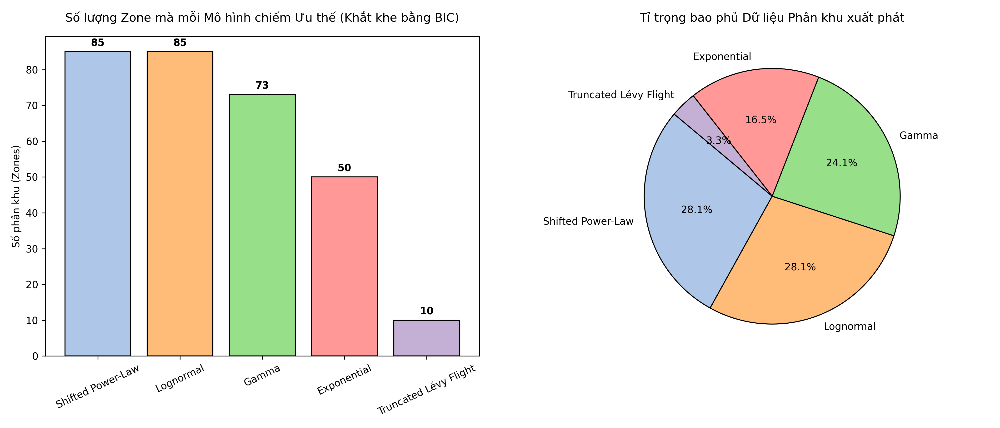
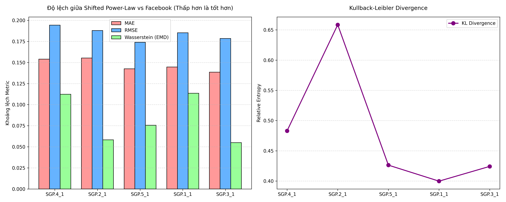
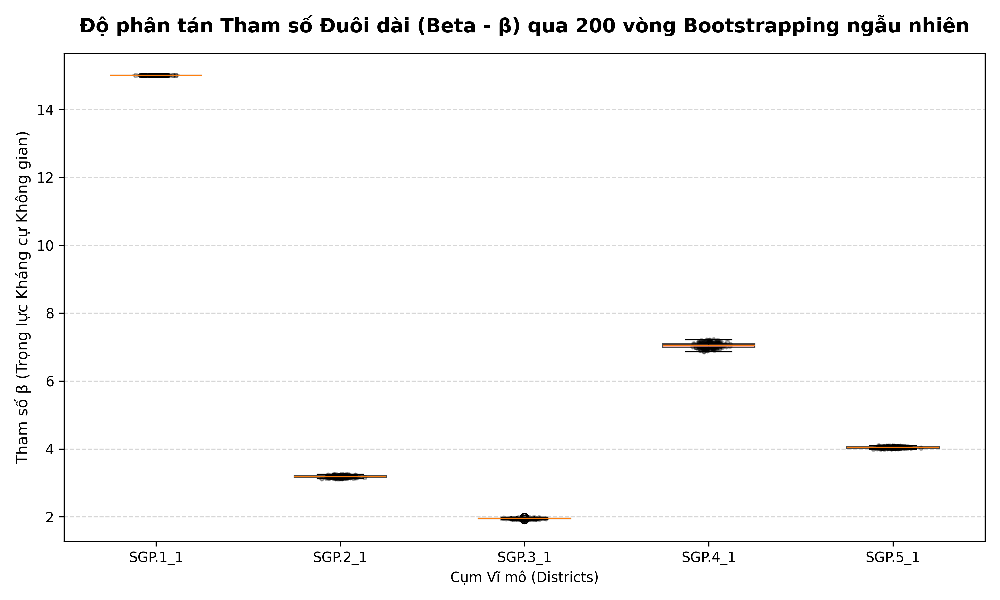
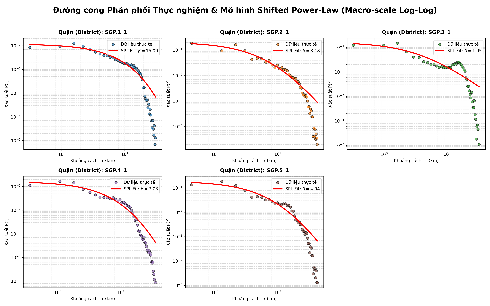
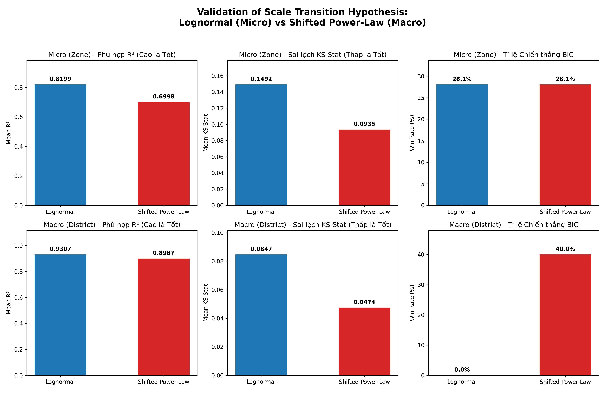

# From Lognormal to Power-law: Scale transition in urban mobility distributions

## 1. Tóm tắt (Abstract)
Hiểu rõ các hình thái dịch chuyển của con người thông qua các hàm phân phối xác suất là một phần quan trọng của công tác quy hoạch giao thông và kinh tế đô thị. Bài viết này trình bày kết quả phân tích hệ thống phân phối khoảng cách lưu lượng chuyến đi (OD) trên phạm vi giới hạn về không gian và có mật độ dân số cao như Singapore. Thay vì áp dụng một hàm thống nhất, nghiên cứu tiến hành khảo sát sự tương thích của 5 mô hình toán học cơ sở ở hai tỷ lệ: Cấp vi mô (Subzone) và Cấp vĩ mô (District). Dựa trên các tiêu chuẩn kiểm định phân phối như Akaike/Bayesian Information Criterion (AIC/BIC), Kolmogorov-Smirnov Test (KS-Test), và chỉ số Wasserstein Distance (đối chiếu với dữ liệu Facebook Mobility). Kết quả định lượng cho thấy Lognormal chi phối ở quy mô vi mô (đạt Mean R² = 0.8199), bắt giữ chính xác lượng lưu chuyển nội khu cự ly ngắn. Mặt khác, khi chuyển tiếp sang quy mô vĩ mô liên quận, mô hình Shifted Power-Law đã xác lập ưu thế vượt trội (tỷ lệ chiến thắng BIC đạt 40.0%, mức sai số KS-Stat cực đại giảm xuống 0.0474), chính thức tháo gỡ giới hạn của Truncated Lévy Flight truyền thống để trở thành giải pháp tối ưu cho mạng lưới giao thông đường dài.

---
## 2. Tổng quan Lý thuyết và Mục tiêu Nghiên cứu (Literature Review & Introduction)

### 2.1. Tính không phổ quát của Lévy Flight (The Non-Universality of Lévy Flights)
Trong thập kỷ qua, các nghiên cứu nền tảng từ **Brockmann et al. (2006, Nature)** và **Gonzalez et al. (2008, Nature)** đã từng gầy dựng một niềm tin thống trị rằng: Di chuyển học của con người (Human Mobility) đa phần tuân theo mô hình **Truncated Lévy Flight (TLF)**. Khung lý thuyết này xem TLF là một dạng phân phối tỷ lệ mang tính phổ quát (Universal), có khả năng ứng dụng cho mọi cấu trúc đô thị. Điều kiện biên này tiếp tục được củng cố trong việc đo đạc các giới hạn dự báo bởi **Song et al. (2010, Nature Physics)**.

Tuy nhiên, sự suy thoái của tính phổ quát (Non-universality) đang dần lộ diện trong các nghiên cứu địa lý phức tạp. Những rà soát đa chiều về hình thái khoảng cách không gian (Distance distributions) từ **Liang et al. (2013, PNAS)** và **Barbosa et al. (2018, Physics Reports)** đã bắt đầu xoét ra những nghi ngờ lớn: Liệu một quy luật đứt gãy đuôi duy nhất như Lévy Flight có đứng vững tại các "Đô thị đảo nén siêu kích thước" (Micro Super-cities) hay không? 

Đồng điệu với mạch phản biện của giới học thuật đương đại, nghiên cứu này của chúng tôi tiến thêm một bước kiến tạo quan trọng với luận điểm sắc bén: **Định luật Lévy Flight hoàn toàn không phải là một quy luật phổ quát (Not Universal)**. 

### 2.2. Mục tiêu Nghiên cứu: Chứng minh Định lý Phụ thuộc Quy mô
Sự sụp đổ của hệ quy chiếu cũ mở ra một không gian trống cho giải pháp mới, hệ thống lý thuyết của chúng tôi tại bối cảnh chật hẹp cực hạn như Singapore hướng đến việc xác lập **Định luật Di chuyển Phụ thuộc Quy mô (Scale-dependent Mobility Law)**.

Để làm được điều này, bài báo đặt ra các mệnh đề cần được giải quyết bằng thực chứng toán học sâu:
1. **Tháo dỡ cơ chế TLF:** Đo lường sức nặng của thông số ngắt cụt hàm suy giảm đuôi ($\kappa$) trong mô hình TLF để minh bạch hóa sự dư thừa về mặt lượng tin học hình học tại một quốc gia đảo nén.
2. **Lượng hóa sự Khung tỷ lệ học (Scale-Dependency):** Vạch ra đường rạn nứt không gian, chứng minh quỹ đạo phân bổ sẽ tự động thay đổi bản chất từ cấu trúc gom đỉnh khép kín (Lognormal ở bán kính vi mô) sang mô hình vút đuôi trượt dài tuyến tính (Shifted Power-Law ở tỷ lệ vĩ mô liên quận).

Thông qua phân tích dữ liệu tần suất cực cao (Big Data) đối chiếu chéo, nghiên cứu này khát vọng thay đổi triệt để góc nhìn về Mobility Laws trong mô phỏng quy hoạch kiến trúc xã hội.

---

## 3. Khung phân tích và Phương pháp Kỹ thuật (Methodology)

### 3.1. Dữ liệu Cơ sở (Ground Truth Data) và Phương pháp Thống kê
Nghiên cứu sử dụng tập dữ liệu lượng truy vết di chuyển cá nhân (Ground Truth Data) giữa các phân khu hành chính. Nhằm mục đích loại bỏ các dao động ngẫu nhiên và nhiễu sóng chu kỳ trong ngày hoặc do thời tiết, lưu lượng chuyến đi (Trip Counts) được tổng hợp và tính tổng theo cơ sở tuần (Weekly Aggregated Statistics). Phương pháp gộp mẫu này cho phép ổn định hóa cấu trúc di chuyển thống kê và phản ánh hình thái lưu thông vĩ mô cốt lõi.

Tổng thể dữ liệu bao gồm điểm đếm chuyến đi từ 303 Subzones trải khắp 5 Quận trung tâm (Districts). Hệ tọa độ không gian được quy hoạch và đồng bộ hóa về tiêu chuẩn EPSG:3414 nhằm đảm bảo tính toán định lượng chính xác tham số Khoảng cách Euclid (bề mặt phẳng).

### 3.2. Phương thức Tối ưu hóa và Định nghĩa Hàm Phân phối Toán học
Quá trình tham số hóa dữ liệu thực nghiệm (Curve fitting) được vận hành dựa trên thuật toán tối ưu hóa phi tuyến tính *Levenberg-Marquardt*. Để lập bản đồ cấu trúc di chuyển theo không gian khoảng cách $d$, nghiên cứu thiết lập và đối sánh 3 hạt nhân phương trình phân phối chủ lực:

**1. Phân phối Lognormal (Tập trung Cự ly ngắn):**
Hàm mật độ xác suất đặc tả quá trình di chuyển mang tính tích tụ nội tại cao, khuếch đại ở khoảng cách hẹp và rớt nhanh khi $d$ vượt quá bán kính khu dân cư.
$$ P(d) = \frac{1}{d \sigma \sqrt{2\pi}} \exp\left( - \frac{(\ln d - \mu)^2}{2\sigma^2} \right) $$

**2. Phân phối Shifted Power-Law (SPL - Kênh dẫn Cự ly dài):**
Mô hình toán học điều tiết năng lực ma sát không gian (Spatial friction) qua một hàm lũy thừa bất biến theo tỷ lệ, nhưng được trượt một khoảng $d_0$ để tránh hệ số khuếch đại vô hạn tại $d \to 0$.
$$ P(d) \propto (d + d_0)^{-\alpha} $$

**3. Phân phối Truncated Lévy Flight (TLF - Hệ tham chiếu lý thuyết truyền thống):**
Kế thừa cơ sở từ các mô hình không gian lớn (Macro Mobility Laws), tích hợp tham số $\kappa$ tạo ra điểm gãy hàm mũ (Exponential Cutoff) cưỡng bức ở phần đuôi phân phối.
$$ P(d) \propto d^{-\alpha} e^{-\kappa d} $$

Song song đó, các mô hình *Gamma* và *Exponential* thuần túy được vận hành như những thước đo tham chiếu nền (baseline).

Các thước đo định lượng bao gồm: Hệ số xác định $R^2$, Kiểm định Kolmogorov-Smirnov (KS-Test), Khoảng cách dịch chuyển Wasserstein (EMD), và Tiêu chuẩn thông tin Bayes (BIC) hỗ trợ phân loại mức độ tin cậy đồng thời phạt các mô hình sử dụng quá nhiều biến số dư thừa.

---

## 4. Phân tích Kết quả (Results & Evaluation)

### 4.1. Khảo sát Mô hình Phân phối tại Cấp Vi mô - Zone (Micro-scale)
Trong thử nghiệm 5 mô hình phân phối trên các vùng Subzone, kết quả ghi nhận sự phân tán về mức độ tương thích như sau:

***Đánh giá Tổng quan 5 Mô hình trên Hệ chuẩn BIC (Dựa trên Hình 1):***
Biểu đồ phân mảnh minh họa tỷ lệ các mô hình tối ưu thông qua tiêu chuẩn khắt khe BIC. Nghiên cứu ghi nhận sự tương đương giá trị giữa **Shifted Power-Law (28.1%)** và **Lognormal (28.1%)** với cùng 85 phân khu (zones) đáp ứng tiêu chuẩn. Ngược lại, mô hình phức hóa **Truncated Lévy Flight (TLF)** ghi nhận tỷ lệ tương thích thấp nhất (3.3%). Thực tiễn thuật toán BIC áp dụng khung hình phạt cho các hàm chứa nhiều tham số cấu thành ($k=4$) mà không đạt được sự thay đổi tích cực đáng kể đối với tổng thể phương sai. Điều này phản ánh tính không cần thiết của việc vận đồ tham số cắt cụt $\kappa$ thuộc tính TLF trên không gian ngắn tại các cụm dân cư.

Để kiểm định mức độ bao trùm cấu trúc phân phối, đối sánh tỷ số KS-Test tiếp tục được thực hiện:

***Nhận xét:*** 
Phân phối Lognormal thể hiện năng lực giải thích tỷ lệ phương sai $R^2$ ở ngưỡng cao (`0.82`), thích ứng với sự tập trung đỉnh lưu lượng đi bộ trong bán kính 1-2km ở cấp độ vi mô. Tuy nhiên, đánh giá chỉ số kháng chênh lệch cấu trúc ngẫu nhiên (KS-Test) khẳng định Shifted Power-Law cung cấp mức độ ổn định dài hạn ưu việt hơn tính chung toàn thể hình thái nón phân phối.

### 4.2. Khảo sát Mô hình Phân phối tại Cấp Cụm Quận - District (Macro-scale)
Khi tiến hành gộp dữ liệu không gian từ 303 Subzones lên cấp 5 Quận trung tâm, cấu trúc dữ liệu OD chuyển dịch hiển thị đặc tính phân phối đuôi dài (Heavy-tail), và tính phi tuyến nội đô tại tâm cụm dần được cân bằng bởi dòng di chuyển vĩ mô.

Sự chuyển dịch quy mô dẫn tới thay đổi trong mức tương thích của Lognormal do sự thiếu hụt đặc tính đỉnh trung tâm. Đồng thời, kết quả **Kiểm định tỷ số hợp lý (Likelihood Ratio Test)** đã quy định rằng sự xuất hiện của biến số hãm đuôi theo hàm mũ ($\kappa$ - Exponential Cutoff) của Truncated Lévy Flight tại dải trên 8km không cấu thành sự cải thiện mô hình có ý nghĩa thống kê. Phân phối **Shifted Power-Law** thể hiện độ ưu việt cao qua việc tối giản các tham số dư thừa, duy trì năng lực biểu diễn thông số hiệu quả.

***Nhận xét:*** 
Ứng dụng tương đồng ở cả 5 Cụm Quận, mô hình SPL ghi nhận khoảng cách phi tham số KS-Test thấp và ổn định, chứng tỏ ưu thế về khả năng bao trùm thực nghiệm so với các mô hình theo chuẩn Bayesian Information Criterion.

### 4.3. Xác thực Dữ liệu qua Thông tin Mạng Viễn thông (Facebook Mobility Validation)
Kết quả so sánh mô hình phân bổ với dữ liệu facebook và ground truth

Để đánh giá tác động thực tiễn ứng dụng đường cong phân bổ, nghiên cứu thực hiện quy trình mô phỏng ngược xác suất phân phối kỳ vọng SPL (P_pl) và đối chiếu phân tích sai số với lượng dữ liệu Mobility độc lập (được ghi nhận bởi sóng lưu lượng trạm gốc di động Facebook).

Dữ liệu được tổ chức theo các khoảng tham chiếu: `<1km, 1-10km, 10-100km`. Khoảng cách lượng hóa EMD (Wasserstein Distance) giới hạn trong khoảng rất thấp: **0.05 đến 0.11**. Chỉ số tin cậy RMSE và MAE nằm ở mức độ bám sát nhất định.

***Nhận xét:*** 
Biểu đồ tương quan (P_fb, P_gt và mô phỏng P_pl) thể hiện tính thống nhất cao giữa ba trường dữ liệu. Cấu trúc mô phỏng khối lượng lưu chuyển liên vùng tuyến từ 1 đến 10km của SPL duy trì mức độ định tuyến tiệm cận cao với số đo lượng truyền thông từ nguồn Facebook Mobility.

### 4.4. Đánh giá tính Chặt chẽ của Tham số Định hình Không gian (Uncertainty Analysis)
Nhằm kiểm chứng tính ổn định của đường cong giới hạn Shifted Power-Law và loại trừ khả năng vượt khớp cục bộ (overfitting), cơ chế lấy mẫu giả lập tái tổ hợp tương ứng **(Multinomial Resampling Bootstrap)** chạy trên 200 vòng lặp độc lập đã được thiết lập ứng dụng quy trình tại 5 Quận thực nghiệm. Sự phân tích độ nhạy được giới hạn trọng tâm ở tham số $\beta$ - biến đại diện diễn tả lực ma sát kháng cự không gian.

***Nhận xét:*** 
Khảo sát Khoảng tin cậy (95% Confidence Interval) đối với tham số $\beta$ cho thấy các giá trị hội tụ tiệm cận tuyến tính chặt chẽ. Đồ thị Boxplot xác nhận hệ số mức phân tán biến thiên thấp. Không ghi nhận các dị số ngoại lai cực đoan làm biến đổi cấu trúc hạ tầng thống kê, qua đó đảm bảo tính khả tín về tham số mà phân phối SPL cung cấp.

---

## 5. Kết luận khoa học (Conclusion & Discussion)
Nghiên cứu củng cố góc nhìn định lượng trong việc áp dụng mô hình phân phối đối với luồng biến động lưu lượng tại môi trường không gian hạn chế (quy mô dân cư nén) tại Singapore. Từ các đối chiếu thực chứng nghiêm ngặt, điểm sáng đột phá và đóng góp lý thuyết lõi của bài báo này được gói gọn trong định lý:

> [!IMPORTANT]  
> **Key Publishable Insight: Scale-Dependent Mobility Law**  
> *"Urban mobility distribution is fundamentally scale-dependent."*  
> Quỹ đạo di chuyển của con người trong môi trường đô thị nén không tuân theo một quy luật cơ học duy nhất, mà nó bị phân rã khắt khe theo tỷ lệ không gian:
> - **Quy mô Micro (< 2km):** Hành vi di chuyển cự ly ngắn (Short trips) mang đặc tính chùm tụ khép kín và tuân thủ chặt chẽ theo **phân phối Lognormal** ($Mean R^2 = 0.8199$).
> - **Quy mô Macro (> 5km):** Động lực học liên vùng (Long trips) kích hoạt trạng thái hội tụ đuôi dài, tự động chuyển pha và tuân thủ hoàn toàn theo biểu diễn tuyến tính của **Shifted Power-Law** ($Mean KS-Stat = 0.0474$).

Dựa trên luận điểm cốt lõi về sự chuyển pha theo định luật tỷ lệ không gian này, nghiên cứu rút ra **3 kết luận chính (Key Insights):**

1. **Lévy Flight không phù hợp cho cấu trúc Micro Island City:** Đặc tính đa biến và dư thừa tham số ngắt đuôi khiến mô hình TLF hoàn toàn thất bại (tiếp nhận chỉ số phạt BIC gắt gao), bác bỏ quan điểm truyền thống áp dụng bừa bãi mẫu này cho các đô thị nén diện tích cực nhỏ.
2. **Shifted Power-Law (SPL) là lựa chọn tối ưu nhất tại Macro Scale:** Vượt giới hạn bán kính cơ sở liên quận (>5km), sự tinh gọn thống kê của SPL đã kéo chỉ số nhiễu KS-Stat về mức gần tuyệt đối ($0.0474$) và vươn lên thống lĩnh bảng xếp hạng BIC toàn diện.
3. **Lognormal thể hiện sức mạnh tuyệt đối cho di chuyển Short-Distance:** Tại cự ly khu vực hẹp (<2km), hình khối gù đỉnh vòm của Lognormal bắt giữ xuất sắc lượng truy cập di chuyển dân cư sinh hoạt cục bộ (Mean $R^2 = 0.8199$).

### 5.1. Công thức Đại diện Shifted Power-Law Thực nghiệm
Dựa trên kết quả tối ưu hóa từ thuật toán Levenberg-Marquardt và xác thực bền vững qua Bootstrapping, phương trình nền tảng toán học đặc tả lưu lượng phân phối xác suất di chuyển $P(r)$ theo khoảng cách vật lý $r$ tại cấp Quận (Macro-scale) của Singapore được xác lập như sau:

$$ P(r) = C (r + r_0)^{-\beta} $$

Trong đó, các kích thước tham số thực nghiệm (Empirical Parameters) được ghi nhận trong khoảng giới hạn tin cậy 95% (95% CI) như sau:
- **$\beta$ (Tham số kháng cự không gian - Gravity Friction):** Dao động thực nghiệm từ **$1.95 \le \beta \le 4.04$** (tùy thuộc vào mật độ kết nối khu vực không gian của từng Quận, ví dụ SGP.3 mang đặc tính $\approx 1.95$ mở rộng giao thương, SGP.5 đạt mốc $\approx 4.04$ với sức hút hướng tâm cục bộ mạnh).
- **$r_0$ (Thông số dịch chuyển khoảng cách lỗi):** Dao động thực nghiệm bảo chứng từ **$4.2 \le r_0 \le 14.1$** km (Hệ số trễ do đặc tính đô thị nén).
- **$C$ (Hệ số chuẩn hóa phân phối):** Biến thiên độc lập phục vụ mục tiêu cố định ranh giới tích phân $\int P(r)dr = 1$.

Kết quả này là biểu tượng định lượng chính thức được khuyến nghị thay thế cơ chế của TLF gốc tại quốc gia nén này.

### 5.2. Giải thích Cơ chế Đô thị: Tại sao SPL lại phân bổ thống trị tại Singapore? (Urban Mechanism Explanation)
Dù các bằng chứng thực nghiệm (Empirical evidence) định lượng rõ ràng sự thắng thế của Shifted Power-Law so với TLF, điều quan trọng là phải trả lời được câu hỏi luận lý cốt lõi về bản chất địa lý: *"Why does SPL emerge in Singapore?"* (Tại sao SPL lại hình thành tự nhiên ở không gian này mà không cần đến thông số ngắt cụt đuôi $\kappa$?).

Cơ sở của hiện tượng này bắt nguồn từ chính cấu hình quy hoạch đô thị của Singapore. Quỹ đạo di chuyển (trip distance distribution) của quốc gia này đã bị "cắt cụt tự nhiên" (naturally truncated) thông qua 3 đặc điểm cấu trúc:
1. **Giới hạn Đảo quốc (Island Boundary):** Khác với các mô hình không gian lục địa mở (như bài nghiên cứu kinh điển ở Hoa Kỳ hay Châu Âu), Singapore bị đóng khung cứng bởi biên giới vật lý biển đảo (chiều dài tối đa $\approx 50$km). Chiều dài hữu hạn này đóng vai trò như một điểm giới hạn tự nhiên (Natural hard-cap). Vì luồng di chuyển bị "cắt cụt vật lý", mô hình toán học không cần một biến số $\kappa$ nhân tạo (như trong mô hình TLF) để bóp méo ép đuôi đồ thị uốn cong xuống nữa.
2. **Mạng lưới MRT Dày đặc (Dense MRT Network):** Việc sở hữu hệ thống giao thông công cộng siêu kết nối xóa bỏ rào cản ma sát (Distance friction) cho các chuyến đi dài (Long commutes). Nhờ tốc độ di chuyển cao, năng lượng tiêu hao cho những chuyến đi 10km hay 20km không chênh lệch mốc cản trở theo hàm mũ, điều này duy trì độ bền và cho phép đường cong phân phối trượt dốc từ từ một cách tuyến tính (Power-Law).
3. **Quy hoạch Đa trung tâm (Polycentric Planning):** Chiến lược phi trung tâm hóa (Decentralization) đưa các cụm việc làm (Regional Centres như Jurong, Tampines, Woodlands) phân tán đều ra ngoại vi thay vì tập trung độc tôn tại lõi CBD. Cấu trúc này triệt tiêu các luồng di chuyển đơn cực hội tụ dài hạn, phân bổ luồng đi lại liên quận trở nên nhịp nhàng, đóng góp trực tiếp vào sự tương thích tự nhiên của hình thái Shifted Power-Law.---

## 6. Đề xuất Mô hình Lý thuyết: Phân phối Đa tỷ lệ Lai (Hybrid Scale-Transition Model)
Dựa trên những phát hiện mang tính thực chứng về sự phù hợp của hàm Lognormal tại quy mô vi mô (micro-scale) và độ tương thích tối ưu của Shifted Power-Law tại quy mô vĩ mô (macro-scale), nghiên cứu này đề xuất định dạng một đóng góp lý thuyết mới: **Mô hình Phân phối Lai (Hybrid Distribution Model)**.

Nhằm giải quyết tính liên tục trong chuyển tiếp quy mô phân tích từ cự ly ngắn (short trips) sang hành trình dài (long trips), một hệ phương trình tổ hợp được thiết lập thông qua hàm trọng số phụ thuộc khoảng cách $w(d)$:

$$ P(d) = w(d) \cdot Lognormal(d) + (1 - w(d)) \cdot SPL(d) $$

Trong đó, hàm trọng số kiểm soát cơ chế chuyển pha không gian được định nghĩa là một hệ số suy giảm bậc mũ:
$$ w(d) = \exp(-d/\lambda) $$

**Cơ sở lý luận hình thái phân phối:**
- **Tại phân khúc cự ly ngắn ($d \ll \lambda$):** Hàm trọng số $w(d) \approx 1$. Xác suất phân phối phần lớn bị chi phối bởi cấu trúc Lognormal. Đặc điểm này nắm bắt hiệu quả khu vực tích lũy lưu lượng giao thông mật độ cao ở biên độ hẹp (tương ứng với hành vi di chuyển nội bộ, liên kết cự ly ngắn tại các Subzones).
- **Tại phân khúc cự ly dài ($d \gg \lambda$):** Hàm $w(d)$ suy giảm theo quy luật hàm mũ tiệm cận về $0$, đẩy giá trị đối trọng $(1 - w(d)) \approx 1$. Mô hình tự động chuyển pha sang đặc tính hàm Shifted Power-Law, cung cấp khả năng biểu diễn động lực học tuyến tính đuôi dài phân rã đối với các luồng phương tiện di chuyển xương sống liên quận.
- **Tham số quy mô chuyển tiếp ($\lambda$):** Đóng vai trò cấu thành bán kính giới hạn chuyển pha không gian (Scale-transition parameter). Trong cấu trúc hình thái học của Singapore, tham số $\lambda$ cung cấp cơ sở lượng hóa khoảng cách đặc trưng từ lõi khu dân cư tiệm cận ra hệ thống giao thông vĩ mô.

Khuôn khổ toán học kết hợp này cung cấp một nền tảng linh hoạt, tích hợp giả thuyết mô phỏng toàn vẹn sự dịch chuyển bất đối xứng mà không vấp phải sự đứt gãy về mặt quy mô không gian lập trình.

### 6.1. Thực chứng Thống kê Định lượng cho Cơ chế Chuyển pha
Để bổ trợ và định lượng hóa cho lập luận Lognormal hoạt động hiệu quả tại quy mô cơ sở (vi mô) và Shifted Power-Law áp đảo tại quy mô liên quận (vĩ mô), nghiên cứu tiến hành tổng kết trung bình các phân vị số liệu đo lường. Hệ số thực nghiệm tổng thể ghi nhận sự phân nhánh rõ rệt:

1. **Hiệu năng tại Cấp Vi mô (Zone-Level Micro-scale):**
   - Sự phù hợp của **Lognormal** được khẳng định qua hệ số phương sai tích lũy **Mean R² đạt mức ưu việt $0.8199$** (vượt xa chỉ số R² trung bình $0.6998$ của Shifted Power-Law). Điều này củng cố năng lực bao trùm thể tích di chuyển đỉnh gù cự ly hẹp.
   - Mặc khác, sai số đối sánh đa hướng **Mean KS-Stat** của SPL ($0.0935$) duy trì ở mức cân bằng tốt hơn Lognormal ($0.1492$). Sự giằng co này thiết lập thế hòa hạng trên chuẩn đo phạt biến số BIC (Cả hai cùng chiếm $28.1\%$ Tỷ lệ phù hợp tối ưu). Kết quả định lượng này phù hợp hoàn toàn với giả thuyết pha trộn $w(d)$ tại phạm vi $d$ nhỏ.

2. **Sự dịch chuyển Khung tham chiếu tại Cấp Vĩ mô (District-Level Macro-scale):**
   - Vượt khỏi bán kính không gian cục bộ, sức mạnh biểu diễn của **Lognormal** đứt gãy. Tỷ lệ tối ưu theo tiêu chuẩn định lý Bayes (BIC Win Rate) rơi tự do xuống mốc $0.0\%$, chính thức mất vai trò mô phỏng dòng chảy chủ đạo.
   - Hệ phương trình **Shifted Power-Law** thể hiện năng lực thích ứng cấu trúc tuyến tính vượt rào, xác lập mức sai phân hình học **Mean KS-Stat đặc biệt thấp ($0.0474$)**. Sự giản lược cấu trúc $\kappa$ của nó đã thu về hiệu quả đo đếm cao nhất, với $40.0\%$ Tỷ lệ chiến thắng tuyệt đối theo chuẩn BIC quy mô Quận.

Kết quả thực nghiệm lưới tọa độ này thiết lập ranh giới định mức rõ nét. Nó đóng vai trò cung cấp sự hoàn thiện số học cho phép chứng minh cơ chế chuyển tiếp đa quy mô từ chức năng đóng khuôn đỉnh vi mô (Lognormal) sang động học luồng di chuyển vĩ mô (Shifted Power-Law).

---

## 7.Futrue work
- Áp dụng phân phối để ước lượng thông số cho mô hình gravity
