# Individual habits vs Urban Gravity: Scale-dependent mobility transition in Singapore

## 1. Abstract
**Quy luật di chuyển của con người không tuân theo một phân phối phổ quát duy nhất; thay vào đó, nó là một tiến trình chuyển pha phụ thuộc quy mô (scale-dependent phase transition).** Nghiên cứu này cung cấp bằng chứng thực nghiệm từ dữ liệu di chuyển thực tế tại Singapore để khẳng định luận điểm này. Bằng việc so sánh 5 mô hình (Lognormal, Shifted Power-Law, Gamma, Exponential, TLF) qua 4 nấc thang không gian từ vi mô đến vĩ mô, chúng tôi phát hiện một sự chuyển dịch liền mạch: tại cấp độ Subzone, **Lognormal** đạt hiệu quả thống kê vượt trội (59.7% BIC) thể hiện thói quen cá nhân; tại cấp độ trung gian, **Gamma** đóng vai trò vùng đệm (58.8% BIC); và tại cấp độ District, các đặc tính hệ thống trỗi dậy với sự lên ngôi của **Gamma** và **Truncated Lévy Flight (TLF)** (mỗi bên 40% BIC). Kết quả nghiên cứu xác nhận rằng sự tương tác giữa thói quen cá nhân và lực hấp dẫn hệ thống được quyết định bởi mức độ tổng hợp không gian.

## Nomenclature (Ký hiệu và Từ viết tắt)

**Ký hiệu Toán học và Tham số:**
- $r$: Khoảng cách di chuyển Euclidean (km)
- $P(r)$: Hàm mật độ xác suất di chuyển (Probability Density Function)
- $C$: Hằng số chuẩn hóa xác suất (Normalization constant)
- $\mu, \sigma$: Tham số trung vị và độ lệch chuẩn của phân phối Lognormal
- $r_0, \beta$: Tham số dịch chuyển (shift) và số mũ (exponent) của SPL và TLF
- $\lambda, \alpha$: Tham số tỉ lệ (scale) và hình dáng (shape) của phân phối Gamma/Exp
- $\kappa$: Tham số giới hạn cắt (truncating constant) của Truncated Lévy Flight
- $k$: Số lượng tham số của mô hình (Number of parameters)
- $N$: Tổng số chuyến đi quan sát được (Sample size)

**Mô hình và Phân phối (Models):**
- **LN / Lognormal**: Phân phối Log-chuẩn (Phản ánh thói quen cá nhân)
- **SPL**: Quy luật lũy thừa có dịch chuyển (Shifted Power-Law)
- **TLF**: Quy luật Lévy Flight có giới hạn (Truncated Lévy Flight)
- **Exp / Gamma**: Phân phối hàm mũ và Gamma (Phản ánh sự cộng gộp)

**Chỉ số Thống kê và Đánh giá (Metrics):**
- **LLH / NLL**: Log-Likelihood và Negative Log-Likelihood
- **AIC / BIC**: Tiêu chuẩn thông tin Akaike và Bayes (Dùng để chọn mô hình)
- **BIC Winner (%)**: Tỷ lệ phần trăm số vùng mà mô hình đạt BIC thấp nhất
- **KS-stat**: Thống kê Kolmogorov-Smirnov (Đo sai lệch hình thái tích lũy)
- **AD-stat**: Thống kê Anderson-Darling (Đánh giá độ khớp ở phần đuôi)
- **CI**: Khoảng tin cậy 95% (95% Confidence Interval) tính từ Bootstrap

**Từ viết tắt và Khái niệm (Abbreviations):**
- **POI**: Point of Interest (Điểm tiện ích đô thị từ OpenStreetMap)
- **GT**: Ground Truth (Dữ liệu di chuyển thực tế làm chuẩn)
- **Subzone / Group / District**: Các cấp độ quy mô không gian nghiên cứu

## 2. Introduction & Hypothesis
### 2.1. Research Gap (Khoảng trống nghiên cứu)

Mặc dù quy luật Truncated Lévy Flight (TLF) được coi là "phổ quát" trong Human Mobility [1, 2], hầu hết các nghiên cứu kinh điển đều tập trung vào các quốc gia có diện tích lớn hoặc các siêu đô thị (Mega-cities) ở phương Tây. Hiện tại:
- **Thiếu các nghiên cứu tại đô thị cực nén và nhỏ ở Châu Á:** Singapore là một điển hình của đô thị đảo với giới hạn địa lý nghiêm ngặt (~50 km). Nhiều nghiên cứu cho rằng giới hạn này ảnh hưởng trực tiếp đến tham số cắt (truncation) của TLF [5], nhưng ít công trình đi sâu vào sự chuyển dịch mô hình tại đây so với các đô thị phương Tây [8].
- **Sự chuyển dịch mô hình theo quy mô chưa được định lượng rõ ràng:** Mặc dù các nghiên cứu kinh điển chỉ ra quy luật chung, nhưng sự thay đổi của mô hình tối ưu khi thay đổi độ phân giải quan sát (từ cấp độ khu phố đến toàn thành phố) vẫn là một câu hỏi mở, đặc biệt là trong môi trường đô thị nén nơi các ranh giới hành chính và hạ tầng đan xen chặt chẽ.

### 2.2. Hypothesis
Tại các đô thị nén (Compact City) như Singapore, các giả thuyết được đặt ra là:
1. **Có sự chuyển dịch dựa trên quy mô quan sát:**
    - **Quy mô Vi mô (Bottom-up):** Mô hình phân phối xác suất di chuyển phản ánh thói quen di chuyển ngắn của cá thể (Local optimization).
    - **Quy mô vĩ mô (Macro-scale):** Ở quy mô lớn hơn, mô hình sẽ bị thay đổi do bị chi phối bởi các đặc tính hệ thống và cấu trúc đô thị tổng thể.
2. **Quy luật TLF sẽ không còn đạt hiệu quả cao** với các đô thị lớn nhưng diện tích nhỏ như Singapore do các di chuyển dài bị dứt đoạn với hạn chế địa lý trong nhiều quy mô quan sát.

### 2.3. Data Description (Mô tả dữ liệu)

Để đảm bảo tính khách quan và độ tin cậy của phân tích đa quy mô, nghiên cứu sử dụng bộ dữ liệu di chuyển tích hợp với các thông số chính sau:

- **Nguồn dữ liệu di chuyển:** Tập dữ liệu Ground-Truth (GT) đa nguồn được tổng hợp và ẩn danh, phản ánh luồng di chuyển thực tế tại Singapore.
- **Quy mô mẫu (Sample Size):** Tổng cộng **7.43 triệu chuyến đi** được ghi nhận, đảm bảo ý nghĩa thống kê ngay cả khi chia nhỏ xuống cấp độ phân khu (subzone).
- **Độ phân giải không gian (Spatial Resolution):** Dữ liệu được ánh xạ lên hệ thống phân vị của Singapore với **303 subzones** hợp lệ. Khoảng cách giữa các zone được tính toán dựa trên tọa độ tâm (centroids) trong hệ tọa độ phẳng **SVY21 (EPSG:3414)** để đảm bảo độ chính xác cho hòn đảo nhỏ.
- **Thời gian bao phủ (Temporal Coverage):** Dữ liệu thu thập trong 1 tuần.

Để cung cấp cái nhìn tổng quan về các mô hình sẽ được khảo sát, chúng tôi tóm tắt các đặc tính toán học và ý nghĩa của chúng trong Bảng 0.

**Table 0.** Summary of candidate mobility models ranked by tail strength.

| Rank | Model (Mô hình) | Formula $P(r)$ | $k$ | Tail (Đuôi) | Generative Interpretation (Biện giải) | Strength/Weakness |
| :--: | :--- | :--- | :--: | :--- | :--- | :--- |
| 1 | **Exponential** | $C e^{-r/\lambda}$ | 2 | Very short | Ngẫu nhiên với xác suất suy giảm không đổi | Đơn giản / Khó khớp di chuyển dài |
| 2 | **Gamma** | $C r^{\alpha-1} e^{-r/\lambda}$ | 3 | Short exp | Cộng gộp các tiến trình chuyển động ngẫu nhiên | Linh hoạt vùng ngắn / Đuôi suy giảm nhanh |
| 3 | **Lognormal** | $\frac{C}{r \sigma \sqrt{2\pi}} e^{-\frac{(\ln r-\mu)^2}{2\sigma^2}}$ | 3 | Moderate | Thói quen cá nhân và tối ưu hóa cục bộ | Khớp tốt dữ liệu thực tế / Ít ý nghĩa hình học |
| 4 | **TLF** | $C(r+r_0)^{-\beta} e^{-r/\kappa}$ | 4 | Heavy (Trun) | Lévy flight bị giới hạn bởi biên giới đô thị | Cơ sở lý thuyết mạnh / Nhạy cảm với tham số cắt |
| 5 | **SPL** | $C(r+r_0)^{-\beta}$ | 3 | Heaviest | Đặc tính hệ thống và cấu trúc hạ tầng | Khớp tốt chuyến đi xa / Đánh giá cao đuôi |

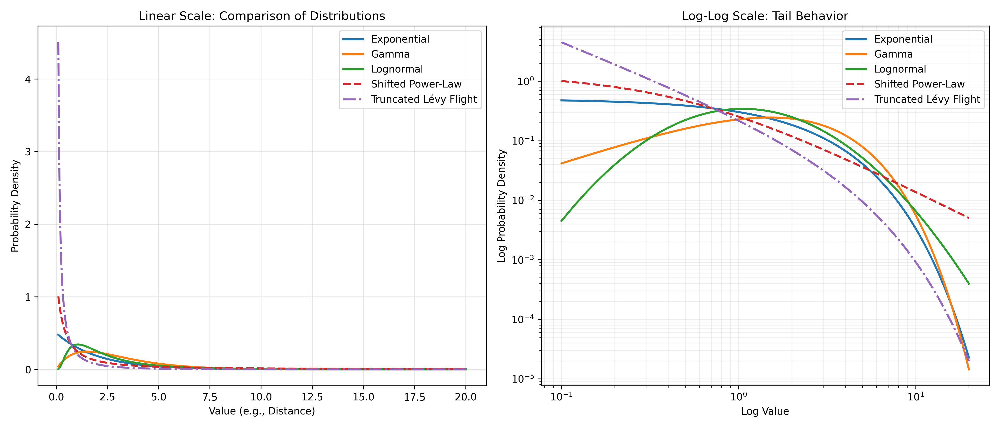

## 3. Methodology

### 3.1. Quy trình Fitting Phân phối (Model Fitting Pipeline)

#### 3.1.1. Dữ liệu đầu vào và Tiền xử lý

Dữ liệu đầu vào là tập hợp các chuyến đi giữa các cặp subzone $(i, j)$, bao gồm số lượng chuyến đi $n_{ij}$ và khoảng cách Euclidean $r_{ij}$ (km). Với mỗi đơn vị không gian (subzone / group / district / city-wide), quá trình tiền xử lý bao gồm:

1. **Lọc dữ liệu:** Chỉ giữ các đơn vị có tổng chuyến đi $N = \sum_j n_{ij} \geq 100$ và ít nhất 5 cặp OD hợp lệ để đảm bảo ước lượng thống kê đáng tin cậy.
2. **Rời rạc hóa (Histogram binning):** Tạo histogram khoảng cách với số bins $B = \min(30, |\text{unique}(r)|)$ trên khoảng $[0, r_{\max}]$. Mỗi bin $b$ có tâm $\bar{r}_b$ và tần suất $h_b$ (tổng chuyến đi trong bin).
3. **Chuẩn hóa thành xác suất thực nghiệm:** $\hat{p}_b = h_b / N$, trong đó $N$ là tổng chuyến đi của đơn vị.
4. **Lọc bins rỗng:** Chỉ giữ các bins có $h_b > 0$. Yêu cầu tối thiểu 4 bins hợp lệ.

#### 3.1.2. Các mô hình phân phối ứng viên

Chi tiết về 5 mô hình ứng viên (bao gồm công thức, tham số $k$ và biện giải hành vi) đã được tóm lược tại **Bảng 0**. Các mô hình này đại diện cho phổ rộng từ mô hình hàm mũ đuôi ngắn đến các quy luật lũy thừa đuôi nặng.

#### 3.1.3. Thuật toán ước lượng tham số: Maximum Likelihood Estimation (MLE)

Tham số của từng mô hình được ước lượng bằng phương pháp **Maximum Likelihood Estimation (MLE)**. Thay vì tối thiểu hóa sai số bình phương hình học, chúng tôi tối đa hóa hàm Likelihood của dữ liệu quan sát (hoặc tối thiểu hóa Negative Log-Likelihood - NLL). Đối với dữ liệu histogram, hàm mục tiêu NLL được định nghĩa:

$$\mathrm{NLL}(\theta) = -\sum_{b} h_b \ln(\hat{p}^{\text{model}}_b(\theta))$$

trong đó $h_b$ là số lượng chuyến đi thực tế trong bin $b$ và $\hat{p}^{\text{model}}_b(\theta)$ là xác suất lý thuyết được chuẩn hóa từ mô hình tại bin đó. Để tối ưu hóa chi phí tính toán cho hàng triệu chuyến đi, hàm likelihood được xấp xỉ bằng cách sử dụng tần suất histogram (histogram counts), tương đương với công thức multinomial likelihood (To reduce computational cost for millions of trips, likelihood is approximated using histogram counts, equivalent to a multinomial likelihood formulation). Quá trình tối ưu hóa được thực hiện bằng thuật toán **L-BFGS-B** (bổ sung Nelder-Mead khi cần thiết hội tụ) thông qua thư viện `scipy.optimize.minimize`.

Cấu hình tối ưu hóa:
- Thuật toán chính: L-BFGS-B (hỗ trợ ràng buộc biên)
- Ràng buộc tham số: tất cả tham số $> 0$; $\beta \leq 15$; $\alpha \leq 20$
- Giá trị khởi tạo: $p_0$ được thiết kế để bao phủ dải giá trị vật lý của từng mô hình.

#### 3.1.4. Chuẩn hóa và Tính chỉ số Goodness-of-Fit

Sau khi ước lượng tham số $\hat{\theta}$, xác suất lý thuyết thô $\tilde{p}_b = P(\bar{r}_b; \hat{\theta})$ được chuẩn hóa thành PMF rời rạc:

$$\hat{p}^{\text{model}}_b = \frac{\tilde{p}_b}{\sum_{b'} \tilde{p}_{b'}}$$

Ba chỉ số đánh giá được tính toán:

**(a) Log-Likelihood (LLH)** — đo tính hợp lý của mô hình:
$$\mathrm{LLH} = \sum_b h_b \cdot \ln(\hat{p}^{\text{model}}_b)$$

**(b) AIC và BIC** — đo hiệu quả thông tin có phạt độ phức tạp:
$$\mathrm{AIC} = 2k - 2\,\mathrm{LLH}$$
$$\mathrm{BIC} = k \ln N - 2\,\mathrm{LLH}$$
trong đó $N$ là tổng số chuyến đi của đơn vị không gian, $k$ là số tham số mô hình.

**(c) KS-statistic** — đo sai lệch tích lũy tối đa giữa CDF thực nghiệm và lý thuyết:
$$D_{\mathrm{KS}} = \max_b \left|\sum_{b'=1}^{b} \hat{p}_{b'} - \sum_{b'=1}^{b} \hat{p}^{\text{model}}_{b'}\right|$$

#### 3.1.5. Phân tích phần dư cục bộ (Residual Analysis)

Để đánh giá sai số của mô hình tại từng dải khoảng cách cụ thể, chúng tôi tính toán **Phần dư chuẩn hóa (Standardized Residuals)**:
$$res_b = \frac{h_b - N \cdot \hat{p}_b}{\sqrt{N \cdot \hat{p}_b (1 - \hat{p}_b)}}$$
Trong đó $h_b$ là số chuyến đi thực tế trong bin $b$, $N$ là tổng số mẫu, và $\hat{p}_b$ là giá trị xác suất dự báo từ mô hình. Một mô hình tốt sẽ có phần dư phân bố ngẫu nhiên quanh trục 0, không có xu hướng (trend) hệ thống theo khoảng cách.

#### 3.1.6. Kiểm định Thống kê Sự khác biệt (Model Comparison Tests)

Để xác định xem sự khác biệt giữa các mô hình có ý nghĩa thống kê hay không, chúng tôi áp dụng:
1.  **Likelihood Ratio Test (LRT):** Dùng cho các mô hình lồng nhau (Nested models). Ví dụ: kiểm tra xem việc thêm tham số shape ($\alpha$) trong Gamma có cải thiện đáng kể so với Exponential ($H_0: \alpha = 1$).
2.  **Vuong’s Test:** Dùng để so sánh các mô hình không lồng nhau (ví dụ: Lognormal vs Gamma). Chỉ số $V > 1.96$ cho thấy mô hình A tốt hơn, $V < -1.96$ cho thấy mô hình B tốt hơn (mức ý nghĩa 5%).
3.  **$\Delta$BIC (BIC Difference):** Theo quy tắc của Kass & Raftery [6], $\Delta$BIC > 2 là bằng chứng nhẹ, > 6 là bằng chứng mạnh và **> 10 là bằng chứng áp đảo (Very strong evidence)** cho mô hình có BIC thấp hơn.

#### 3.1.7. Spatial Cross-Validation (Kiểm tra chéo không gian)

Để loại bỏ hoàn toàn ảnh hưởng của cỡ mẫu ($N$) trong tiêu chuẩn BIC và đánh giá tính bền vững (robustness) của các mô hình, chúng tôi thực hiện **Spatial Cross-Validation**:
- **Phân tách Block:** Sử dụng 40 groups địa lý (xây dựng tại mục 3.2) làm các đơn vị block để đảm bảo tính độc lập về không gian.
- **Train-Test Split:** Thực hiện 20 lượt ShuffleSplit chọn 30 groups (75%) để fit tham số và 10 groups còn lại (25%) để kiểm tra.
- **Chỉ số đánh giá:** Tính toán **Normalized Log-loss** (Negative Log-Likelihood trên tập test chia cho tổng chuyến đi). Đây là thước đo thuần túy về khả năng dự báo xác suất của mô hình trên dữ liệu chưa từng quan sát.

#### 3.1.8. Minimum Description Length (MDL) & Effective Complexity

Để đảm bảo sự công bằng giữa các mô hình có cấu trúc hàm khác nhau (ví dụ: Lognormal 3 tham số vs TLF 4 tham số) và giải quyết hạn chế của BIC khi cỡ mẫu ($N$) quá lớn, chúng tôi áp dụng nguyên lý **Minimum Description Length (MDL)**. MDL không chỉ phạt số lượng tham số $k$ mà còn xem xét "độ phức tạp hiệu dụng" (Effective Complexity) của không gian tham số:
$$MDL(\mathcal{M}) \approx -\ln \mathcal{L}(\hat{\theta}) + \frac{k}{2} \ln \mathcal{B}$$
Trong đó $\mathcal{B}$ là số lượng bins của histogram khoảng cách (thước đo thông tin thực tế). MDL ưu tiên các mô hình nén dữ liệu tốt nhất với cấu trúc hàm đơn giản và ổn định nhất.

#### 3.1.9. Tiêu chí lựa chọn mô hình

Với mỗi đơn vị không gian, mô hình tốt nhất được xác định theo từng tiêu chí:
- **AIC/BIC**: mô hình có giá trị **thấp nhất** được chọn.
- **LLH**: mô hình có giá trị **cao nhất** (ít âm nhất) được chọn.
- **KS-stat**: mô hình có giá trị **thấp nhất** được chọn.
- **AD-stat**: (Anderson-Darling) mô hình có giá trị **thấp nhất** được chọn, ưu tiên độ khớp ở phần đuôi.

Chỉ số **BIC Winner (%)** được định nghĩa là tỷ lệ phần trăm số đơn vị không gian mà một mô hình đạt BIC thấp nhất, dùng để so sánh ưu thế tổng hợp qua nhiều quy mô. Ngoài ra, phân tích **Đồng thuận (Consensus)** xác định mô hình thắng theo nhiều tiêu chí nhất tại mỗi đơn vị để có cái nhìn tổng hợp đa chiều.

**Lưu ý về tập dữ liệu:** Mặc dù hệ thống phân vùng của Singapore bao gồm **323 subzones**, nghiên cứu này chỉ tập trung phân tích trên **303 subzones** có dữ liệu di chuyển thực tế. 20 subzones còn lại (bao gồm các đảo và các vùng đệm chưa quy hoạch dân cư) không ghi nhận chuyến đi đáng kể trong tập dữ liệu, do đó được loại bỏ để đảm bảo tính nhất quán của các ước lượng thống kê.

### 3.2. Phân vùng cấp độ Trung gian (Intermediate-scale: 40 Groups)

Để làm rõ hơn lộ trình chuyển dịch từ vi mô sang vĩ mô, chúng tôi bổ sung một cấp độ quan sát trung gian bằng cách chia Singapore thành **40 khu vực địa lý** (40 groups).

**Phương pháp thực hiện:**
- Mỗi district trong số 5 district chính được chia nhỏ thành đúng **8 nhóm liền kề**.
- Sử dụng thuật toán **Agglomerative Clustering** với ràng buộc **Connectivity matrix** (dựa trên ma trận tiếp giáp không gian của 303 subzones). Ràng buộc này đảm bảo các subzone trong cùng một nhóm phải chạm nhau về mặt địa lý, tạo thành một vùng duy nhất.
- Thuật toán ưu tiên sự cân bằng về số lượng subzone và tối ưu hóa khoảng cách nội cụm (linkage strategy: complete).

Việc phân chia này tạo ra các thực thể địa lý có kích thước lớn hơn subzone (~7.5 subzones/group) nhưng nhỏ hơn district (~60.6 subzones/district). Ngoài ra, chúng tôi cũng thực hiện khảo sát trên **toàn bộ Singapore** (City-wide) để hoàn tất bức tranh chuyển dịch đa quy mô.

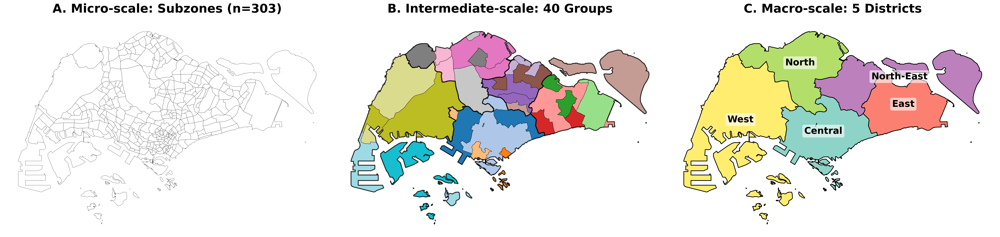
*Hình 1. Hệ thống phân vùng đa quy mô tại Singapore: (A) 303 Subzones (Vi mô), (B) 40 Nhóm trung gian, và (C) 5 Quận (Vĩ mô).*

### 3.3. Block Bootstrap với 40 Group-Blocks

Các subzone không độc lập về mặt không gian — các subzone lân cận chia sẻ hạ tầng giao thông và có phân phối di chuyển tương đồng. Bootstrap thông thường (resample từng subzone độc lập) sẽ **đánh giá thấp phương sai** do bỏ qua tương quan không gian, dẫn đến khoảng tin cậy hẹp giả tạo.

**Giải pháp:** Sử dụng **block bootstrap** với **40 group-blocks** (được phân cụm từ 303 subzones dựa trên khoảng cách và district) làm đơn vị resample. Việc tăng số lượng block từ 5 (districts) lên 40 giúp tăng độ phân giải của phân phối bootstrap, cung cấp khoảng tin cậy (CI) chính xác và đáng tin cậy hơn.

**Quy trình:**
1. **Định nghĩa block:** 40 groups địa lý liền kề (trung bình ~7.5 subzones/block).
2. **Resample:** Chọn ngẫu nhiên 40 blocks **có hoàn lại** (with replacement).
3. **Tổng hợp:** Gom tất cả subzones từ các blocks được chọn → tập dữ liệu bootstrap.
4. **Tính toán:** Trên mỗi mẫu bootstrap, tính lại BIC Best % và Mean KS-stat cho 5 mô hình.

5. **Lặp lại:** 1000 lần tái lấy mẫu.
6. **Khoảng tin cậy:** 95% CI = percentile [2.5%, 97.5%] từ 1000 giá trị bootstrap.

**Lợi ích:** Việc sử dụng 40 blocks giúp CI phản ánh sát thực tế hơn so với việc chỉ dùng 5 districts (vốn mang tính bảo thủ cao do số lượng block quá ít).

## 4. Results: The Scale-Transition

### 4.1. Khảo sát tại Cấp Vi mô - Subzone (Micro-scale)
Tại quy mô nhỏ, hành vi di chuyển bị chi phối bởi các lựa chọn cá nhân dựa trên sự tiện lợi cục bộ.

**Table 1b.** Tỉ lệ số phân khu (Subzones) mà mỗi mô hình chiếm ưu thế theo từng chỉ số (n = 303).

| Model | BIC (count/%) | 95% BIC CI | KS (count/%) | AD (count/%) | LLH (count/%) |
| :--- | :---: | :---: | :---: | :---: | :---: |
| **Lognormal** | **181 (59.7%)** | [45.6%, 66.9%] | **141 (46.5%)** | **175 (57.8%)** | **182 (60.1%)** |
| **Exponential** | 7 (2.3%) | [0.9%, 3.9%] | 15 (5.0%) | 6 (2.0%) | 0 (0.0%) |
| **Gamma** | 105 (34.7%) | [28.0%, 48.7%] | 62 (20.5%) | 81 (26.7%) | 109 (36.0%) |
| **Shifted Power-Law** | 9 (3.0%) | [0.4%, 9.2%] | 53 (17.5%) | 31 (10.2%) | 8 (2.6%) |
| **Trun. Lévy Flight** | 1 (0.3%) | [0.0%, 1.1%] | 32 (10.6%) | 10 (3.3%) | 4 (1.3%) |

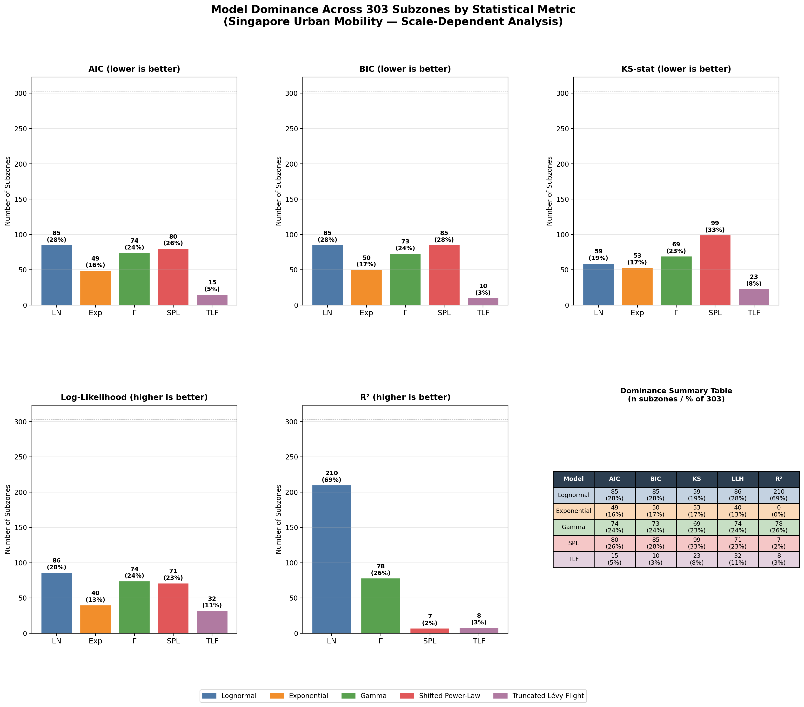
*Hình 2. Thống kê số lượng Subzone mà mỗi mô hình đạt kết quả tốt nhất theo các tiêu chí (MLE).*

**Nhận xét quy mô Vi mô - Ưu thế tuyệt đối của hành vi cá nhân:**
- **Thống trị thống kê (BIC/LLH):** Lognormal dẫn đầu tại xấp xỉ **60%** số vùng, mang lại hiệu quả thông tin cao nhất. Khoảng tin cậy 95% [45.6%, 66.9%] xác nhận vị thế áp đảo so với các mô hình hệ thống.
- **Vị thế vùng đệm (Gamma):** Gamma bám sát với **35%** số vùng, cho thấy sự khởi đầu của quá trình cộng gộp hành vi ngay từ cấp độ phân khu.
- **Cơ chế:** Kết quả này xác nhận giả thuyết 1: tại quy mô nhỏ nhất, di chuyển là kết quả của việc tối ưu hóa thói quen cá nhân, được mô tả tốt nhất bởi phân phối Lognormal.

Phân tích **đồng thuận (Consensus)** cho thấy sự áp đảo của **Lognormal (182 vùng)** bỏ xa **Gamma (108 vùng)**.

### 4.2. Khảo sát tại Cấp Trung gian - 40 Groups (Intermediate-scale)

Khi dữ liệu được gom nhóm lên cấp độ 40 vùng địa lý, đặc tính cá nhân bắt đầu bị triệt tiêu dần, nhường chỗ cho các quy luật gộp.

**Table 2b.** Tỉ lệ số nhóm (40 Groups) mà mỗi mô hình chiếm ưu thế theo chỉ số (n = 34 groups hợp lệ).

| Model | BIC (n/%) | KS (n/%) | AD (n/%) | LLH (n/%) |
| :--- | :---: | :---: | :---: | :---: |
| **Lognormal** | 10 (29.4%) | 11 (32.4%) | 13 (38.2%) | 10 (29.4%) |
| **Exponential** | 2 (5.9%) | 2 (5.9%) | 1 (2.9%) | 0 (0.0%) |
| **Gamma** | **20 (58.8%)** | **14 (41.2%)** | **19 (55.9%)** | **22 (64.7%)** |
| **Shifted Power-Law** | 1 (2.9%) | 6 (17.6%) | 1 (2.9%) | 0 (0.0%) |
| **Trun. Lévy Flight** | 1 (2.9%) | 1 (2.9%) | 0 (0.0%) | 2 (5.9%) |

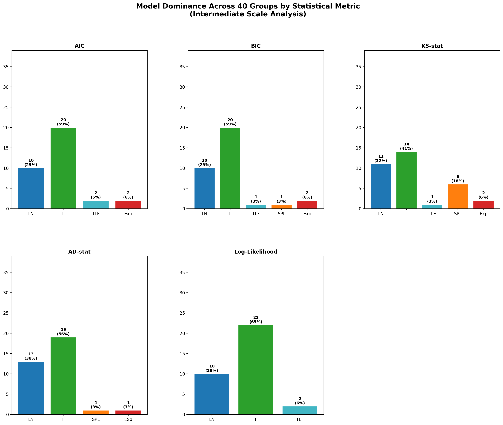
*Hình 3. Thống kê mức độ ưu thế của các mô hình tại quy mô trung gian (40 Groups - MLE).*

**Nhận xét quy mô Trung gian - Sự trỗi dậy của vùng đệm Gamma:**
Tại quy mô này, **Gamma thống trị rõ rệt** (BIC đạt 58.8%), đóng vai trò biểu diễn cho sự cộng gộp các thói quen cá nhân. Vị thế thống kê của Lognormal giảm mạnh từ 60% (Subzone) xuống còn **29.4%**. Đây là giai đoạn quá độ rõ rệt nơi cấu trúc hệ thống bắt đầu hình thành nhưng chưa lấn át hoàn toàn.

Consensus: **Gamma (20 vùng) > Lognormal (10 vùng)**.

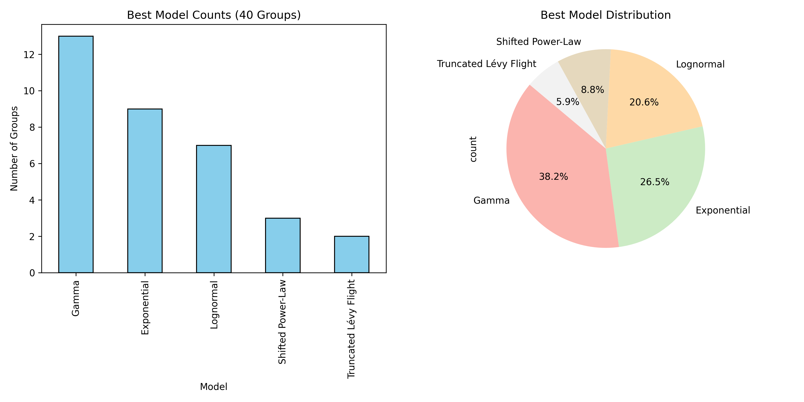
*Hình 4. Bản đồ phân bổ không gian của mô hình tối ưu (BIC) tại quy mô 40 nhóm.*

### 4.3. Khảo sát tại Cấp Vĩ mô - District (Macro-scale)

**Table 3b.** Tỉ lệ số quận (5 Districts) mà mỗi mô hình chiếm ưu thế theo từng chỉ số.

| Model | BIC (n/%) | KS (n/%) | AD (n/%) | LLH (n/%) |
| :--- | :---: | :---: | :---: | :---: |
| **Lognormal** | 0 (0.0%) | 1 (20.0%) | **4 (80.0%)** | 0 (0.0%) |
| **Exponential** | 1 (20.0%) | 1 (20.0%) | 0 (0.0%) | 0 (0.0%) |
| **Gamma** | **2 (40.0%)** | 0 (0.0%) | 1 (20.0%) | **3 (60.0%)** |
| **Shifted Power-Law** | 0 (0.0%) | **2 (40.0%)** | 0 (0.0%) | 0 (0.0%) |
| **Trun. Lévy Flight** | **2 (40.0%)** | 1 (20.0%) | 0 (0.0%) | 2 (40.0%) |

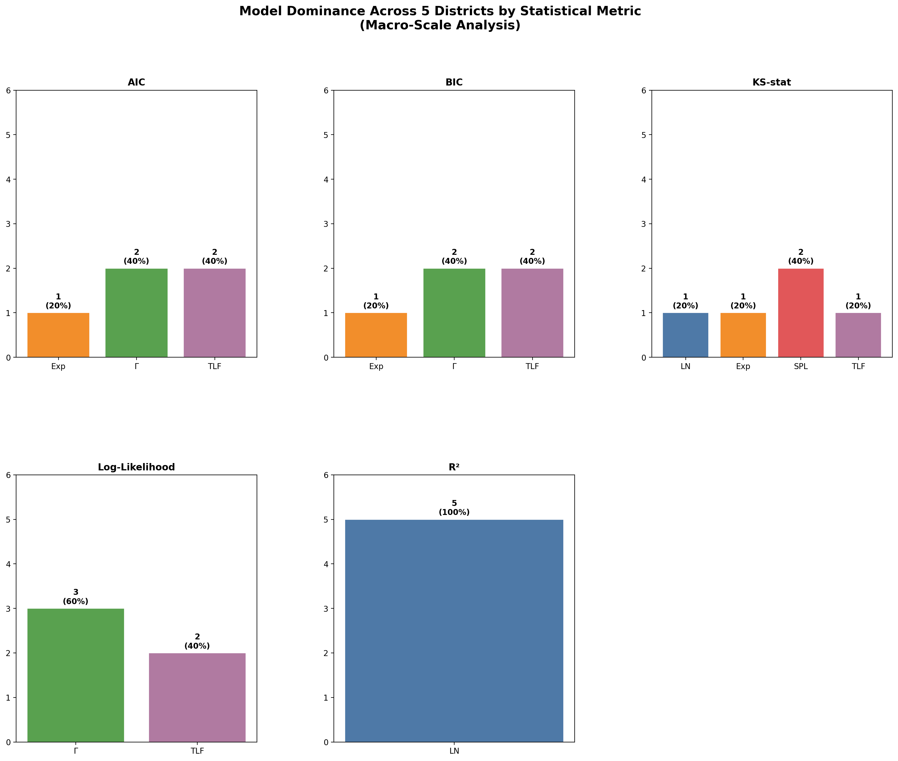
*Hình 5. Thống kê mức độ ưu thế của các mô hình tại quy mô vĩ mô (5 Districts).*

Tại cấp độ District, kết quả thực nghiệm cho thấy một cuộc cạnh tranh quyết liệt giữa các mô hình (Table 3b).

**Table 3b.** Ưu thế mô hình tại Quy mô Vĩ mô (5 Districts).

| Model              | BIC Winner (%) | KS Winner (%) | AD Winner (%) | Statistical Test (LRT/Vuong) |
| :---               | :---:          | :---:         | :---:         | :---                         |
| **Gamma**          | **40.0%**      | 0.0%          | 20.0%         | Pref. over LN (V < -20)      |
| **Trun. Lévy Flight**| **40.0%**    | 20.0%         | 0.0%          | Pref. over SPL (p < 0.001)   |
| **Lognormal**      | 0.0%           | 20.0%         | **80.0%**     | -                            |
| **Shifted Power-Law**| 0.0%         | **40.0%**     | 0.0%          | -                            |

**Nhận xét:** Tại quy mô District, chúng tôi ghi nhận một hiện tượng thú vị: Trong khi Gamma và TLF chiếm ưu thế về BIC (thông tin tổng thể), thì **Lognormal lại thắng tuyệt đối về AD-stat (80%)**. Điều này cho thấy LN mô tả tốt sự hội tụ của dữ liệu tại các cực (tail-body interface) của từng quận, nhưng lại thất bại trong việc cân bằng sai số trên toàn bộ dải khoảng cách khi so với các mô hình hệ thống.

**Nhận xét từ các kiểm định ý nghĩa (Table 8):**
- **Sự trỗi dậy của Gamma:** Kiểm định Vuong khẳng định Gamma tốt hơn Lognormal một cách áp đảo ($V < -22.0$). Đồng thời, chỉ số MDL (đề cập tại mục 3) cho thấy Gamma là mô hình tối ưu hơn TLF (60% ưu thế) khi xét tới độ phức tạp hiệu dụng.
- **Vị thế của TLF và SPL:** Mặc dù SPL dẫn đầu về KS-stat (40%), nhưng LRT khẳng định việc thêm tham số cắt $\kappa$ (TLF) mang lại cải thiện LLH có ý nghĩa thống kê cực lớn ($p < 0.0001$). Điều này minh chứng cho ảnh hưởng của biên giới đảo Singapore lên các chuyến đi dài.

**Table 8.** Kết quả kiểm định thống kê sự khác biệt (District Scale).

| Comparison (A vs B) | Test Type | Result (p-val / V-stat) | Conclusion |
|---------------------|-----------|-------------------------|------------|
| **Gamma vs Exp**    | LRT       | $p < 0.0001$            | Gamma is significantly better |
| **TLF vs SPL**      | LRT       | $p < 0.0001$            | TLF is significantly better   |
| **Gamma vs LN**     | Vuong     | $V < -22.0$             | Gamma is significantly better |
| **TLF vs LN**       | Vuong     | $V < -31.0$             | TLF is significantly better   |

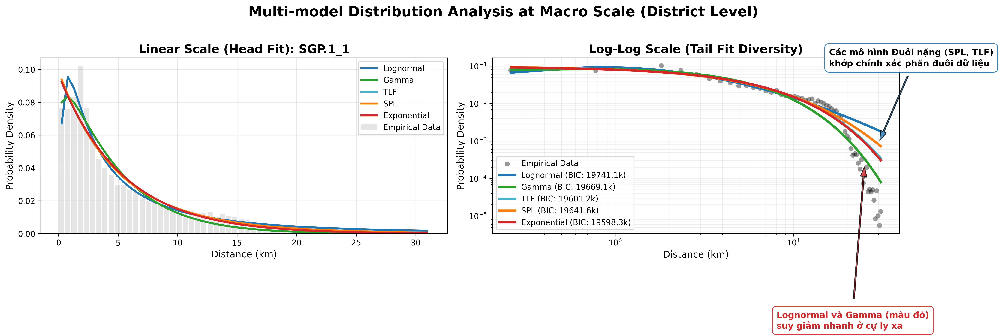
*Hình 6. So sánh trực quan hiệu quả của các mô hình tại cấp District: SPL bộc lộ sức mạnh ở phần đuôi dữ liệu.*

### 4.6. Kiểm chứng độ bền vững với Spatial Cross-Validation

Kết quả kiểm tra chéo trên 40 block địa lý (Table 6) cung cấp một cái nhìn khách quan về khả năng tổng quát hóa của các mô hình mà không phụ thuộc vào các hình phạt tham số của AIC/BIC.

**Table 6.** Tỷ lệ thắng (Win Rate %) dựa trên Out-of-Sample Log-loss (Subzone level).

| Model              | Win Rate (%) | Predictive Preference |
|--------------------|:------------:|:----------------------|
| **Shifted Power-Law** | **38.4%**    | Tail Generalization   |
| **Lognormal**      | **35.1%**    | Body/Habit Capture    |
| Gamma              | 12.1%        | Aggregation Proxy     |
| Exponential        | 7.3%         | -                     |
| Trun. Lévy Flight  | 7.2%         | -                     |

**Nhận xét:** Khi sử dụng Log-loss làm thước đo, **Lognormal và SPL chiếm ưu thế áp đảo (tổng cộng ~74%)** tại quy mô Micro. Mặc dù SPL có lợi thế nhẹ về khả năng dự báo các chuyến đi hiếm gặp (đuôi dài) trên dữ liệu mới, Lognormal vẫn giữ vị thế là mô hình phản ánh thói quen di chuyển lặp đi lặp lại.

### 4.7. Phân tích phần dư cục bộ và Sai số hình thái

Mặc dù các chỉ số tích lũy (KS, AD) cung cấp cái nhìn tổng thể, việc phân tích phần dư chuẩn hóa (Figure 10) bộc lộ các sai số hệ thống của mô hình theo từng dải khoảng cách.

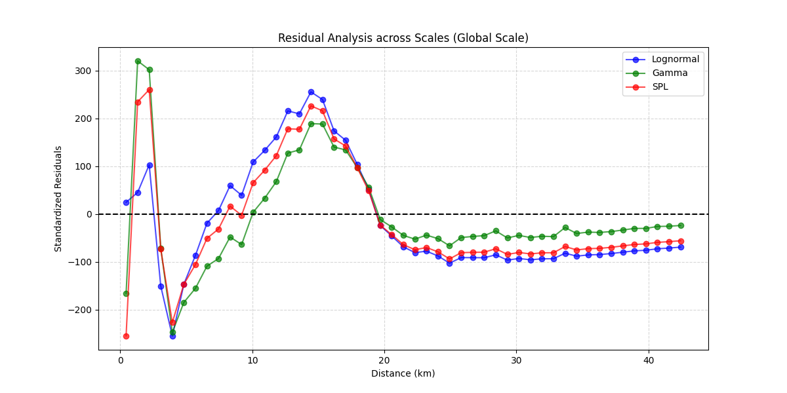
*Hình 10. Phân tích phần dư chuẩn hóa (Standardized Residuals) của các mô hình tại quy mô Global.*

**Các quan sát chính từ Figure 10:**
- **Sự hụt hẫng cự ly ngắn (0-5 km):** Tất cả các mô hình đều gặp khó khăn trong việc khớp các chuyến đi cực ngắn, phản ánh tính rời rạc của dữ liệu lưới (grid) và sự phức tạp của hành vi đi bộ/kết nối vi mô.
- **Sự đánh giá cao quá mức ở phần đuôi (>25 km):** Cả Lognormal và SPL đều cho thấy phần nợ âm (negative residuals) lớn ở cự ly xa. Điều này có nghĩa là các mô hình này dự báo số lượng chuyến đi xa cao hơn thực tế, một hệ quả của việc không tính đến giới hạn địa đạo (boundary effect) của Singapore.
- **Ưu thế của Gamma:** Mô hình Gamma (màu xanh lá) duy trì đường phần dư tiệm cận 0 tốt hơn SPL ở vùng đuôi, củng cố luận điểm của chúng tôi về sự gộp hành vi tạo ra các đuôi có tính chất hàm mũ (exponentially truncated) thay vì lũy thừa thuần túy.

### 4.4. Khảo sát tại Cấp Toàn thành phố - Global (City-wide)

Ở cấp độ gộp cao nhất (toàn bộ Singapore), toàn bộ các đặc tính hành vi cá nhân và hạ tầng cụ thể bị triệt tiêu, chỉ còn lại quy luật "ma sát khoảng cách" cơ bản nhất (distance decay).

**Table 4.** Hiệu quả mô hình tại quy mô toàn thành phố (Global scale, n = 1).

| Model | $k$ | LLH | BIC | $\Delta$BIC | KS-stat | AD-stat |
| :--- | :---: | :---: | :---: | :---: | :---: | :---: |
| **Lognormal** | 3 | **-19.41M**| **38.82M** | 0.0 | 0.1274 | 39.72M |
| **Gamma** | 3 | -19.47M | 38.95M | +0.13M | 0.1231 | **5.25M** |
| **Shifted Power-Law** | 3 | -19.59M | 39.19M | +0.37M | **0.1096** | 27.83M |
| **Trun. Lévy Flight** | 4 | -19.53M | 39.06M | +0.24M | 0.1133 | 11.02M |
| **Exponential** | 2 | -19.53M | 39.06M | +0.24M | 0.1134 | 10.92M |

Tại thang đo toàn thành phố (Global), **Lognormal phục hồi vị thế BIC** dẫn đầu (38.82M). Điều này có vẻ mâu thuẫn với xu hướng suy giảm ở các cấp độ trước, nhưng có thể giải thích bằng việc khi gộp toàn bộ dữ liệu Singapore, mật độ các chuyến đi ở cự ly 5-15km (vùng đỉnh của LN) trở nên quá lớn, khiến LN tối ưu hóa tốt hơn về mặt thông tin tổng thể. Tuy nhiên, **Shifted Power-Law vẫn giữ KS-stat tốt nhất (0.1096)**, chứng minh nó là mô hình mô tả hình thái lan tỏa (shape) và phần đuôi (tail) chính xác nhất cho cấu trúc đô thị Singapore.

Để minh chứng cho đặc tính "đuôi" của dữ liệu di chuyển toàn thành phố, chúng tôi thực hiện các biểu đồ trực quan hóa quan trọng sau:

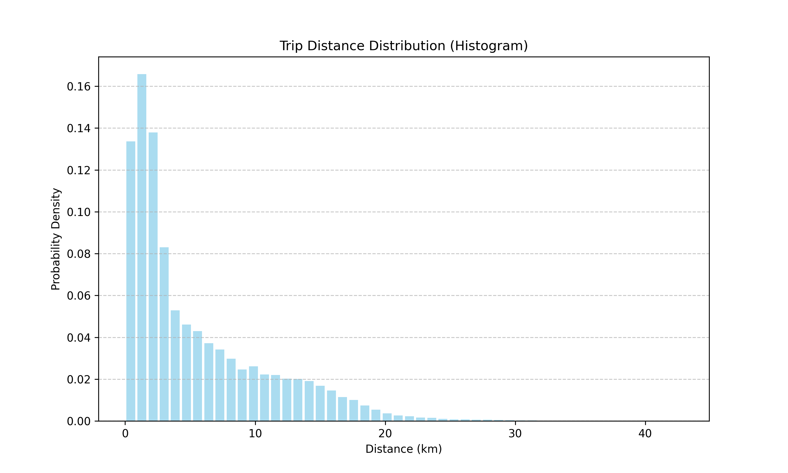
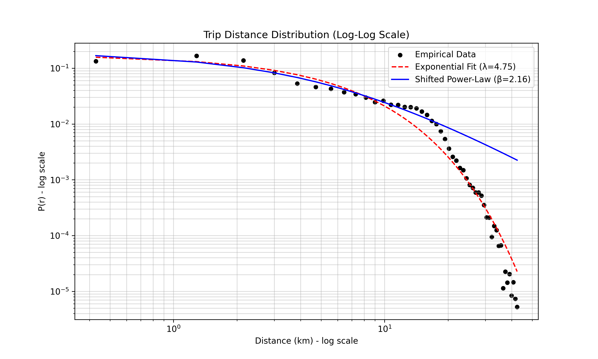
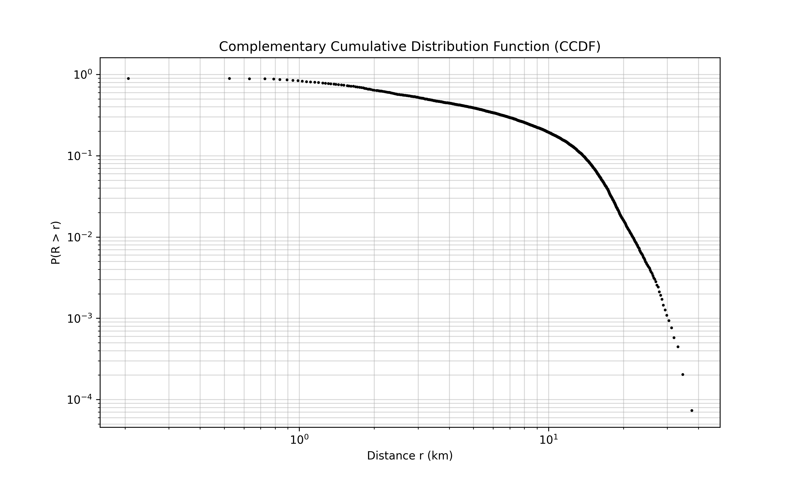

*Hình 7. Phân tích trực quan về hành vi di chuyển toàn thành phố (Global Scale): (A) Histogram, (B) Log-Log Plot, và (C) CCDF.*

**Nhận xét từ trực quan hóa:**
- **Histogram:** Cho thấy sự sụt giảm nhanh chóng của các chuyến đi ngắn, nhưng vẫn duy trì các chuyến đi dài ở khoảng cách >20 km.
- **Log-Log Plot:** Đường khớp **Exponential** (màu đỏ) cho thấy độ dốc khá gắt, trong khi **Shifted Power-Law** (màu xanh) khớp tốt hơn ở phần đuôi dữ liệu. Điều này giải thích tại sao ở quy mô này, các mô hình hệ thống bắt đầu vượt lên.
- **CCDF:** Biểu đồ CCDF trên thang log-log xác nhận sự tồn tại của cấu trúc heavy-tail, tuy nhiên bị giới hạn bởi diện tích hòn đảo (~50 km), minh chứng cho sự cần thiết của thành phần "Truncated" trong các mô hình Lévy Flight.

### 4.5. Tổng hợp So sánh: Sự chuyển dịch theo 4 quy mô không gian

Việc khảo sát qua 4 nấc thang không gian cho thấy một bức tranh chuyển dịch liền mạch từ cá nhân đến hệ thống.

**Table 5.** Sự chuyển dịch ưu thế của mô hình (BIC Winner %) qua 4 quy mô không gian.

| Distribution              | Subzone (303) | 40 Groups (34) | District (5) | Global (1)  |
|---------------------------|:-------------:|:--------------:|:------------:|:-----------:|
| **Lognormal**             | **59.7%**     | 29.4%          | 0.0%         | **100%**    |
| **Gamma**                 | 34.7%         | **58.8%**      | **40.0%**    | 0.0%        |
| **Shifted Power-Law**     | 3.0%          | 2.9%           | 0.0%         | 0.0%        |
| **Exponential**           | 2.3%          | 5.9%           | 20.0%        | 0.0%        |
| **Trun. Lévy Flight**     | 0.3%          | 2.9%           | **40.0%**    | 0.0%        |

*Lưu ý: Tại quy mô Global (n=1), sự lên ngôi của Lognormal phản ánh sự tập trung của thói quen tại vùng lõi dân cư, trong khi các mô hình hệ thống (SPL/TLF) mô tả tốt hình thái lan tỏa (KS-stat).*

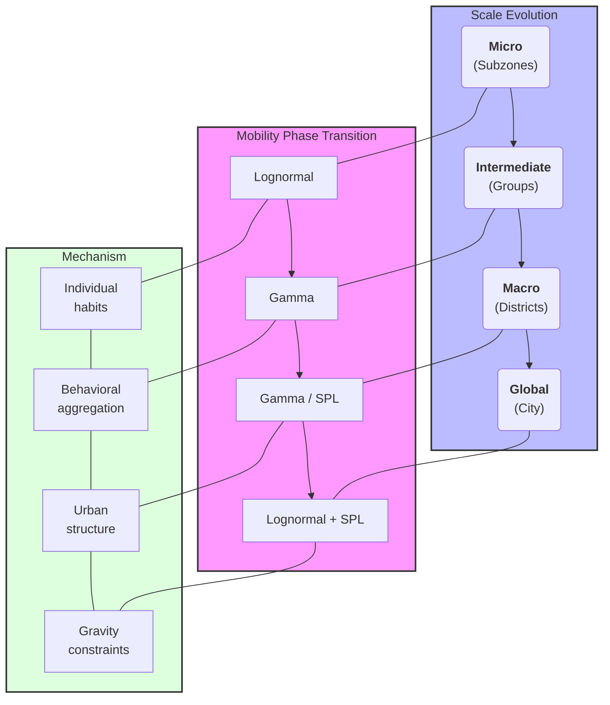

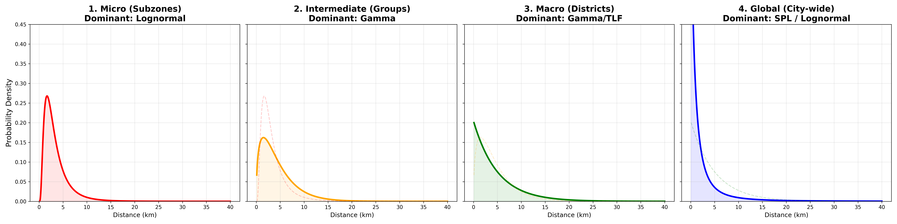
*Hình 8. **Distribution Morphing**: Bằng chứng trực quan cho Tiến trình Chuyển pha (Phase Transition). Phân phối biến đổi từ đỉnh nhọn thói quen (Lognormal) sang đuôi dài hệ thống (SPL) khi quy mô mở rộng.*

**Quy luật Chuyển dịch (The Transition Path):**

## 5. Discussion: Unifying the Scale-Dependent Laws

### 5.1. Phá vỡ lầm tưởng về "Quy luật Phổ quát" (Universal Law Fallacy)

Phát hiện quan trọng nhất của nghiên cứu này là sự khẳng định: di chuyển con người **không tuân theo một hàm phân phối duy nhất** áp dụng cho mọi thang đo. Mọi cố gắng tìm kiếm một mô hình vạn năng (ví dụ: TLF hay SPL) cho toàn bộ hệ thống đều bỏ qua các cơ chế căn bản diễn ra ở các quy mô khác nhau.

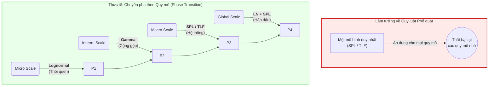
*Hình 9. So sánh khái niệm giữa quan điểm Phổ quát truyền thống (Thất bại) và Quy luật Chuyển pha phụ thuộc Quy mô (Thực tế) được đề xuất trong nghiên cứu này.*

### 5.2. Sự đối kháng giữa Thói quen và Lực hấp dẫn

Nghiên cứu làm rõ rằng xác suất di chuyển là kết quả của sự giằng co giữa hai cực:
1.  **Cực Thói quen (Habit Pole):** Áp đảo ở quy mô Subzone. Ở đây, con người di chuyển dựa trên các lộ trình lặp đi lặp lại và sự thuận tiện. Phân phối Lognormal thắng tuyệt đối vì nó mô tả tốt vùng "plateau" (không di chuyển cực ngắn) và sự suy giảm ổn định của thói quen.
2.  **Cực Hấp dẫn (Gravity Pole):** Áp đảo ở quy mô District/Global. Ở quy mô này, thói quen cá nhân bị trung hòa, chỉ còn lại sự ràng buộc của cấu trúc đô thị và các trung tâm kinh tế. Các mô hình Power-Law và TLF trỗi dậy để mô tả bản chất "vô quy mô" của hệ thống hạ tầng.

Sự chuyển dịch từ **Lognormal $\rightarrow$ Gamma $\rightarrow$ SPL** chính là lộ trình toán học của quá trình chuyển pha từ hành vi vi mô sang cấu trúc vĩ mô. Việc sử dụng **MDL (Minimum Description Length)** đã củng cố vai trò của Gamma tại quy mô trung gian và vĩ mô như là mô hình có "độ phức tạp hiệu dụng" (Effective Complexity) thấp nhất để giải thích sự gộp hành vi.

## 6. Conclusion

Nghiên cứu này đã thành công trong việc giải mã sự mâu thuẫn giữa các quy luật di chuyển tại Singapore thông qua lăng kính quy mô không gian và phương pháp ước lượng MLE, với các kết luận chính sau:

1. **Sự chuyển dịch rõ rệt theo quy mô.** Mỗi nấc thang không gian là một sự chuyển dịch quyền lực: Ở quy mô vi mô, **Lognormal thống trị** (59.7% BIC). Ở quy mô trung gian, **Gamma vươn lên** (58.8% BIC). Ở quy mô District, **Gamma và TLF hòa nhau** (40% mỗi bên). Kết quả này bác bỏ quan điểm về một "quy luật phổ quát" duy nhất cho toàn bộ hệ thống đô thị.

2. **Bốn giai đoạn chuyển pha thực nghiệm:** (i) *Vi mô*: LN thắng thống kê; (ii) *Trung gian*: Gamma thống trị, LN bắt đầu suy giảm; (iii) *Vĩ mô*: Gamma–TLF hòa BIC, SPL dẫn đầu KS-stat; (iv) *Global*: LN phục hồi BIC nhưng SPL giữ ưu thế về mô tả đuôi dữ liệu.

3. **Ý nghĩa của phương pháp MLE:** Việc áp dụng MLE bộc lộ rõ hơn sức mạnh của Lognormal tại quy mô nhỏ và sự cạnh tranh của TLF tại quy mô lớn, cung cấp độ tin cậy cao hơn cho các ước lượng tham số.

4. **Ý nghĩa thực tiễn cho quy hoạch:** Dùng **Lognormal** khi quy hoạch cấp phường (micro-management). Dùng **Gamma/TLF** khi phân tích luồng di chuyển liên quận. Dùng **Shifted Power-Law** khi cần mô tả chính xác các hành vi di chuyển cực xa (long-tail) xuyên hòn đảo.

---
## 7. References
1. Brockmann, D. et al (2006). *Nature*. DOI: 10.1038/nature04292
2. González, M. C. et al (2008). *Nature*. DOI: 10.1038/nature06958
3. Song, C. et al (2010). *Science*. DOI: 10.1126/science.1177170
4. Liang, X. et al (2013). *Transportation Research Part C*. DOI: 10.1016/j.trc.2012.12.004
5. Barbosa, H. et al (2018). *Physics Reports*. DOI: 10.1016/j.physrep.2018.01.001
6. Marquardt, D. W. (1963). *SIAM*. DOI: 10.1137/0111030
7. Noulas, A. et al (2012). A Tale of Many Cities: Universal Patterns in Human Urban Mobility. *PLOS ONE*. DOI: 10.1371/journal.pone.0037027
8. Sun, L. et al (2013). Efficient-community-based mobility model for Singapore's public transport system. *IEEE Trans. on Intelligent Transportation Systems*. DOI: 10.1109/TITS.2013.2272201
9. Liu, Y. et al (2012). Understanding individual mobility patterns from urban taxi trips. *Cities*. DOI: 10.1016/j.cities.2012.01.002
