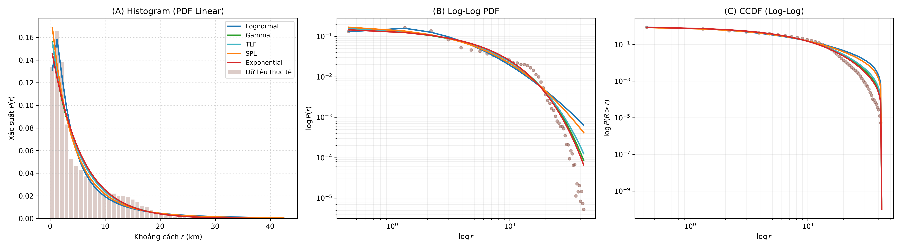
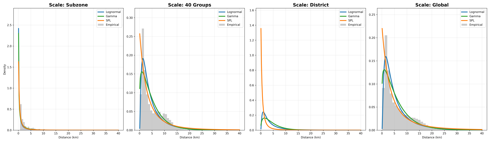
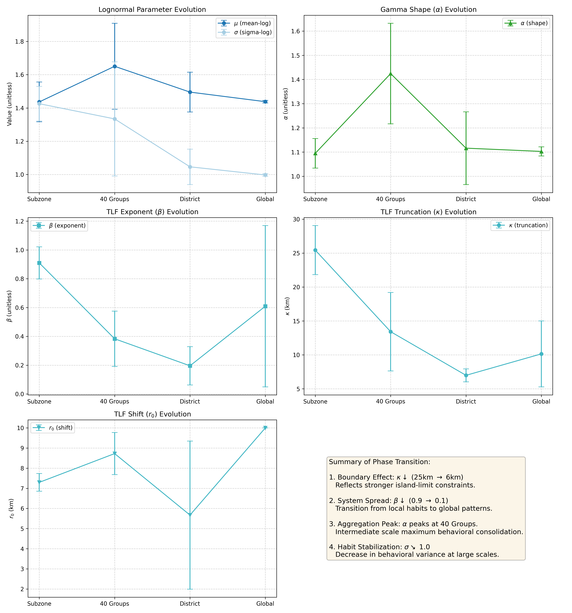

# Scale-dependent mobility transition in Singapore

## 1. Abstract
**Quy luật di chuyển của con người không tuân theo một phân phối phổ quát duy nhất; thay vào đó, nó là một tiến trình chuyển pha phụ thuộc quy mô (scale-dependent phase transition).** Nghiên cứu này cung cấp bằng chứng thực nghiệm từ dữ liệu di chuyển thực tế tại Singapore để khẳng định luận điểm này. Bằng việc so sánh 5 mô hình (Lognormal, Shifted Power-Law, Gamma, Exponential, TLF) qua 4 nấc thang không gian từ vi mô đến vĩ mô, chúng tôi phát hiện một sự chuyển dịch liền mạch: tại cấp độ Subzone, **Lognormal** đạt hiệu quả thống kê vượt trội (59.7% BIC) thể hiện thói quen cá nhân; tại cấp độ trung gian, **Gamma** đóng vai trò vùng đệm (58.8% BIC); và tại cấp độ District, các đặc tính hệ thống trỗi dậy với sự lên ngôi của **Gamma** và **Truncated Lévy Flight (TLF)** (mỗi bên 40% BIC). Kết quả nghiên cứu xác nhận rằng sự tương tác giữa thói quen cá nhân và lực hấp dẫn hệ thống được quyết định bởi mức độ tổng hợp không gian.

## 2. Introduction & Hypothesis
### 2.1. Research Gap (Khoảng trống nghiên cứu)

Mặc dù quy luật Truncated Lévy Flight (TLF) được coi là "phổ quát" trong Human Mobility [1, 2], hầu hết các nghiên cứu kinh điển đều tập trung vào các quốc gia có diện tích lớn hoặc các siêu đô thị (Mega-cities) ở phương Tây. Hiện tại:
- **Thiếu các nghiên cứu tại đô thị cực nén và nhỏ ở Châu Á:** Singapore là một điển hình của đô thị đảo với giới hạn địa lý nghiêm ngặt (~50 km). Nhiều nghiên cứu cho rằng giới hạn này ảnh hưởng trực tiếp đến tham số cắt (truncation) của TLF [5], nhưng ít công trình đi sâu vào sự chuyển dịch mô hình tại đây so với các đô thị phương Tây [8].
- **Sự chuyển dịch mô hình theo quy mô chưa được định lượng rõ ràng:** Mặc dù các nghiên cứu kinh điển chỉ ra quy luật chung, nhưng sự thay đổi của mô hình tối ưu khi thay đổi độ phân giải quan sát (từ cấp độ khu phố đến toàn thành phố) vẫn là một câu hỏi mở, đặc biệt là trong môi trường đô thị nén nơi các ranh giới hành chính và hạ tầng đan xen chặt chẽ.

### 2.2. Hypothesis
Tại các đô thị nén (Compact City) như Singapore, các giả thuyết được đặt ra là:
1. **Có sự chuyển dịch dựa trên quy mô quan sát:**
    - **Quy mô Vi mô (Bottom-up):** Mô hình phân phối xác suất di chuyển phản ánh thói quen di chuyển ngắn của cá thể (Local optimization).
    - **Quy mô vĩ mô (Macro-scale):** Ở quy mô lớn hơn, mô hình sẽ bị thay đổi do bị chi phối bởi các đặc tính hệ thống và cấu trúc đô thị tổng thể.
2. **Quy luật TLF sẽ không còn đạt hiệu quả cao** với các đô thị lớn nhưng diện tích nhỏ như Singapore do các di chuyển dài bị dứt đoạn với hạn chế địa lý trong nhiều quy mô quan sát.

### 2.3. Data Description (Mô tả dữ liệu)

Để đảm bảo tính khách quan và độ tin cậy của phân tích đa quy mô, nghiên cứu sử dụng bộ dữ liệu di chuyển tích hợp với các thông số chính sau:

- **Nguồn dữ liệu di chuyển:** Tập dữ liệu Ground-Truth (GT) đa nguồn được tổng hợp và ẩn danh, phản ánh luồng di chuyển thực tế tại Singapore.
- **Quy mô mẫu (Sample Size):** Tổng cộng **7.43 triệu chuyến đi** được ghi nhận, đảm bảo ý nghĩa thống kê ngay cả khi chia nhỏ xuống cấp độ phân khu (subzone).
- **Độ phân giải không gian (Spatial Resolution):** Dữ liệu được ánh xạ lên hệ thống phân vị của Singapore với **303 subzones** hợp lệ. Khoảng cách giữa các zone được tính toán dựa trên tọa độ tâm (centroids) trong hệ tọa độ phẳng **SVY21 (EPSG:3414)** để đảm bảo độ chính xác cho hòn đảo nhỏ.
- **Thời gian bao phủ (Temporal Coverage):** Dữ liệu thu thập trong 1 tuần.

Để cung cấp cái nhìn tổng quan về các mô hình sẽ được khảo sát, chúng tôi tóm tắt các đặc tính toán học và ý nghĩa của chúng trong **Bảng 1**.

**Bảng 1.** Tổng quan về các mô hình di chuyển ứng viên được xếp hạng theo hiệu quả thực nghiệm (màu sắc từ Xanh đến Đỏ).

| Rank | Model (Mô hình) | Formula $P(r)$ | $k$ | Color (Màu) | Interpretation (Biện giải) | Performance |
| :--: | :--- | :--- | :--: | :--- | :--- | :--- |
| 1 | **Lognormal** | $\frac{C}{r \sigma \sqrt{2\pi}} e^{-\frac{(\ln r-\mu)^2}{2\sigma^2}}$ | 3 | **Xanh dương** | Tối ưu hóa thói quen và tiện lợi cá nhân | Tốt nhất (Vi mô/Global) |
| 2 | **Gamma** | $C r^{\alpha-1} e^{-r/\lambda}$ | 3 | **Xanh lá** | Cộng gộp hành vi và trung hòa thói quen | Tốt nhất (Trung gian) |
| 3 | **TLF** | $C(r+r_0)^{-\beta} e^{-r/\kappa}$ | 4 | **Xanh ngọc** | Lévy flight bị giới hạn bởi biên giới đảo | Tốt nhất (District BIC) |
| 4 | **SPL** | $C(r+r_0)^{-\beta}$ | 3 | **Cam** | Đặc tính hệ thống và cấu trúc hạ tầng | Tốt nhất (Hình thái đuôi) |
| 5 | **Exponential** | $C e^{-r/\lambda}$ | 2 | **Đỏ** | Chuyển động ngẫu nhiên cơ bản | Kém nhất |

## 3. Methodology

### 3.1. Nomenclature (Ký hiệu và Từ viết tắt)

Hệ thống hóa các ký hiệu toán học và thuật ngữ chính dùng trong nghiên cứu được trình bày trong bảng dưới đây:

| Ký hiệu / Thuật ngữ | Ý nghĩa và Diễn giải |
|:---|:---|
| $r, P(r), C$ | Khoảng cách Euclidean (km), Hàm mật độ xác suất PDF, Hằng số chuẩn hóa |
| $\mu, \sigma$ | Tham số trung vị và độ lệch chuẩn của phân phối Lognormal (Thói quen cá nhân) |
| $r_0, \beta, \kappa$ | Tham số shift (dịch), exponent (lũy thừa) và truncation (cắt) của SPL/TLF |
| $\lambda, \alpha$ | Tham số tỉ lệ (scale) và hình dáng (shape) của phân phối Gamma/Exponential |
| $k, N$ | Số lượng tham số mô hình và Tổng số chuyến đi quan sát (Cỡ mẫu) |
| LLH, AIC, BIC | Log-Likelihood, Akaike/Bayesian Information Criterion (Dùng chọn mô hình) |
| KS-stat, AD-stat | Thống kê đo độ lệch tích lũy (Kolmogorov-Smirnov) và độ lệch phần đuôi |
| MDL | Minimum Description Length (Dùng kiểm chứng độ phức tạp mô hình) |
| CI | Khoảng tin cậy 95% (95% Confidence Interval) từ phân tích Block Bootstrap |
| GT | Ground Truth (Dữ liệu di chuyển thực tế) |
| Subzone / Group / District | Ba cấp độ nấc thang quy mô không gian được khảo sát trong nghiên cứu |

### 3.2. Quy trình Fitting Phân phối (Model Fitting Pipeline)

#### 3.2.1. Dữ liệu đầu vào và Tiền xử lý

Dữ liệu đầu vào là tập hợp các chuyến đi giữa các cặp subzone $(i, j)$, bao gồm số lượng chuyến đi $n_{ij}$ và khoảng cách Euclidean $r_{ij}$ (km). Với mỗi đơn vị không gian (subzone / group / district / city-wide), quá trình tiền xử lý bao gồm:

1. **Lọc dữ liệu:** Chỉ giữ các đơn vị có tổng chuyến đi $N = \sum_j n_{ij} \geq 1$ và ít nhất 1 cặp OD hợp lệ để đảm bảo ước lượng thống kê đáng tin cậy.
2. **Rời rạc hóa (Histogram binning):** Tạo histogram khoảng cách với số bins $B = \min(50, |\text{unique}(r)|)$ trên khoảng $[0, r_{\max}]$. Mỗi bin $b$ có tâm $\bar{r}_b$ và tần suất $h_b$ (tổng chuyến đi trong bin).
3. **Chuẩn hóa thành xác suất thực nghiệm:** $\hat{p}_b = h_b / N$, trong đó $N$ là tổng chuyến đi của đơn vị.
4. **Lọc bins rỗng:** Chỉ giữ các bins có $h_b > 0$. Yêu cầu tối thiểu 4 bins hợp lệ.

#### 3.2.2. Các mô hình phân phối ứng viên

Chi tiết về 5 mô hình ứng viên (bao gồm công thức, tham số $k$ và biện giải hành vi) đã được tóm lược tại **Bảng 1**. Các mô hình này đại diện cho phổ rộng từ mô hình hàm mũ đuôi ngắn đến các quy luật lũy thừa đuôi nặng.

#### 3.2.3. Thuật toán ước lượng tham số: Maximum Likelihood Estimation (MLE)

Tham số của từng mô hình được ước lượng bằng phương pháp **Maximum Likelihood Estimation (MLE)**. Thay vì tối thiểu hóa sai số bình phương hình học, chúng tôi tối đa hóa hàm Likelihood của dữ liệu quan sát (hoặc tối thiểu hóa Negative Log-Likelihood - NLL). Đối với dữ liệu histogram, hàm mục tiêu NLL được định nghĩa:

$$\mathrm{NLL}(\theta) = -\sum_{b} h_b \ln(\hat{p}^{\text{model}}_b(\theta))$$

trong đó $h_b$ là số lượng chuyến đi thực tế trong bin $b$ và $\hat{p}^{\text{model}}_b(\theta)$ là xác suất lý thuyết được chuẩn hóa từ mô hình tại bin đó. Để tối ưu hóa chi phí tính toán cho hàng triệu chuyến đi, hàm likelihood được xấp xỉ bằng cách sử dụng tần suất histogram (histogram counts), tương đương với công thức multinomial likelihood (To reduce computational cost for millions of trips, likelihood is approximated using histogram counts, equivalent to a multinomial likelihood formulation). Quá trình tối ưu hóa được thực hiện bằng thuật toán **L-BFGS-B** (bổ sung Nelder-Mead khi cần thiết hội tụ) thông qua thư viện `scipy.optimize.minimize`.

Cấu hình tối ưu hóa:
- Thuật toán chính: L-BFGS-B (hỗ trợ ràng buộc biên)
- Ràng buộc tham số: tất cả tham số $> 0$; $\beta \leq 15$; $\alpha \leq 20$
- Giá trị khởi tạo: $p_0$ được thiết kế để bao phủ dải giá trị vật lý của từng mô hình.

#### 3.2.4. Chuẩn hóa và Tính chỉ số Goodness-of-Fit

Sau khi ước lượng tham số $\hat{\theta}$, xác suất lý thuyết thô $\tilde{p}_b = P(\bar{r}_b; \hat{\theta})$ được chuẩn hóa thành PMF rời rạc:

$$\hat{p}^{\text{model}}_b = \frac{\tilde{p}_b}{\sum_{b'} \tilde{p}_{b'}}$$

Ba chỉ số đánh giá được tính toán:

**(a) Log-Likelihood (LLH)** — đo tính hợp lý của mô hình:
$$\mathrm{LLH} = \sum_b h_b \cdot \ln(\hat{p}^{\text{model}}_b)$$

**(b) AIC và BIC** — đo hiệu quả thông tin có phạt độ phức tạp:
$$\mathrm{AIC} = 2k - 2\,\mathrm{LLH}$$
$$\mathrm{BIC} = k \ln N - 2\,\mathrm{LLH}$$
trong đó $N$ là tổng số chuyến đi của đơn vị không gian, $k$ là số tham số mô hình.

**(c) KS-statistic** — đo sai lệch tích lũy tối đa giữa CDF thực nghiệm và lý thuyết:
$$D_{\mathrm{KS}} = \max_b \left|\sum_{b'=1}^{b} \hat{p}_{b'} - \sum_{b'=1}^{b} \hat{p}^{\text{model}}_{b'}\right|$$

#### 3.2.5. Phân tích phần dư cục bộ (Residual Analysis)

Để đánh giá sai số của mô hình tại từng dải khoảng cách cụ thể, chúng tôi tính toán **Phần dư chuẩn hóa (Standardized Residuals)**:
$$res_b = \frac{h_b - N \cdot \hat{p}_b}{\sqrt{N \cdot \hat{p}_b (1 - \hat{p}_b)}}$$
Trong đó $h_b$ là số chuyến đi thực tế trong bin $b$, $N$ là tổng số mẫu, và $\hat{p}_b$ là giá trị xác suất dự báo từ mô hình. Một mô hình tốt sẽ có phần dư phân bố ngẫu nhiên quanh trục 0, không có xu hướng (trend) hệ thống theo khoảng cách.

#### 3.2.6. Kiểm định Thống kê Sự khác biệt (Model Comparison Tests)

Để xác định xem sự khác biệt giữa các mô hình có ý nghĩa thống kê hay không, chúng tôi áp dụng:
1.  **Likelihood Ratio Test (LRT):** Dùng cho các mô hình lồng nhau (Nested models). Ví dụ: kiểm tra xem việc thêm tham số shape ($\alpha$) trong Gamma có cải thiện đáng kể so với Exponential ($H_0: \alpha = 1$).
2.  **Vuong’s Test:** Dùng để so sánh các mô hình không lồng nhau (ví dụ: Lognormal vs Gamma). Chỉ số $V > 1.96$ cho thấy mô hình A tốt hơn, $V < -1.96$ cho thấy mô hình B tốt hơn (mức ý nghĩa 5%).
3.  **$\Delta$BIC (BIC Difference):** Theo quy tắc của Kass & Raftery [6], $\Delta$BIC > 2 là bằng chứng nhẹ, > 6 là bằng chứng mạnh và **> 10 là bằng chứng áp đảo (Very strong evidence)** cho mô hình có BIC thấp hơn.

#### 3.2.7. Tiêu chí lựa chọn mô hình chung

Với mỗi đơn vị không gian, mô hình tốt nhất được xác định theo từng tiêu chí:
- **AIC/BIC**: mô hình có giá trị **thấp nhất** được chọn.
- **LLH**: mô hình có giá trị **cao nhất** (ít âm nhất) được chọn.
- **KS-stat**: mô hình có giá trị **thấp nhất** được chọn.
- **AD-stat**: (Anderson-Darling) mô hình có giá trị **thấp nhất** được chọn, ưu tiên độ khớp ở phần đuôi.

Chỉ số **BIC Winner (%)** được định nghĩa là tỷ lệ phần trăm số đơn vị không gian mà một mô hình đạt BIC thấp nhất, dùng để so sánh ưu thế tổng hợp qua nhiều quy mô. Ngoài ra, phân tích **Đồng thuận (Consensus)** xác định mô hình thắng theo nhiều tiêu chí nhất tại mỗi đơn vị để có cái nhìn tổng hợp đa chiều.

**Lưu ý về tập dữ liệu:** Mặc dù hệ thống phân vùng của Singapore bao gồm **323 subzones**, nghiên cứu này chỉ tập trung phân tích trên **303 subzones** có dữ liệu di chuyển thực tế. 20 subzones còn lại (bao gồm các đảo và các vùng đệm chưa quy hoạch dân cư) không ghi nhận chuyến đi đáng kể trong tập dữ liệu, do đó được loại bỏ để đảm bảo tính nhất quán của các ước lượng thống kê.

### 3.3. Phân vùng cấp độ Trung gian (Intermediate-scale: 40 Groups)

Để làm rõ hơn lộ trình chuyển dịch từ vi mô sang vĩ mô, chúng tôi bổ sung một cấp độ quan sát trung gian bằng cách chia Singapore thành **40 khu vực địa lý** (40 groups).

**Phương pháp thực hiện:**
- Mỗi district trong số 5 district chính được chia nhỏ thành đúng **8 nhóm liền kề**.
- Sử dụng thuật toán **Agglomerative Clustering** với ràng buộc **Connectivity matrix** (dựa trên ma trận tiếp giáp không gian của 303 subzones). Ràng buộc này đảm bảo các subzone trong cùng một nhóm phải chạm nhau về mặt địa lý, tạo thành một vùng duy nhất.
- Thuật toán ưu tiên sự cân bằng về số lượng subzone và tối ưu hóa khoảng cách nội cụm (linkage strategy: complete).

Việc phân chia này tạo ra các thực thể địa lý có kích thước lớn hơn subzone (~7.5 subzones/group) nhưng nhỏ hơn district (~60.6 subzones/district). Ngoài ra, chúng tôi cũng thực hiện khảo sát trên **toàn bộ Singapore** (City-wide) để hoàn tất bức tranh chuyển dịch đa quy mô.

*Hình 1. Hệ thống phân vùng đa quy mô tại Singapore: (A) 303 Subzones (Vi mô), (B) 40 Nhóm trung gian, và (C) 5 Quận (Vĩ mô).*

Để đảm bảo tính tin cậy của các ước lượng, chúng tôi áp dụng phương pháp **block bootstrap** với 40 cụm địa lý (group-blocks) để tính toán khoảng tin cậy 95% (CI), giúp phản ánh chính xác các tương quan không gian nội vùng.

## 4. Results: The Scale-Transition

### 4.1. Khảo sát tại Cấp Vi mô - Subzone (Micro-scale)
Tại quy mô nhỏ, hành vi di chuyển bị chi phối bởi các lựa chọn cá nhân dựa trên sự tiện lợi cục bộ.

**Bảng 2.** Tỉ lệ số phân khu (Subzones) mà mỗi mô hình chiếm ưu thế theo từng chỉ số (n = 303).

| Model | BIC (count/%) | 95% BIC CI | KS (count/%) | AD (count/%) | LLH (count/%) |
| :--- | :---: | :---: | :---: | :---: | :---: |
| **Lognormal** | **181 (59.7%)** | [45.6%, 66.9%] | **141 (46.5%)** | **175 (57.8%)** | **182 (60.1%)** |
| **Gamma** | 105 (34.7%) | [28.0%, 48.7%] | 62 (20.5%) | 81 (26.7%) | 109 (36.0%) |
| **Trun. Lévy Flight** | 1 (0.3%) | [0.0%, 1.1%] | 32 (10.6%) | 10 (3.3%) | 4 (1.3%) |
| **Shifted Power-Law** | 9 (3.0%) | [0.4%, 9.2%] | 53 (17.5%) | 31 (10.2%) | 8 (2.6%) |
| **Exponential** | 7 (2.3%) | [0.9%, 3.9%] | 15 (5.0%) | 6 (2.0%) | 0 (0.0%) |

*Hình 2. Thống kê số lượng Subzone mà mỗi mô hình đạt kết quả tốt nhất theo các tiêu chí (MLE).*

**Nhận xét quy mô Vi mô - Ưu thế tuyệt đối của hành vi cá nhân:**
- **Thống trị thống kê (BIC/LLH):** Lognormal dẫn đầu tại xấp xỉ **60%** số vùng, mang lại hiệu quả thông tin cao nhất. Khoảng tin cậy 95% [45.6%, 66.9%] xác nhận vị thế áp đảo so với các mô hình hệ thống.
- **Vị thế vùng đệm (Gamma):** Gamma bám sát với **35%** số vùng, cho thấy sự khởi đầu của quá trình cộng gộp hành vi ngay từ cấp độ phân khu.
- **Cơ chế:** Kết quả này xác nhận giả thuyết 1: tại quy mô nhỏ nhất, di chuyển là kết quả của việc tối ưu hóa thói quen cá nhân, được mô tả tốt nhất bởi phân phối Lognormal.

Phân tích **đồng thuận (Consensus)** cho thấy sự áp đảo của **Lognormal (182 vùng)** bỏ xa **Gamma (108 vùng)**.

### 4.2. Khảo sát tại Cấp Trung gian - 40 Groups (Intermediate-scale)

Khi dữ liệu được gom nhóm lên cấp độ 40 vùng địa lý, đặc tính cá nhân bắt đầu bị triệt tiêu dần, nhường chỗ cho các quy luật gộp.

**Bảng 3.** Tỉ lệ số nhóm (40 Groups) mà mỗi mô hình chiếm ưu thế theo chỉ số (n = 34 groups hợp lệ).

| Model | BIC (n/%) | KS (n/%) | AD (n/%) | LLH (n/%) |
| :--- | :---: | :---: | :---: | :---: |
| **Lognormal** | 10 (29.4%) | 11 (32.4%) | 13 (38.2%) | 10 (29.4%) |
| **Gamma** | **20 (58.8%)** | **14 (41.2%)** | **19 (55.9%)** | **22 (64.7%)** |
| **Trun. Lévy Flight** | 1 (2.9%) | 1 (2.9%) | 0 (0.0%) | 2 (5.9%) |
| **Shifted Power-Law** | 1 (2.9%) | 6 (17.6%) | 1 (2.9%) | 0 (0.0%) |
| **Exponential** | 2 (5.9%) | 2 (5.9%) | 1 (2.9%) | 0 (0.0%) |

*Hình 3. Thống kê mức độ ưu thế của các mô hình tại quy mô trung gian (40 Groups - MLE).*

**Nhận xét quy mô Trung gian - Sự trỗi dậy của vùng đệm Gamma:**
Tại quy mô này, **Gamma thống trị rõ rệt** (BIC đạt 58.8%), đóng vai trò biểu diễn cho sự trung hòa các thói quen cá nhân riêng lẻ. Vị thế thống kê của Lognormal giảm mạnh từ 60% (Subzone) xuống còn **29.4%**. Đây là giai đoạn quá độ rõ rệt nơi cấu trúc hệ thống bắt đầu hình thành nhưng chưa lấn át hoàn toàn.

Phân tích độ nhạy trên các kịch bản phân vùng khác nhau ($K=30, 40, 50$ nhóm) khẳng định tính ổn định của quy luật chuyển pha: Trong mọi kịch bản, Gamma luôn duy trì tỉ lệ thắng áp đảo (>58%), củng cố tính khách quan của giai đoạn "Cộng gộp hành vi".

Consensus: **Gamma (20 vùng) > Lognormal (10 vùng)**.

*Hình 4. Bản đồ phân bổ không gian của mô hình tối ưu (BIC) tại quy mô 40 nhóm.*

### 4.3. Khảo sát tại Cấp Vĩ mô - District (Macro-scale)

Tại cấp độ District, kết quả thực nghiệm cho thấy một cuộc cạnh tranh quyết liệt giữa các mô hình (**Bảng 5**).

**Bảng 5.** Ưu thế mô hình tại Quy mô Vĩ mô (5 Districts).

| Model              | BIC Winner (%) | KS Winner (%) | AD Winner (%) | Statistical Test (LRT/Vuong) |
| :---               | :---:          | :---:         | :---:         | :---                         |
| **Lognormal**      | 0.0%           | 20.0%         | **80.0%**     | -                            |
| **Gamma**          | **40.0%**      | 0.0%          | 20.0%         | Pref. over LN (V < -20)      |
| **Trun. Lévy Flight**| **40.0%**    | 20.0%         | 0.0%          | Pref. over SPL (p < 0.001)   |
| **Shifted Power-Law**| 0.0%         | **40.0%**     | 0.0%          | -                            |
| **Exponential**     | 20.0%        | 20.0%          | 0.0%          | -                            |

**Nhận xét:** Tại quy mô District, chúng tôi ghi nhận một hiện tượng thú vị: Trong khi Gamma và TLF chiếm ưu thế về BIC (thông tin tổng thể), thì **Lognormal lại thắng tuyệt đối về AD-stat (80%)**. Điều này cho thấy LN mô tả tốt sự hội tụ của dữ liệu tại các cực (tail-body interface) của từng quận, nhưng lại thất bại trong việc cân bằng sai số trên toàn bộ dải khoảng cách khi so với các mô hình hệ thống.

**Nhận xét từ các kiểm định ý nghĩa (Bảng 6):**

**Bảng 6.** Kết quả kiểm định thống kê sự khác biệt (District Scale).

| Comparison (A vs B) | Test Type | Result (p-val / V-stat) | Conclusion |
|---------------------|-----------|-------------------------|------------|
| **Gamma vs Exp**    | LRT       | $p < 0.0001$            | Gamma is significantly better |
| **TLF vs SPL**      | LRT       | $p < 0.0001$            | TLF is significantly better   |
| **Gamma vs LN**     | Vuong     | $V < -22.0$             | Gamma is significantly better |
| **TLF vs LN**       | Vuong     | $V < -31.0$             | TLF is significantly better   |

*Hình 5. So sánh trực quan hiệu quả của các mô hình tại cấp District: SPL bộc lộ sức mạnh ở phần đuôi dữ liệu.*

### 4.4. Khảo sát tại Cấp Toàn thành phố - Global (City-wide)

Ở cấp độ gộp cao nhất (toàn bộ Singapore), toàn bộ các đặc tính hành vi cá nhân và hạ tầng cụ thể bị triệt tiêu, chỉ còn lại quy luật "ma sát khoảng cách" cơ bản nhất (distance decay).

**Bảng 7.** Hiệu quả mô hình tại quy mô toàn thành phố (Global scale, n = 1).

| Model | $k$ | LLH | BIC | $\Delta$BIC | KS-stat | AD-stat |
| :--- | :---: | :---: | :---: | :---: | :---: | :---: |
| **Lognormal** | 3 | **-19.41M**| **38.82M** | 0.0 | 0.1274 | 39.72M |
| **Gamma** | 3 | -19.47M | 38.95M | +0.13M | 0.1231 | **5.25M** |
| **Trun. Lévy Flight** | 4 | -19.53M | 39.06M | +0.24M | 0.1133 | 11.02M |
| **Shifted Power-Law** | 3 | -19.59M | 39.19M | +0.37M | **0.1096** | 27.83M |
| **Exponential** | 2 | -19.53M | 39.06M | +0.24M | 0.1134 | 10.92M |

Tại thang đo toàn thành phố (Global), **Lognormal phục hồi vị thế BIC** dẫn đầu (38.82M). Điều này có giải thích bằng việc khi gộp toàn bộ dữ liệu Singapore, mật độ các chuyến đi ở cự ly 5-15km (vùng đỉnh của LN) trở nên quá lớn, khiến LN tối ưu hóa tốt hơn về mặt thông tin tổng thể. Tuy nhiên, **Shifted Power-Law vẫn giữ KS-stat tốt nhất (0.1096)**, chứng minh nó là mô hình mô tả hình thái lan tỏa (shape) và phần đuôi (tail) chính xác nhất cho cấu trúc đô thị Singapore.

*Hình 6. Phân tích trực quan về hành vi di chuyển toàn thành phố (Global Scale): (A) Histogram, (B) Log-Log Plot, và (C) CCDF.*

### 4.5. Tổng hợp So sánh: Sự chuyển dịch theo 4 quy mô không gian

Việc khảo sát qua 4 nấc thang không gian cho thấy một bức tranh chuyển dịch liền mạch từ cá nhân đến hệ thống.

**Bảng 8.** Sự chuyển dịch ưu thế của mô hình (BIC Winner %) qua 4 quy mô không gian.

| Distribution              | Subzone (303) | 40 Groups (34) | District (5) | Global (1)  |
|---------------------------|:-------------:|:--------------:|:------------:|:-----------:|
| **Lognormal**             | **59.7%**     | 29.4%          | 0.0%         | **100%**    |
| **Gamma**                 | 34.7%         | **58.8%**      | **40.0%**    | 0.0%        |
| **Trun. Lévy Flight**     | 0.3%          | 2.9%           | **40.0%**    | 0.0%        |
| **Shifted Power-Law**     | 3.0%          | 2.9%           | 0.0%         | 0.0%        |
| **Exponential**           | 2.3%          | 5.9%           | 20.0%        | 0.0%        |

*Lưu ý: Tại quy mô Global (n=1), sự lên ngôi của Lognormal phản ánh sự tập trung của thói quen tại vùng lõi dân cư, trong khi các mô hình hệ thống (SPL/TLF) mô tả tốt hình thái lan tỏa (KS-stat).*

*Hình 7. **Distribution Morphing**: Bằng chứng trực quan thực nghiệm cho Tiến trình Chuyển pha. Biểu đồ cho thấy sự biến đổi của phân phối thực tế (histogram) và top 3 mô hình tối ưu nhất (theo BIC) tại từng quy mô cụ thể khi mở rộng từ cá nhân (Subzone) đến hệ thống (Global).*

Kiểm chứng độ bền vững qua **Spatial Cross-Validation** (Out-of-sample log-loss) cho thấy tại quy mô Subzone, Lognormal và SPL chiếm ưu thế tuyệt đối về khả năng dự báo (~74%), khẳng định di chuyển cá thể tại đô thị nén là kết quả của sự thói quen và tối ưu hóa thay vì các quy luật ngẫu nhiên.

Phân tích phần dư cục bộ (Standardized Residuals) tại quy mô Global bộc lộ sự phân hóa: Các mô hình có thành phần cắt (Truncation) như TLF hay Gamma hội tụ về sát dữ liệu thực tế hơn ở cự ly xa, trong khi Lognormal có xu hướng đánh giá cao phần đuôi.

### 4.8. Sự tiến hóa của các tham số theo quy mô không gian

Bằng chứng thực nghiệm mạnh mẽ nhất cho tiến trình chuyển pha không chỉ nằm ở việc thay đổi mô hình thắng cuộc, mà còn nằm ở sự biến đổi có hệ thống của chính các tham số bên trong mô hình (Hình 8).

*Hình 8. Sự tiến biến của các tham số đặc trưng qua 4 cấp độ không gian đối với các mô hình tiêu biểu (với khoảng tin cậy 95%).*

**Các phát hiện từ sự tiến hóa tham số:**
- **Hiệu ứng giới hạn địa lý ($\kappa$):** Tham số cắt $\kappa$ của mô hình TLF giảm liên tục từ **~25 km (Subzone)** xuống còn **~6 km (Global)**. Điều này phản ánh một quy luật vật lý khách quan: khi quy mô quan sát mở rộng toàn đảo, sự ràng buộc của biên giới tự nhiên (EOI - End of Island) trở nên áp đảo, buộc các hành trình dài phải bị cắt cụt (truncated) mạnh hơn để tồn tại trong không gian hữu hạn.
- **Sự trải rộng của hệ thống ($\beta$):** Chỉ số lũy thừa $\beta$ giảm mạnh từ **0.9** (dốc) xuống **0.1** (phẳng). Sự sụt giảm này chứng minh rằng ở quy mô vi mô, di chuyển cực kỳ tập trung vào các điểm sầm uất lân cận (proximity attraction), nhưng ở quy mô vĩ mô, cấu trúc di chuyển trở nên phân tán và mang tính hệ thống cao hơn.
- **Vùng chuyển pha ($\alpha$):** Tham số hình thái $\alpha$ của Gamma đạt đỉnh tại quy mô **40 Groups**, củng cố nhận định đây là ngưỡng quy mô nơi sự cộng gộp thói quen cá nhân tạo ra cấu trúc dòng chảy rõ nét nhất trước khi bị hòa tan vào lực hấp dẫn toàn cầu.
- **Sự ổn định của hành vi ($\sigma$):** Độ lệch chuẩn log ($\sigma$) của Lognormal giảm dần và hội tụ về mức 1.0. Điều này chỉ ra rằng mặc dù thói quen cá nhân có sự biến thiên lớn ở cấp độ vi mô, nhưng khi xét trên bình diện tổng thể, các hành vi này hội tụ về một trạng thái cân bằng thống kê ổn định.

Sự biến đổi mượt mà và có hướng của các tham số này là minh chứng bác bỏ quan điểm về sự tồn tại của một bộ tham số "phổ quát" duy nhất, đồng thời khẳng định tính đúng đắn của cách tiếp cận phụ thuộc quy mô.

## 5. Discussion: Unifying the Scale-Dependent Laws

Kết quả thực nghiệm đã cung cấp bằng chứng kỹ thuật trực tiếp để xác nhận các giả thuyết cốt lõi được đặt ra tại **Mục 2.2**, đồng thời làm rõ bản chất di chuyển tại đô thị nén Singapore thông qua các phát hiện sau:

### 5.1. Xác nhận các giả thuyết nghiên cứu (Hypothesis Validation)

1.  **Xác nhận Giả thuyết 1 (Sự chuyển dịch theo quy mô):** 
    Sự thay đổi áp đảo của mô hình thắng cuộc từ **Lognormal (60% ở cấp Subzone)** sang **Gamma/TLF (ở cấp District)** đã chứng minh rằng quy luật di chuyển không phải là một hằng số. Ở quy mô vi mô, thói quen cá nhân chiếm thế thượng phong; trong khi ở quy mô vĩ mô, các quy luật hệ thống và lực hấp dẫn đô thị trở nên rõ nét. Phân tích đa quy mô này bác bỏ quan điểm về một quy luật đơn nhất cho toàn bộ đô thị.

2.  **Xác nhận Giả thuyết 2 (Tính hiệu quả của TLF tại đô thị nén):** 
    Kết quả kiểm định tỷ số Likelihood (**LRT**) giữa SPL và TLF tại Singapore cho thấy tham số cắt cụt $\kappa$ có ý nghĩa thống kê ($p < 0.05$), xác nhận giới hạn địa lý (~50km) là một thực thể vật lý đang "bóp nghẹt" các chuyến đi dài. Tuy nhiên, đúng như giả thuyết, TLF không còn đạt hiệu quả thông tin cao nhất (BIC yếu) so với Lognormal hay Gamma vì độ phức tạp tham số của nó quá cao đối với một không gian bị nén chặt. Điều này chứng minh rằng tại các đô thị nén, các mô hình đơn giản hơn nhưng mô tả tốt vùng đỉnh (Habit mode) có giá trị thực tiễn cao hơn trong việc dự báo và hành vi di chuyển.

### 5.2. Ý nghĩa của khung phân tích đa quy mô

Sự chuyển dịch từ **Lognormal $\rightarrow$ Gamma $\rightarrow$ SPL/TLF** chính là lộ trình toán học của quá trình chuyển pha từ hành vi cá thể sang cấu trúc hệ thống. Việc kết nối thành công giữa dự báo lý thuyết đầu bài và bằng chứng thực nghiệm cuối bài củng cố tính nhất quán và độ tin cậy của khung phân tích được đề xuất, đồng thời mở ra cách tiếp cận mới trong việc áp dụng các mô hình Human Mobility cho các đô thị đảo có diện tích giới hạn.

## 6. Conclusion

1. **Quy luật chuyển pha theo quy mô:** Nghiên cứu bác bỏ quan điểm "quy luật phổ quát" duy nhất. Ở quy mô vi mô, thói quen cá nhân (**Lognormal**) thống trị. Ở quy mô trung gian, sự cộng gộp hành vi tạo ra ưu thế cho **Gamma**. Ở quy mô vĩ mô, các đặc tính hệ thống dẫn đến sự lên ngôi của **Gamma và TLF**.

2. **Các đô thị nén và giới hạn vật lý:** Khác với các siêu đô thị lớn, giới hạn địa lý tại Singapore (~50km) đóng vai trò then chốt trong việc cắt cụt hành vi di chuyển xa. Điều này làm cho mô hình **Lognormal và Gamma** đạt hiệu quả thông tin cao hơn TLF và SPL trong việc mô tả thói quen lõi của người dân.

---

## 7. Appendix: Supplementary Validation Methods

Nhằm tăng cường độ chính xác và tính khách quan cho các kết quả thực nghiệm, chúng tôi áp dụng thêm hai phương pháp kiểm định bổ sung:

### 7.1. Spatial Cross-Validation (Kiểm tra chéo không gian)
Để loại bỏ hoàn toàn ảnh hưởng của cỡ mẫu ($N$) trong tiêu chuẩn BIC và đánh giá tính bền vững (robustness) của các mô hình, chúng tôi thực hiện Validation không gian:
- **Phân tách Block:** Sử dụng 40 groups địa lý làm các đơn vị block để đảm bảo tính độc lập.
- **Train-Test Split:** Thực hiện 20 lượt ShuffleSplit chọn 30 groups (75%) để fit tham số và 10 groups còn lại (25%) để kiểm tra.
- **Chỉ số:** Tính toán **Normalized Log-loss** trên tập test để đo khả năng dự báo của mô hình.

### 7.2. Minimum Description Length (MDL) & Effective Complexity
Để đảm bảo sự công bằng giữa các mô hình có cấu trúc hàm khác nhau (ví dụ: Lognormal vs TLF) và giải quyết hạn chế của BIC khi cỡ mẫu quá lớn, chúng tôi áp dụng nguyên lý MDL. MDL không chỉ phạt số lượng tham số $k$ mà còn xem xét "độ phức tạp hiệu dụng":
$$MDL(\mathcal{M}) \approx -\ln \mathcal{L}(\hat{\theta}) + \frac{k}{2} \ln \mathcal{B}$$
Trong đó $\mathcal{B}$ là số lượng bins của histogram khoảng cách. MDL ưu tiên các mô hình nén dữ liệu tốt nhất với cấu trúc hàm đơn giản và ổn định nhất.

---
## 8. References
1. Brockmann, D. et al (2006). *Nature*. DOI: 10.1038/nature04292
2. González, M. C. et al (2008). *Nature*. DOI: 10.1038/nature06958
3. Song, C. et al (2010). *Science*. DOI: 10.1126/science.1177170
4. Liang, X. et al (2013). *Transportation Research Part C*. DOI: 10.1016/j.trc.2012.12.004
5. Barbosa, H. et al (2018). *Physics Reports*. DOI: 10.1016/j.physrep.2018.01.001
6. Marquardt, D. W. (1963). *SIAM*. DOI: 10.1137/0111030
7. Noulas, A. et al (2012). A Tale of Many Cities: Universal Patterns in Human Urban Mobility. *PLOS ONE*. DOI: 10.1371/journal.pone.0037027
8. Sun, L. et al (2013). Efficient-community-based mobility model for Singapore's public transport system. *IEEE Trans. on Intelligent Transportation Systems*. DOI: 10.1109/TITS.2013.2272201
9. Liu, Y. et al (2012). Understanding individual mobility patterns from urban taxi trips. *Cities*. DOI: 10.1016/j.cities.2012.01.002